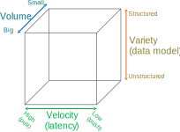
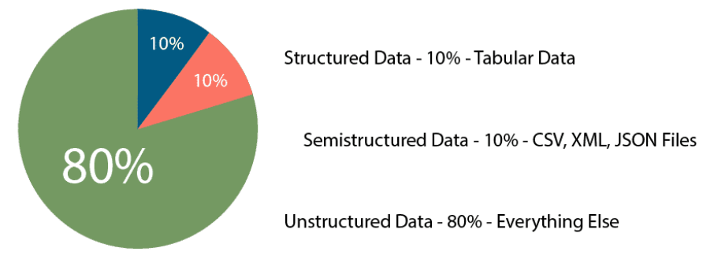
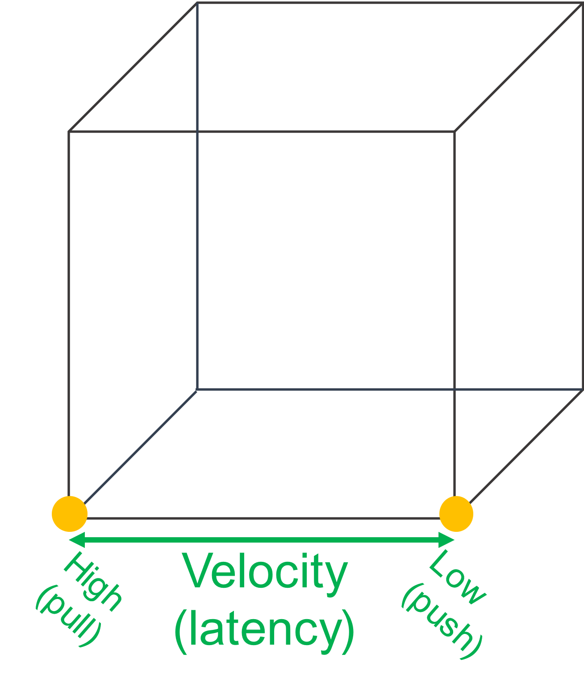
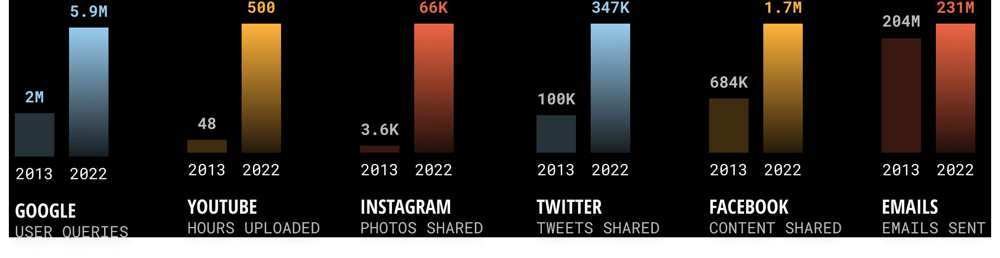
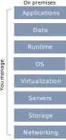
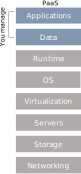
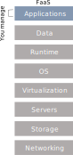
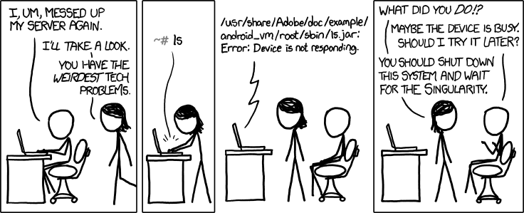

# 

# Reference scenario

:::: {.columns}
::: {.column width=60%}

The big-data cube [@meijer2012your]

* *Volume*: small to big
* *Variety*: structure to unstructured
* *Velocity*: pull to push

:::
::: {.column width=40%}

:::
::::

# Reference scenario

:::: {.columns}
::: {.column width=60%}

**Variety**

* **Structured**
  * Relational tuples with FK/PK relationships
* **Unstructured**
  * Key-value
  * Columnar
  * Document-based
  * Graph
  * ...

:::
::: {.column width=40%}

:::
::::

[https://www.datamation.com/big-data/structured-vs-unstructured-data/](https://www.datamation.com/big-data/structured-vs-unstructured-data/) (accessed 2022-08-01)

# Reference scenario

:::: {.columns}
::: {.column width=60%}

**Velocity** (latency)

* **High**: clients synchronously pulling data from sources
* **Low**: sources asynchronously pushing data to clients

**Velocity** (speed; dual to latency)

* **High**: processing in real-time (milliseconds) or near-real time (minutes)
* **Low**: processing can take hours

:::
::: {.column width=40%}

:::
::::

# Reference scenario

**Acceleration**

* Velocity is not constant, data comes in bursts
* Take Twitter as an example
  * Hashtags can become hugely popular and appear hundreds of times in just seconds
  * ... or slow down to one tag an hour
* Your system must be able to efficiently handle the peak as well as the lows

# [Data never sleeps](https://www.domo.com/learn/infographic/data-never-sleeps-11)

:::: {.columns}
::: {.column width=50%}

:::
::: {.column width=50%}

:::
::::

#

:::: {.columns}
::: {.column width=25%}

:::
::: {.column width=25%}

:::
::: {.column width=25%}

:::
::: {.column width=25%}

:::
::::

# Netflix

The Netflix scenario

# Reference scenario

:::: {.columns}
::: {.column width=50%}

Collecting data

* **Scheduled Batch** 
  * Large volume of data processed on a regular scheduled basis
  * Velocity is very predictable
* **Periodic**
  * Data processed at irregular times (e.g., after collecting a certain ---large--- amount of data)
  * Velocity is less predictable
* **Near real-time** 
  * Streaming data processed in small individual batches collected and processed within minutes
  * Velocity is a huge concern
* **Real-time** 
  * Streaming data collected and processed in very small individual batches within milliseconds
  * Velocity is the paramount concern

:::
::: {.column width=50%}

Processing data

* **Batch and periodic** 
  * Once data has been collected, processing can be done in a controlled environment
  * There is time to plan for the appropriate resources
* **Near real-time and real-time** 
  * Collection of the data leads to an immediate need for processing
  * Depending on the complexity of the processing (cleansing, scrubbing, curation), this can slow down the velocity of the solution significantly
  * Plan accordingly

:::
::::

# Reference scenario

:::: {.columns}
::: {.column width=60%}

Plus other Vs

* **Veracity**: data trustworthiness/quality
* **Value**: ability to extract meaningful information
* ...

Our focus

* (Un)Structured big-data batch
* (Un)Structured big-data streams

**Goal**: keep in mind the cube to categorize the services

:::
::: {.column width=40%}

:::
::::

# Data-driven companies

*Data-driven company* refers to companies where decisions and processes are supported by data

* Decisions are based on quantitative rather than qualitative knowledge
* Processes & Knowledge are an asset of the company and are not lost if managers change
* The gap between a data-driven decision and a good decision is a good manager

Adopting a data-driven mindset goes far beyond adopting a business intelligence solution and entails:

* *Create a data culture*
* *Change the mindset of managers*
* *Change processes*
* *Improve the quality of all the data*

# Why going cloud?

:::: {.columns}
::: {.column width=50%}

*Digitalization* is a journey that involves three main dimensions

* Moving from A to B is a multi-year process made of intermediate goals
* Each of which must be *feasible*
  * Solves a company pain and brings value
  * Can be accomplished in a limited time range (typically less than one year)
  * Costs must be economically related to gains

:::
::: {.column width=50%}

:::
::::

# Why going cloud?

> **Cloud computing** (National Institute of Standards and Technology)
>
> A model for enabling *ubiquitous, convenient, on-demand network access* to a *shared pool* of configurable computing resources (e.g., networks, servers, storage, services) that can be rapidly provisioned and released with *minimal management effort* or *service provider interaction*

* On-demand self-service (consume services when you want)
* Broad network access (consume services from anywhere)
* Resource pooling (infrastructure, virtual platforms, and applications)
* Rapid elasticity (enable horizontal scalability)
* Measured service (pay for the service you consume as you consume)

**Digital transformation ** involves the **cloud** to create/change business flows

* Often involves changing the company culture to adapt to this new way of doing business
* One of the end goal is to meet ever-changing business and market demand

# Why going cloud?

Goal: adjusts capacity to have predictable performance at the lowest cost

* **Scalability** that is not possible on premises
* Scale from one to thousands of servers

**Elasticity**

* Automatically scale resources in response to run-time conditions
* Adapt to changes in workload by turning on/off resources to match the necessary capacity
* Core justification for the cloud adoption

# Why going cloud?

:::: {.columns}
::: {.column width=50%}

Hardware scalability

* No longer think about rack space, switches, and power supplies, etc.

Grow storage from GBs to PBs

* 1PB: one hundred 10TB Enterprise Capacity 3.5 HDD hard drives

:::
::: {.column width=50%}

:::
::::

[https://blog.seagate.com/business/linus-tech-tips-want-petabyte-system/](https://blog.seagate.com/business/linus-tech-tips-want-petabyte-system/)

# Why going cloud?

**Resource pooling**

* Enable *cost-sharing*, a resource to serve different consumers
* Resources are dynamically reassigned according to demands
* Based on *virtualization*, running multiple virtual instances on top of a physical computer system
* Economy of scale for physical resources

**Reliability**

* Built to handle failures
* Fault-tolerant or highly available

# Why going cloud?

Worldwide **deployment**

* Deploy applications as close to customers as possible
  * E.g., to reduce network latency
* Improve data locality
* Compliant to privacy regulations (e.g., GDPR)

Measured **quality of service**

* Services leverage a quantitative qualitative metering capability making pay-as-you-go (or pay-per-use) billing and validation of the service quality available

# Why going cloud?

Service **integration**

* Do not reinvent the wheel, eliminate repetitive tasks
  * Use services that solve common problems (e.g., load balancing, queuing)
* Abstract and automatically adapt the architecture to requirements
  * E.g., create (test) environments on demand

*Integration* and *abstraction* are drivers of change

* From *databases* to *data platforms*
* From *on-premises* to *serverless* architectures
* From *custom* to *standardized* data pipelines

# Is cloud a silver bullet?

Cloud computing is the outsourcing of a company’s hardware and software architecture

* Which are the risks and issues?

# Is cloud a silver bullet?

[https://www.reuters.com/article/us-france-ovh-fire-idUSKBN2B20NU](https://www.reuters.com/article/us-france-ovh-fire-idUSKBN2B20NU)

# Is cloud a silver bullet?

:::: {.columns}
::: {.column width=50%}

:::
::: {.column width=50%}

:::
::::

# 

# Cloud computing: types of cloud

:::: {.columns}
::: {.column width=50%}

There are different types of cloud

* **Public**: accessible to anyone willing to pay (e.g., Microsoft, AWS, Google)
* **Private**: accessible by individuals within an institution
  * In public cloud, any resources that you are not using can be used by other
  * Users share the costs
  * Cost-sharing disappears in private clouds
* **Hybrid**: a mix of the previous

:::
::: {.column width=50%}

:::
::::

# Cloud computing: types of cloud

:::: {.columns}
::: {.column width=50%}

Cloud services are hosted in separate geographic areas

* Locations are composed of **regions** and **availability zones**

Region (e.g., us-east-1)

* Is an independent geographical area that groups data centers
* Has availability zones

Availability zones in a region

* A data center
* Connected through low-latency links
* Resources are usually replicated across zones but not regions

:::
::: {.column width=50%}

:::
::::

[https://docs.aws.amazon.com/AWSEC2/latest/UserGuide/using-regions-availability-zones.html](https://docs.aws.amazon.com/AWSEC2/latest/UserGuide/using-regions-availability-zones.html)

# Cloud computing: principal vendors

:::: {.columns}
::: {.column width=50%}

:::
::: {.column width=50%}

[Gartner Magic Quadrant](https://www.gartner.com/en/research/methodologies/magic-quadrants-research)

* Understanding the technology providers to consider for an investment
* **Leaders** execute well and are well positioned for tomorrow
* **Visionaries** understand where the market is going but do not yet execute well
* **Niche Players** focus successfully on a small segment, or are unfocused and do not out-innovate or outperform others
* **Challengers** execute well but do not demonstrate an understanding of market direction
* Focusing on leaders isn’t always the best
  * A niche player may support needs better than a market leader. It depends on how the provider aligns with business goals

:::
::::

# Cloud computing: deployment models

On a cloud architecture, you can rely on *serverless* or *managed* services

* *Serverless*
* Standalone independent services built for a specific purpose and integrated by cloud service provider
* No visibility into the machines
  * There are still servers in serverless, but they are abstracted away
  * No server management, do not have to manage any servers or scale them
  * E.g., when you run a query on [BigQuery](https://cloud.google.com/blog/products/bigquery/separation-of-storage-and-compute-in-bigquery) you do not know how many machines were used
* Pay for what your application uses, usually per request or per usage

*(Fully) Managed*

* Visibility and control of machines
  * You can choose the number of machines that are being used to run your application
* Do not have to set up any machines, the management and backup are taken care for you
* Pay for machine runtime, however long you run the machines and resources that your application uses

[https://cloud.google.com/blog/topics/developers-practitioners/serverless-vs-fully-managed-whats-difference](https://cloud.google.com/blog/topics/developers-practitioners/serverless-vs-fully-managed-whats-difference) (accessed 2020-08-01)

# Cloud computing: deployment models

:::: {.columns}
::: {.column width=50%}

Understanding architectures is paramount to successful systems

* Good architectures help to scale
* Poor architectures cause issues that necessitate a costly rewrite

**Anything as a service (XaaS)**

* A collective term that refers to the delivery of anything as a service
* It encompasses the products, tools and technologies that vendors deliver to users

:::
::: {.column width=50%}

:::
::::

# Cloud computing: deployment models

:::: {.columns}
::: {.column width=60%}

**On-premises**

* Provisioning servers is time-consuming
  * A non-trivial environment is hard to set up
* Require dedicated operations people
* Often a distraction from strategic tasks

:::
::: {.column width=40%}

:::
::::

# Cloud computing: deployment models

:::: {.columns}
::: {.column width=60%}

**Infrastructure as a service (IaaS)**

* A computing infrastructure provisioned and managed over the internet (e.g., AWS EC2)
* Avoid expense/complexity of buying/managing physical servers/data-centers
* IaaS overcomes issues on-premises
* Possibly requires to manage many environments

:::
::: {.column width=40%}

:::
::::

# Cloud computing: deployment models

:::: {.columns}
::: {.column width=60%}

**Platform as a Service (PaaS)**

* A development and deployment environment in the cloud (e.g., AWS Elastic Beanstalk)
* Support complete application life-cycle: building, testing, deploying, etc.
* Avoid expense/complexity of managing licenses and application infrastructure

:::
::: {.column width=40%}

:::
::::

# Cloud computing: deployment models

:::: {.columns}
::: {.column width=60%}

**Function as a Service (FaaS)**

* A coding environment, cloud provider provisions platform to run the code (e.g., AWS Lambda)
* Infrastructure provisioning and management are invisible to the developer

:::
::: {.column width=40%}

:::
::::

# Cloud computing: deployment models

Principles of FaaS architectures

* FaaS is based on a serverless approach, use a compute service to execute code on demand
* Every function could be considered as a standalone service
* Write single-purpose stateless functions

Functions react to events

* Design push-based, event-driven pipelines
* Create thicker, more powerful front ends
* Embrace third-party services (e.g., security)

FaaS is not a silver bullet

* Not appropriate for latency-sensitive applications
* Strict specific service-level agreements
* Migration costs
* Vendor lock-in can be an issue

# Cloud computing: deployment models

:::: {.columns}
::: {.column width=60%}

**Software as a service (SaaS)**

* An application environment
* Access cloud-based apps over the Internet (e.g., email, Microsoft Office 365, Github)

:::
::: {.column width=40%}

:::
::::

# Virtualization

How do provide computational resources?

:::: {.columns}
::: {.column width=60%}

*Containers* and *virtual machines* are packaged computing environments

*Containers*

* On top of physical server and its host OS
* Share the host OS kernel
* Shared components are read-only
* “Light”, take seconds to start

*Virtual machines*

* Emulate a hardware/software system
* On top of a hypervisor (VM monitor)

:::
::: {.column width=40%}

:::
::::

Containerization isolates an application with its own environment

* Lightweight alternative to full virtualization
* Containers are isolated but need to be deployed to (public/private) server
* Excellent solution when dependencies are in play
* Housekeeping challenges and complexities

# 

# References