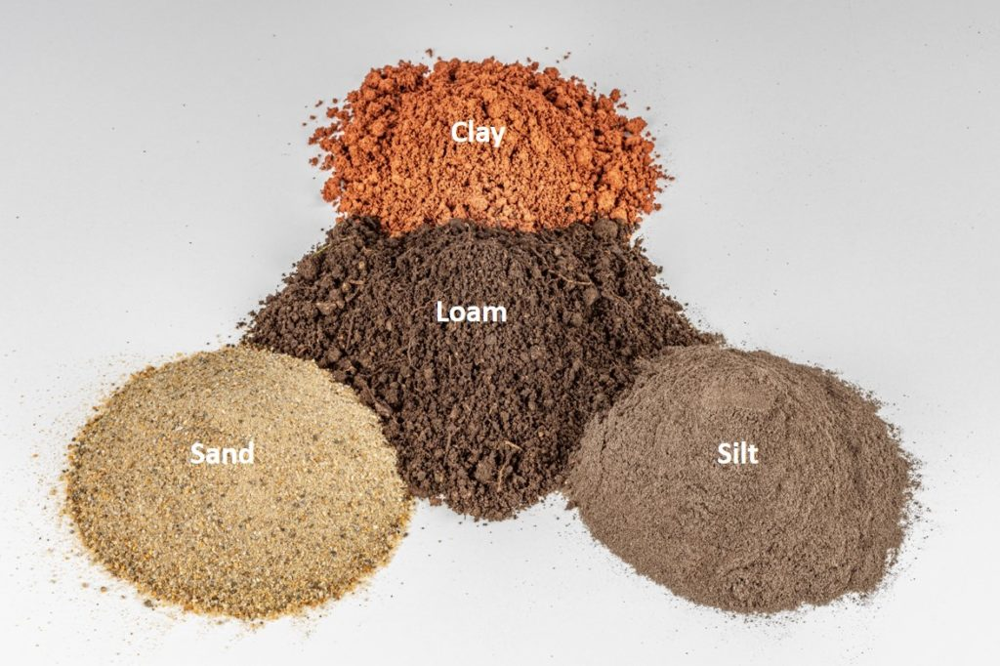
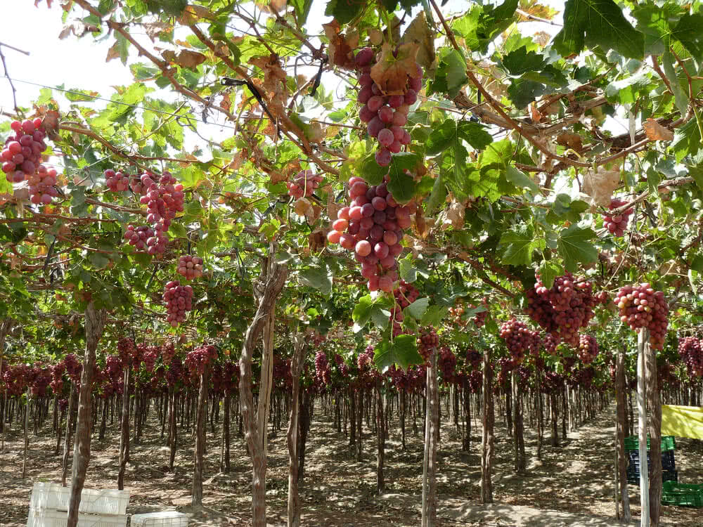
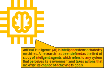
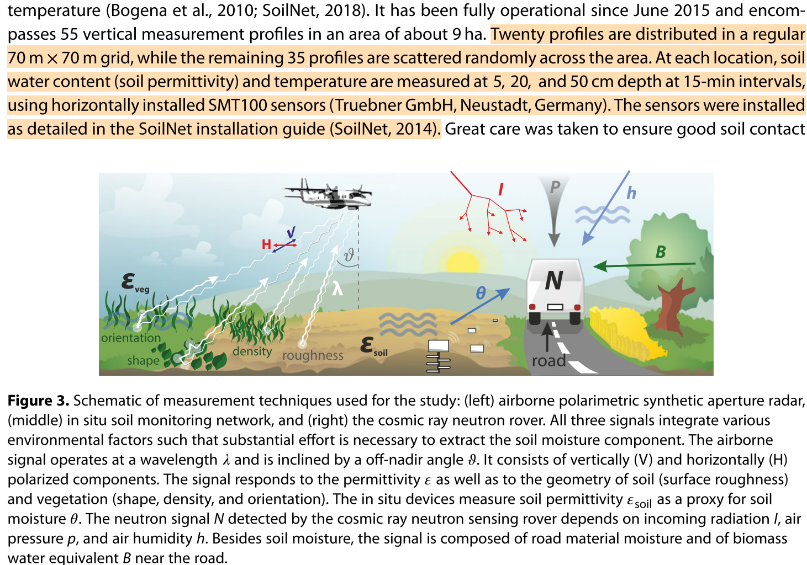
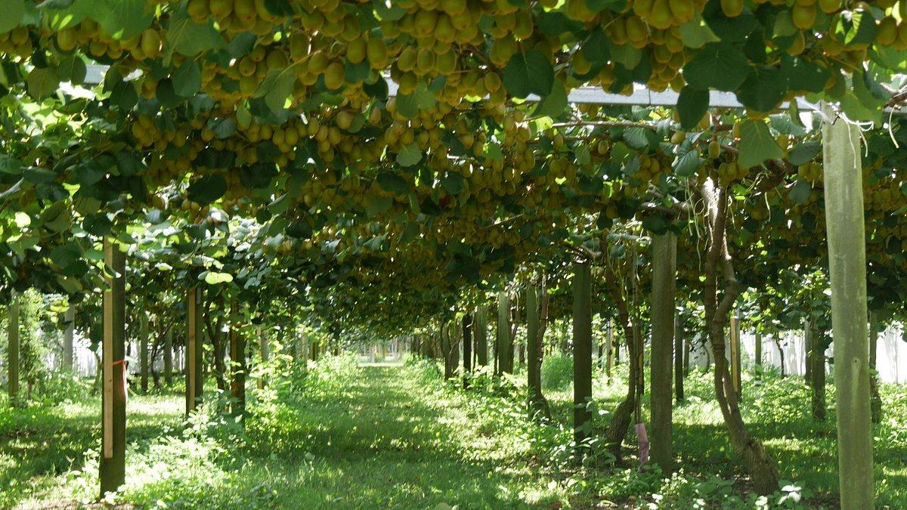
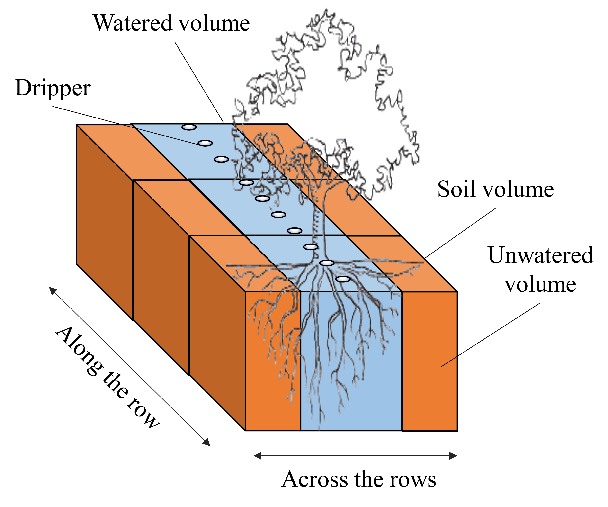

# Context: Soil moisture monitoring

:::: {.columns}
::: {.column width=60%}

Optimizing soil moisture is crucial for watering and crop performance [1]

* **GOAL**: build an expert system to save water while improving fruit quality (i.e., provide a recommendation of the optimal amount of water)
* *Soils* have different water retention
* *Watering systems* have different behaviors (e.g., drippers and sprinklers)
* *Plants* have different water demand (e.g., Kiwi [2] vs Grapes)
* *Sensors* produce different measurements with different precisions

[1] Turkeltaub et al., Real-time monitoring of nitrate transport in the deep vadose zone under a crop field–implications for groundwater protection, Hydrology and Earth System Sciences 20 (8) (2016) 3099–3108.

[2] M. Judd, et al., Water use by sheltered kiwifruit under advective conditions, New Zealand journal of agricultural research 29 (1) (1986) 83–92.

:::
::: {.column width=30%}

:::: {.columns}
::: {.column width=50%}

:::
::: {.column width=46%}

:::
::: {.column width=50%}

:::
::: {.column width=50%}

:::
::::

:::
::::

# Context: Soil moisture monitoring

:::: {.columns}
::: {.column width=60%}

(Example) Scenarios of digital transformation in agriculture

* Scenario \#1
* The farmer/technician controls the watering system based only on the experience
* No digital data/KPIs/automation

Scenario \#2

* The control of the watering system is refined by observing sensor data
* Sensor data is digitalized, no KPIs/automatic

Scenario \#3

* Sensor data feeds a decision support system that, knowing how to optimize KPIs, controls the watering system

:::
::: {.column width=40%}

:::
::::

# Context: Soil moisture monitoring

:::: {.columns}
::: {.column width=60%}

(Example) Scenarios of digital transformation in agriculture

* Scenario \#1
* The farmer/technician controls the watering system based only on the experience
* No digital data/KPIs/automation

Scenario \#2

* The control of the watering system is refined by observing sensor data
* Sensor data is digitalized, no KPIs/automatic

Scenario \#3

* Sensor data feeds a decision support system that, knowing how to optimize KPIs, controls the watering system

:::
::: {.column width=40%}

:::
::::

# Context: Soil moisture monitoring

We need to understand how the soil behaves

* *Simulate* [1, 2] the soil behavior according to physical models [3]
* However, a *fine tuning * is required
* We need to *know/parametrize everything*
  * Soil (e.g., retention curve, hysteresis [4])
  * Plant (e.g., roots, LAI)
  * Weather conditions (temperature, humidity, wind, precipitations)
  * Watering system (e.g., capacity, distance between drippers)

Tuning can take months (of human interactions)!

* Need to collect samples from the field... if parameters are incorrect, trace back
* Need to implement/code all these features into the simulator [1, 2]
* Hyper-parameter tuning with machine learning can help, but it is not a silver bullet

[1] Šimunek, J., et al. "HYDRUS: Model use, calibration, and validation." Transactions of the ASABE 55.4 (2012): 1263-1274.

[2] Bittelli, Marco, et al. Soil physics with Python: transport in the soil-plant-atmosphere system. OUP Oxford, 2015.[3] Van Genuchten, M. Th. "A closed‐form equation for predicting the hydraulic conductivity of unsaturated soils." Soil science society of America journal 44.5 (1980): 892-898.

[4] Pham, Hung Q., Delwyn G. Fredlund, and S. Lee Barbour. "A study of hysteresis models for soil-water characteristic curves." Canadian Geotechnical Journal 42.6 (2005): 1548-1568.

# Context: Soil moisture monitoring

But... we have sensors!

:::: {.columns}
::: {.column width=33%}

:::
::: {.column width=33%}

:::
::: {.column width=33%}

:::
::::

* These settings are too coarse to monitor soil moisture with precision
* They require many sensors

[1] Koyuncu, Hakan, et al. "Construction of 3D soil moisture maps in agricultural fields by using wireless sensor communication." Gazi University Journal of Science 34.1 (2021): 84-98.

[2] Zheng, Zhong, et al. "Spatial estimation of soil moisture and salinity with neural kriging." International Conference on Computer and Computing Technologies in Agriculture. Springer, Boston, MA, 2008.

[3] Fersch, Benjamin, et al. "Synergies for soil moisture retrieval across scales from airborne polarimetric SAR, cosmic ray neutron roving, and an in situ sensor network." Water Resources Research 54.11 (2018): 9364-9383.

# Reference scenario

:::: {.columns}
::: {.column width=60%}

:::
::: {.column width=40%}

We consider an orchard where

* *Kiwi plants * are aligned along *rows*
* Each row has many * drippers* (e.g., 1 every meter)
* Drippers can water a *limited soil volume*

:::
::::

Francia, Matteo, et al. "Multi-sensor profiling for precision soil-moisture monitoring." Computers and Electronics in Agriculture 197 (2022): 106924.

# Reference scenario

:::: {.columns}
::: {.column width=60%}

:::
::: {.column width=40%}

We consider an orchard where

* *Kiwi plants * are aligned along *rows*
* Each row has many * drippers* (e.g., 1 every meter)
* Drippers can water a *limited soil volume*

:::
::::

Francia, Matteo, et al. "Multi-sensor profiling for precision soil-moisture monitoring." Computers and Electronics in Agriculture 197 (2022): 106924.

# Reference scenario

:::: {.columns}
::: {.column width=60%}

(a) Soil moisture is a continuum

(b) Sensors return a discretized representation of soil moisture

* The monitoring accuracy changes
* depending on the *sensor* *layout*

:::
::: {.column width=40%}

:::
::::

# 

# Reference scenario

We consider a 2D grid of 3 x 4 gypsum block sensors

- Sample soil moisture-sensor data every 15 minutes
- Collect dripper and weather data (humidity, temperature, solar radiation, wind) every hour

How many data does each monitored field produces every season?

- $(12 \cdot 4 \frac{𝑠𝑎𝑚𝑝𝑙𝑒𝑠}{ℎ𝑜𝑢𝑟}+5 \frac{𝑠𝑎𝑚𝑝𝑙𝑒𝑠}{ℎ𝑜𝑢𝑟}) \cdot 24 \frac{ℎ𝑜𝑢𝑟}{𝑑𝑎𝑦} \cdot 30 \frac{𝑑𝑎𝑦}{𝑚𝑜𝑛𝑡ℎ} \cdot 5 \frac{𝑚𝑜𝑛𝑡ℎ}{𝑦𝑒𝑎𝑟} = 200 \cdot 10^3 \frac{𝑠𝑎𝑚𝑝𝑙𝑒𝑠}{𝑦𝑒𝑎𝑟}$

We monitored 6 fields for 2 years

- $200 \cdot 10^3 \frac{𝑠𝑎𝑚𝑝𝑙𝑒𝑠}{𝑦𝑒𝑎𝑟}  \cdot 2~𝑦𝑒𝑎𝑟𝑠 \cdot 6 = 2.4 \cdot 10^6~𝑠𝑎𝑚𝑝𝑙𝑒𝑠$

We should consider accessory data for storage and optimization structures

- In two years, we collected/generated 16GB data (as of 2022-08-30)
- In four years, we collected/generated 64GB data (as of 2024-08-30)

# In action

:::: {.columns}
::: {.column width=60%}

Log in AWS Academy [https://awsacademy.instructure.com](https://awsacademy.instructure.com/)

In AWS, start the lab (it takes 5-10 minutes)

Download the Notebook from Virtuale

Upload the Notebook to Sagemaker (not in COLAB!)

:::
::: {.column width=40%}

:::
::::