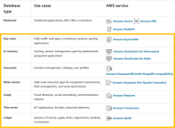
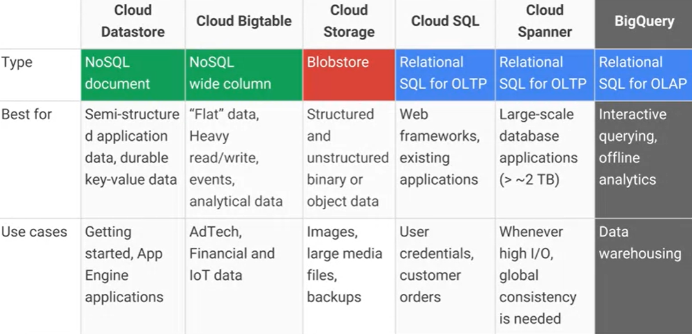

#

**Data pipeline**: a *sequence* of operations to transform and consume raw data

# Storage

# Storage

**Goal**: persisting data

- Which storage do we choose?
- **Storage model ** (or data model) ~= variety
  - How data are organized/accessed in a storage system
    * Structured vs unstructured
    * Data access model (key-value, column, etc.)
- Access **frequency**
- **Analyses ** to be performed

# Storage models

Mansouri, Yaser, Adel Nadjaran Toosi, and Rajkumar Buyya. "Data storage management in cloud environments: Taxonomy, survey, and future directions." ACM Computing Surveys (CSUR) 50.6 (2017): 1-51.

# Storage models (AWS)

:::: {.columns}
::: {.column width=60%}

Data structure: structured

Data abstraction: database

Data access model: relational

**Relational**

- Store data with predefined schemas and relationships between them
- Support ACID transactions
- Maintain referential integrity

:::
::: {.column width=40%}

:::
::::

[https://aws.amazon.com/products/databases/](https://aws.amazon.com/products/databases/)

# Storage models (AWS)

:::: {.columns}
::: {.column width=60%}

Data structure: semi/unstructured

Data abstraction: database

Data access model: *

- **Key/value**: store and retrieve large volumes of data
- **Document**: store semi-structured data as JSON-like documents
- **Wide column**: use tables but unlike a relational database, columns can vary from row to row in the same table
- **Graph**: navigate and query relationships between highly connected datasets
- ... and more

:::
::: {.column width=40%}

:::
::::

[https://aws.amazon.com/products/databases/](https://aws.amazon.com/products/databases/)

# Storage models (Google Cloud)

:::: {.columns}
::: {.column width=50%}

:::
::: {.column width=50%}

:::
::::

[https://cloud.google.com/products/databases](https://cloud.google.com/products/databases)

# Storage models (AWS)

Data structure: unstructured

Data abstraction: file (or database)

Data access model: key-value

**File system** (EFS), **object storage** (S3) (or **DB K-V** ; e.g., DynamoDB)

- Handle unstructured data
- ... organized as files (or blob)
- ... accessed using a key-value

Differ in the supported features

- E.g., maximum item size (DynamoDB: 400KB, S3: 5TB)
- E.g., indexes, querying mechanisms, latency, etc.

# AWS S3

Simple Storage Service (S3)

- Serverless storage, save data as **objects** within **buckets** 
- An **object** is composed of a file and any metadata that describes that file (e.g.,  **object key**)
- **Buckets** are logical containers for objects
  - You can have one or more buckets in your account
  - Control access for each bucket individually
  - Choose the geographical region where Amazon S3 will store the bucket and its contents

Benefits

- Unified data architecture
  - Build a multi-tenant environment, where many users can bring their own data
  - Improve both cost and data governance over traditional solutions
- Decoupling of storage from compute and data processing
  - You can cost-effectively store all data types in their native formats
  - Then, launch transformations as you need

# Storage: access frequency (AWS)

:::: {.columns}
::: {.column width=60%}

Storage (AWS S3) **classes**

- **Standard**: general purpose
- **Infrequent** (rapid) **access**
- **One Zone-IA**: lower-cost option for infrequently accessed data that do not require high availability and resilience
- **Glacier**: low-cost storage class for data archiving, three retrieval options that range from a few minutes to hours
- **Deep Glacier**: long-term retention for data accessed once or twice in a year. E.g., retain data sets for 10 years or longer
- **Intelligent-Tiering**: move objects between access tiers when access patterns change

:::
::: {.column width=40%}

:::
::::

[https://aws.amazon.com/s3/storage-classes/](https://aws.amazon.com/s3/storage-classes/)

# Storage: access frequency (AWS)

:::: {.columns}
::: {.column width=60%}

**Lifecycle** configuration

- A set of rules that define actions that Amazon S3 applies to a group of objects

Two types of actions:

- **Transition: ** when objects transition to another storage class. E.g., archive objects to the S3 Glacier storage class one year after creating them
- **Expiration**: when objects expire. Amazon S3 deletes expired objects on your behalf

:::
::: {.column width=40%}

:::
::::

[https://docs.aws.amazon.com/AmazonS3/latest/userguide/object-lifecycle-mgmt.html](https://docs.aws.amazon.com/AmazonS3/latest/userguide/object-lifecycle-mgmt.html)

# Storage: access frequency (Google Cloud)

:::: {.columns}
::: {.column width=50%}

:::
::: {.column width=50%}

:::
::::

[https://cloud.google.com/blog/products/storage-data-transfer/archive-storage-class-for-coldest-data-now-available](https://cloud.google.com/blog/products/storage-data-transfer/archive-storage-class-for-coldest-data-now-available)

# Organizing the data lake

:::: {.columns}
::: {.column width=60%}

Having consistent principles on how to organize your data is important

- To build standardized pipelines with the same design with regard to where read/write data
- Standardization makes it easier to manage your pipelines at scale
- Helps data users search for data in the storage and understand exactly to find what they need
- Decoupling storage from processing

:::
::: {.column width=40%}

:::
::::

# Organizing the data lake

:::: {.columns}
::: {.column width=60%}

Landing area (LA)

- Save *raw data* from ingestion
- Transient, data is not stored for long term

Staging area (SA)

- Raw data goes through a set of common transformations: ensuring *basic quality* and making sure it *conforms to existing schemas* for this data source and then data is saved into SA

Archive area (A)

- After saving into SA, raw data from LA should be *copied into the archive* to reprocess any given batch of data by simply copying it from AA into LA
- Useful for debugging and testing

:::
::: {.column width=40%}

:::
::::

# Organizing the data lake

:::: {.columns}
::: {.column width=60%}

Production area (PA)

- Apply the business logic to data from SA

Pass-through job

- Copy data from SA to PA and then into DWH without applying any business logic
- Optional, but having a data set in the data warehouse and PA that is an exact replica can be helpful when debugging any issues with the business logic

Cloud data warehouse (DWH)

- Failed area (FA)
- You need to be able to deal with all kinds of errors and failures
- There might be bugs in the pipeline code, cloud resources may fail

:::
::: {.column width=40%}

:::
::::

# Organizing the data lake

| Area | Permissions | Tier |
|:-: |:-: |:-: |
| Landing | Ingestion applications can write Scheduled pipelines can readData consumers can’t access | Hot |
| Staging | Scheduled pipelines can read/write Selected data consumers can read | Hot |
| Production | Scheduled pipelines can read/writeSelected data consumers can read | Hot |
| Archive | Scheduled pipelines can writeDedicated data reprocessing pipelines can read  | Cold or archive |
| Failed | Scheduled pipelines can writeDedicated data reprocessing pipelines can readData consumers don’t have access | Hot |

# Organizing the data lake

Use folders to organize data inside areas into a logical structure

- *Namespace*
  - Logically group multiple pipelines together.
- *Pipeline name*
  - Each data pipeline should have a name that reflects its purpose. For example
    * A pipeline that takes data from the LA, applies common processing steps, and saves data into SA
    * You will also have one for archiving data into AA
- *Data source name*
  - Ingestion layer will assign a name to each data source you bring into the platform
- *BatchId*
  - Unique identifier for any batch of data that is saved into LA
  - E.g., Since only ingestion can write to LA, it is its responsibility to generate this identifier
  - A common choice for this type of an identifier is a Universally Unique Identifier (UUID)

Different areas will have slightly different folder structures

- /landing/ETL/sales*oracle*ingest/customers/01DFTFX89YDFAXREPJTR94

# Organizing the data lake

However, alternative organizations are available

:::: {.columns}
::: {.column width=60%}

> "A data lake is a central repository system for storage, processing, and analysis of raw data, in which the data is **kept in its original format ** and is processed to be queried only when needed. It can store a **varied amount of formats ** in big data ecosystems, from unstructured, semi-structured, to structured data sources."
>
> Couto et al., 2019 

:::
::: {.column width=40%}

:::
::::

# Data Lakehouse

Combine the key benefits of data lakes and data warehouses

- Low-cost storage in an open format accessible by a variety of systems from the former
- Powerful management and optimization features from the latter
  - ACID transactions, data versioning, auditing, indexing, caching, and query optimization.

Key question: can we combine these benefits in an effective way?

- Direct access means that they **give up some aspects of data independence**, which has been a cornerstone of relational DBMS design
- **Lakehouses** are an especially good fit for cloud environments with separate compute and storage**: different computing applications can run on-demand on separate computing nodes (e.g., a GPU cluster for ML) while directly accessing the same storage data

# Data Independence

:::: {.columns}
::: {.column width=60%}

Data independence can be explained using the three-schema architecture

- Data independence: modify the schema at one level of the database system without altering the schema at the next higher level

:::
::: {.column width=40%}

:::
::::

# Data Lakehouse

**1st generation systems**: data warehousing started with helping business leaders get analytical insights

- Data in these warehouses would be written with *schema-on-write*, which ensured that the data model was optimized for downstream BI consumption
- Several challenges
  - They typically coupled compute and storage into an on-premises appliance
    * This forced enterprises to provision and pay for the peak of user load and data under management, very costly
  - More and more datasets were completely unstructured, which DWHs could not store and query at all

Armbrust, Michael, et al. "Lakehouse: a new generation of open platforms that unify data warehousing and advanced analytics."  *CIDR* . 2021.

# Data Lakehouse

**2nd generation**: offloading all the raw data into data lakes

- The data lake is *schema-on-read* and stores any data at low cost, but on the other hand, punted the problem of data quality and governance
- In this architecture, a small subset of data in the lake would later be ETLed to a downstream data warehouse
- The use of open formats also made data lake data directly accessible to a wide range of other analytics engines, such as machine learning systems
- From 2015 onwards, cloud data lakes, such as S3, ADLS and GCS, started replacing HDFS
  - Superior durability (often >10 nines), geo-replication, and most importantly, extremely low cost

# Data Lakehouse

# Data Lakehouse

While the cloud data lake and warehouse architecture is ostensibly cheap, a two-tier architecture is highly complex for users

- Data is first ETLed into lakes, and then again ELTed into warehouses
- Enterprise use cases now include advanced analytics such as machine learning, for which neither data lakes nor warehouses are ideal
- (Some) main problems:
  - **Reliability** . Keeping the data lake and warehouse consistent is difficult and costly
  - Data **staleness** . The data in the warehouse is stale compared to that of the data lake, with new data frequently taking days to load
  - **Limited support for advanced analytics** . Businesses want to ask predictive questions using their warehousing data, e.g., “which customers should I offer discounts to?” None of the leading machine learning systems directly work well on top of warehouses
    * Process large datasets using complex non-SQL code

# Dataset Search for Data Discovery, Augmentation, and Explanation

Is there a real need for many unstructured and integrated dataset?

- Recent years have seen an explosion in our ability to collect and catalog immense amounts of data about our environment, society, and populace
- Governments, and organizations are increasingly making structured data available on the Web and in various repositories and data lakes
- **This opportunity is often missed due to a central technical barrier**: it is currently nearly impossible for domain experts to weed through the vast amount of available information to discover datasets that are needed for their specific application

Juliana Freire, keynote @ EDBT 2023

# Data Lakehouse

Main features

- **Store data in a low-cost object store** using a standard file format such as Apache Parquet
- **Implement a transactional metadata layer** on top of the object store that defines which objects are part of a table version
- **Implement management features ** within the metadata layer

Challenges:

- The metadata layer is insufficient to achieve good SQL performance
  - **Data warehouses use several techniques to get state-of-the-art performance**
    * Storing hot data on fast devices such as SSDs, maintaining statistics, building efficient indexes, etc.
  - **In a Lakehouse it is not possible to change the format**, but it is possible to implement other optimizations that leave the data files unchanged

# Delta Lake

**Challenges**:

- Most **cloud object stores are merely key-value stores**, with no cross-key consistency
- **Multi-object updates are not atomic**, there is no isolation between queries
  - If a query needs to update multiple objects in the table readers will see partial updates as the query updates each object individually
- For large tables with millions of objects, **metadata operations are expensive**
  - The latency of cloud object stores is so much higher that these data skipping checks can take longer than the actual query

Armbrust, Michael, et al. "Delta lake: high-performance ACID table storage over cloud object stores." Proceedings of the VLDB Endowment 13.12 (2020): 3411-3424.

# Delta Lake

:::: {.columns}
::: {.column width=60%}

Delta Lake uses a **transaction log ** that is compacted **into Apache Parquet ** for significantly faster metadata operations for large tabular datasets

- E.g., quickly search billions of table partitions for those relevant to a query
- The log is stored in the **delta*log** subdirectory within the table
- It contains
  - Sequence of JSON objects with increasing, zero-padded numerical IDs to store the log records
  - Occasional checkpoints for specific log objects that summarize the log up to that point

:::
::: {.column width=40%}

:::
::::

# Delta Lake

Each log record object (e.g., 000003.json) contains an array of actions to apply to the previous version of the table to generate the next one

- Examples of actions are:
- Change Metadata
- Add or Remove Files

It is necessary to compress the log periodically into checkpoints

- Checkpoints store all the non-redundant actions in the table’s log up to a certain log record ID, in Parquet format
- Some sets of actions are redundant and can be removed
- Read the *last*checkpoint object in the table’s log directory, if it exists, to obtain a recent checkpoint ID

# Delta Lake

Example of a write transaction

- Transaction will read the data at table version r (if needed) and attempt to write log record r+1
- Read data at table version r, if required combine previous checkpoint and further log records
- Write any new data objects that the transaction aims to add to the table into new files in the correct data directories, generating the object names using GUIDs.
  - This step can happen in parallel
  - At the end, these objects are ready to be referenced in a new log record.
- Attempt to write the transaction’s log record into the r+1 .json log object, if no other client has written this object
- **This step needs to be atomic** . If the step fails, the transaction can be retried; depending on the query’s semantics (optimistic concurrency)
- Optionally, write a new .parquet checkpoint for log record r+1

Creating the r+1 .json record, needs to be atomic: only 1 client should succeed. Not all large-scale storage systems have an atomic put operation

- Google Cloud Storage and Azure Blob Store support atomic put-if-absent operations
- HDFS, we use atomic renames to rename a temporary file to the target name
- Amazon S3 need ad-hoc protocols

# Lakehouse

(SQL) Format-independent optimizations are

- **Caching**: When using a transactional metadata layer such as Delta Lake, it is safe for a Lakehouse system to cache files from the cloud object store on faster storage devices such as SSDs and RAM on the processing nodes
- **Auxiliary data**: maintain column min-max statistics for each data file in the table within the same Parquet file used to store the transaction log, which enables data skipping optimizations when the base data is clustered by particular columns
- **Data layout**:
  - Record ordering: which records are clustered together and hence easiest to read together, e.g. ordering records using individual dimensions or space-filling curves such as Z-order
  - Compression strategies differently for various groups of records, or other strategies

Offer a declarative version of the DataFrame APIs which maps data preparation computations into Spark SQL query plans and can benefit from logical optimizations