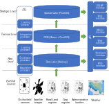
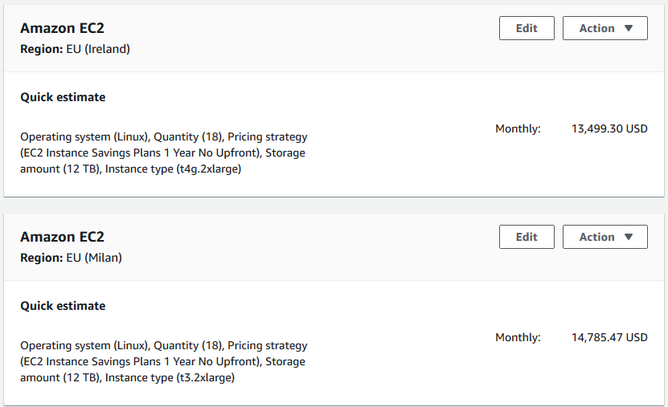
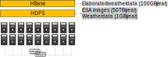
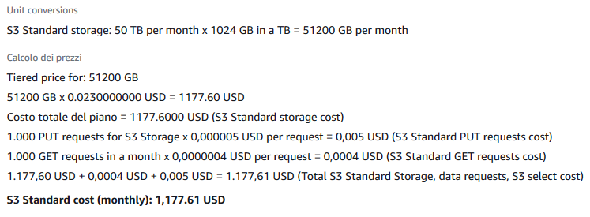

# Migration

:::: {.columns}
::: {.column width=90%}

Goals

* Evaluating the costs for a cloud/on-premises data platform
* Real-world case study
* Fill in this table

:::
::: {.column width=10%}

| Cost | On-premises | On cloud |
|:-: |:-: |:-: |
| Hardware |? |? |
| Software |? |? |

:::
::::

# Case study

Business intelligence group

# Migration

:::: {.columns}
::: {.column width=50%}



:::
::: {.column width=50%}


:::
::::

# Migration

Hardware

:::: {.columns}
::: {.column width=60%}


:::
::: {.column width=40%}

8 CPUs (144 total)

* - Intel(R) Core(TM) i7-8700 CPU @ 3.20GHz

32GB RAM (576GB total)

* - 2 x 16GB DIMM DDR4 2666 MHz

12TB HDD Disk (216TB total)

* - 3 x 4TB ST4000DM004-2CV1

:::
::::

* Software
* "Classic" Hadoop stack

```bash
lshw -short -C cpu
lshw -short -C memory
lshw -short -C disk
```

# Migration

:::: {.columns}
::: {.column width=90%}

**Hardware cost**:?

* Refer to [https://www.rect.coreto-europe.com/en/search.html?clearsearch=1](https://www.rect.coreto-europe.com/en/search.html?clearsearch=1)

:::
::: {.column width=10%}

| SOLonprem | On-premises | On cloud |
|:-: |:-: |:-: |
| Hardware |? |? |
| Software |? |? |

:::
::::

# On-premises

:::: {.columns}
::: {.column width=90%}

**Hardware cost**(up to Mar 05, 2021): 

* 1767€ x 18 = 31806€
* Amortization over 3 years (i.e., *10602€/year*)


:::
::: {.column width=10%}

| SOLonprem | On-premises | On cloud |
|:-: |:-: |:-: |
| Hardware | 10602€/year |? |
| Software |? |? |


:::
::::

[https://www.rect.coreto-europe.com/en](https://www.rect.coreto-europe.com/en) (Accessed 2021-08-01)

# On-premises

:::: {.columns}
::: {.column width=90%}

**Software cost**:?

:::
::: {.column width=10%}

| SOLonprem | On-premises | On cloud |
|:-: |:-: |:-: |
| Hardware | 10602€/year |? |
| Software |? |? |

:::
::::

# On-premises

:::: {.columns}
::: {.column width=90%}

**Software cost** (up to 2020): 0€*

* Free Cloudera Management System
* No software licensing (for research purpose)

:::
::: {.column width=10%}

| SOLonprem | On-premises | On cloud |
|:-: |:-: |:-: |
| Hardware | 10602€/year |? |
| Software | 0€ |? |

:::
::::

# On-premises

:::: {.columns}
::: {.column width=90%}

**Software cost**(up to Mar 05, 2021): 10000€/year x 18 = 180000€/year*

* Cloudera is no more free, 10K€ per node
* [https://www.cloudera.com/products/pricing.html\#private-cloud-services](https://www.cloudera.com/products/pricing.html#private-cloud-services)
* [https://www.cloudera.com/products/pricing/product-features.html](https://www.cloudera.com/products/pricing/product-features.html)
* No license for research purpose

*“Houston we’ve had a problem!”*

* We cannot update/extend the cluster anymore
* What about migrating to the cloud? (we only consider AWS)

:::
::: {.column width=10%}

| SOLonprem | On-premises | On cloud |
|:-: |:-: |:-: |
| Hardware | 10602€/year |? |
| Software | 180000€/year |? |

:::
::::

# Migration

Moving a Hadoop cluster to the cloud (we only consider AWS)

* [AWS price calculator](https://calculator.aws/#/estimate)

How do we start?

* We have already defined the hardware and the software stack
* Start with coarse tuning, identify the dominating costs first
  * Is it computing, storage, or processing?
* Identify a suitable budget, implement, refine later
  * Wrong refinements can do a lot of damage

# On cloud v1

:::: {.columns}
::: {.column width=90%}

Migrating the cluster as-is: ?

* Hint: add 18 EC2 instances satisfying the hardware requirements

:::
::: {.column width=10%}

| SOLcloud1 | On-premises | On cloud |
|:-: |:-: |:-: |
| Hardware | 10602€/year |? |
| Software | 180000€/year |? |

:::
::::

# On cloud v1

:::: {.columns}
::: {.column width=90%}

SOLcloud1 migrating the cluster as-is: *13500$/month = 162000$/year*

* 18 EC2 instances (t4g.2xlarge) with 12TB EBS storage each machine
* Still, we have no software configuration

Prices change over the year

* In 2022, 162000$/year
* In 2023, 146000$/year



:::
::: {.column width=10%}

| SOLcloud1 | On-premises | On cloud |
|:-: |:-: |:-: |
| Hardware | 10602€/year | 162000$/year |
| Software | 180000€/year |? |

:::
::::

[https://calculator.aws/\#/estimate?id=7757afffccc3cafdcfdeb212b74623ef02ed5a36](https://calculator.aws/#/estimate?id=7757afffccc3cafdcfdeb212b74623ef02ed5a36)

# Migration

:::: {.columns}
::: {.column width=60%}


Pay attention to the region

* Different regions, different prices
* Different regions, different services
* Remember the GDPR and data locality

:::
::: {.column width=40%}


:::
::::

# Migration

It makes no sense to move the cluster as-is

* More machines ensure better (on-prem) scalability but higher costs

How do we proceed with the migration?

* We need minimum software requirements
* Try to achieve the smallest migration impact
  * Find the most similar cloud-based solution to a Hadoop cluster
  * Rethink applications (later) when you got the know-how
* Identify a suitable budget, implement, refine later
  * Wrong refinements can do a lot of damage

# Migration

:::: {.columns}
::: {.column width=60%}

**HDFS**

* How much durability do we need?
  * HP0: three replicas (we stick to this)
  * HP1: decrease replicas for cold data
  * HP2: move cold data to glacier or delete id
  * ...

**HBase** has marginal effects on the pricing (100GB << 50TB)

* For simplicity, we can omit it

**Overall**: 50TB storage/year

:::
::: {.column width=40%}



:::
::::

# Migration

:::: {.columns}
::: {.column width=60%}

Processing takes place each time that ESA provides a satellite image

* Some days no images are available
* Some days up to 10 images are available
* Spark jobs are always executed with the same parameters

**Image processing**

* 4 machines, 2 cores, 10GB RAM at least

**Weather processing** is negligible

:::
::: {.column width=40%}


:::
::::

# On cloud v2

:::: {.columns}
::: {.column width=90%}

Assuming 1 Executor = 1 Machine

* Compare 4 machines on-premises vs on cloud

On-premises

* 4 machines: 10602€/year / 18 machines x 4 machines = *2356€/year*
* Cloudera requires at least 10 nodes: *100000€/year*

AWS

* 4 EC2 instances: 162000$/year / 18 machines x 4 machines = *36000$/year*
  * Plus the resources for master services = *2000$/year*
* Problems
  * Still no software stack
  * A lot of storage cost
  * Machines are up-and-running even when no computation is necessary (just to persist data)

:::
::: {.column width=10%}

|  | On-premises | On cloud |
|:-: |:-: |:-: |
| Hardware | 2356€/year | 38000$/year |
| Software | 100000€/year |? |

:::
::::

# On cloud v2

AWS

* Still, we have no software stack configuration
* Which is the major cost?

# On cloud v2

:::: {.columns}
::: {.column width=60%}

AWS

* Still, we have no software stack configuration
* Which is the major cost?

:::
::: {.column width=40%}


:::
::::

# Migration

:::: {.columns}
::: {.column width=50%}

S3 standard



:::
::: {.column width=50%}

S3 Infrequent Access


:::
::::

# Migration

:::: {.columns}
::: {.column width=60%}

*AWS Storage*

* HDFS on EC2
* Heavy price
* Machine must be always on to guarantee data persistency
* Data locality

S3

* Much cheaper
* Does not require machines for data storage
* Data locality is lost

:::
::: {.column width=40%}


:::
::::

# Migration

:::: {.columns}
::: {.column width=90%}

Migrating cluster to EMR: *?*

* Given the software requirements, we need
* 1 x Master Node (to manage the cluster)1 x Core node (with HDFS/EBS)
* 4 x Task Nodes (to compute)


:::
::: {.column width=10%}

|  | On-premises | On cloud |
|:-: |:-: |:-: |
| Hardware | 2356€/year |? |
| Software | 100000€/year |? |

:::
::::

# On cloud v3

:::: {.columns}
::: {.column width=90%}

Migrating cluster to EMR: *14710€/year*

* S3 Infrequent Access storage (50 TB per month): 640€
* 1 x Master EMR nodes, EC2 (m4.xlarge), Utilization (75 h/month): 4.5€
  * 75 h/month = 15min/task x 10task/day x 30day/month / 60min/hour
* 1 x Core EMR nodes, EC2 (m4.xlarge), Utilization (75 h/month): 4.5€
* 4 x Task EMR nodes, EC2 (m4.4xlarge), Utilization (75 h/month): 72€
* 4 x EC2 *on demand (task node): 174.83€*
  * Storage amount (30 GB)
  * Workload (Daily, Duration of peak: 0 Hr 15 Min)
  * Instance type (m4.xlarge)
* 2 x EC2 on demand (master and core nodes): 330€
  * Storage amount (30 GB)
  * Instance type (m4.xlarge)

:::
::: {.column width=10%}

|  | On-premises | On cloud |
|:-: |:-: |:-: |
| Hardware | 2356€/year | 14710€/year |
| Software | 100000€/year |? |

:::
::::

# On cloud v3

:::: {.columns}
::: {.column width=90%}

Migrating cluster to EMR: *13445€/year*

* S3 Infrequent Access storage (50 TB per month): 640€
* 1 x Master EMR nodes, EC2 (m4.xlarge), Utilization (75 h/month): 4.5€
  * 75 h/month = 15min/task x 10task/day x 30day/month / 60min/hour
* 1 x Core EMR nodes, EC2 (m4.xlarge), Utilization (75 h/month): 4.5€
* 4 x Task EMR nodes, EC2 (m4.4xlarge), Utilization (75 h/month): 72€
* 4 x EC2 *spot (task node): 69.55€*
  * Storage amount (30 GB)
  * Workload (Daily, Duration of peak: 0 Hr 15 Min)
  * Instance type (m4.xlarge)
* 2 x EC2 on demand (master and core nodes): 330€
  * Storage amount (30 GB)
  * Instance type (m4.xlarge)

:::
::: {.column width=10%}

|  | On-premises | On cloud |
|:-: |:-: |:-: |
| Hardware | 2356€/year | 13445€/year |
| Software | 100000€/year |? |

:::
::::

[https://calculator.aws/\#/estimate?id=c3780b12bb43b593d05def5a1d5218d9764b8a65](https://calculator.aws/#/estimate?id=c3780b12bb43b593d05def5a1d5218d9764b8a65)

# Migration

Summing up (cloud options)

| Machine uptime | Storage | Software | Feasible? | Cost per year |
|:-: |:-: |:-: |:-: |:-: |
| Constant | EC2 | Manual | YES: but high storage cost | ~36K€ |
| Constant | EC2 | EMR | YES: but high storage cost | ~37K€ |
| Constant | S3 | Manual | YES: but still manual provisioning | ~17K€ |
| Constant | S3 | EMR | YES | ~18K€ |
| Pay-per-use | EC2 | Manual | NO: pay-per-use + EC2 = Data unpersisted | - |
| Pay-per-use | EC2 | EMR | NO: pay-per-use + EC2 = Data unpersisted | - |
| Pay-per-use | S3 | Manual | ISH: repetitive manual provisioning | - |
| Pay-per-use | S3 | EMR | YES | ~14K€ |

Summing up

* We estimated the cluster costs
  * On-premises solution with 18 machines: no go
  * Cloud solution with 18 EC2 instances: no go
* We reduced the solution based on software requirements
  * On-premises solution with 4 machines: no go
  * Cloud solution with 4 EC2 instances: no go, we miss the software configuration
* We moved the cluster to AWS EMR + spot instances + S3 storage

Can we do better?

* Pick ad-hoc cloud services (AWS Lambda e AWS Batch)
* ... to re-think the applications (food for thoughts)