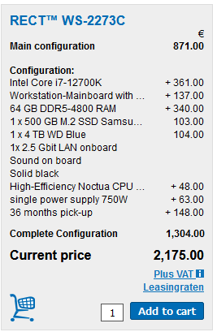

# The WeLASER project

:::: {.columns}
::: {.column width=60%}

**Project description**

* The increased use of pesticides and fertilisers damages the environment, destroys non-target plants and beneficial insects for the soil and harms human and animal health. Most seeds develop herbicide-resistant properties, rendering pesticides ineffective. Mechanical automatic systems that are studied as alternatives to pesticides deteriorate soil features, damage beneficial soil organisms and offer limited results for in-row weeding. The EU-funded WeLASER project will develop a non-chemical solution for weed management based on pioneering technology consisting of the application of lethal doses of energy on the weed meristems through a high-power laser source. An AI-vision system separates crops from weeds, identifying the weed meristems and pointing the laser at them. A smart controller based on IoT and cloud computing techniques coordinates the system, which is transfered all over the field by an autonomous vehicle.

:::
::: {.column width=40%}

:::
::::

[https://cordis.europa.eu/project/id/101000256](https://cordis.europa.eu/project/id/101000256) (accessed 2020-08-01)

# The WeLASER project

:::: {.columns}
::: {.column width=60%}

**Project description**

Which requirements do you foresee?

* Can we define a tentative (service) architecture for the WeLASER project?

Assumptions

* Do not consider the collection of weed/crop images & training/deploying of the CV algorithm

:::
::: {.column width=40%}

:::
::::

# Data sources

8 cameras on the field, average image size 3MB; two services:

- Alerting: a camera sends an image when smt enters the field (at most $\frac{1 img}{5 min})$; assuming $20 \frac{alerts}{day}$
  - $20 \frac{𝑎𝑙𝑒𝑟𝑡}{𝑑𝑎𝑦}  \cdot 1 \frac{𝑖𝑚𝑎𝑔𝑒}{𝑎𝑙𝑒𝑟𝑡} \cdot 8 \frac{𝑐𝑎𝑚𝑒𝑟𝑎}{𝑓𝑖𝑒𝑙𝑑} = 160 \frac{𝑖𝑚𝑎𝑔𝑒}{𝑑𝑎𝑦 \cdot 𝑓𝑖𝑒𝑙𝑑}$
  - $160 \frac{𝑖𝑚𝑎𝑔𝑒}{𝑑𝑎𝑦 \cdot 𝑓𝑖𝑒𝑙𝑑} \cdot 3 \frac{𝑀𝐵}{𝑖𝑚𝑎𝑔𝑒}=480 \frac{𝑀𝐵}{𝑑𝑎𝑦 \cdot 𝑓𝑖𝑒𝑙𝑑} \~= 500 \frac{𝑀𝐵}{𝑑𝑎𝑦 \cdot 𝑓𝑖𝑒𝑙𝑑}$
- Monitoring the crop}{weed; assuming $2 \frac{images}{day}$
  - $2 \frac{𝑖𝑚𝑎𝑔𝑒}{𝑑𝑎𝑦} \cdot 8 \frac{𝑐𝑎𝑚𝑒𝑟𝑎}{𝑓𝑖𝑒𝑙𝑑}=16 \frac{𝑖𝑚𝑎𝑔𝑒}{𝑑𝑎𝑦 \cdot 𝑓𝑖𝑒𝑙𝑑}$
  - 16 \frac{𝑖𝑚𝑎𝑔𝑒}{𝑑𝑎𝑦 \cdot 𝑓𝑖𝑒𝑙𝑑} \cdot 3 \frac{𝑀𝐵}{𝑖𝑚𝑎𝑔𝑒}=48 \frac{𝑀𝐵}{𝑑𝑎𝑦 \cdot 𝑓𝑖𝑒𝑙𝑑}  ~ 50 \frac{𝑀𝐵}{𝑑𝑎𝑦 \cdot 𝑓𝑖𝑒𝑙𝑑}

Weather station: $24 \frac{measurement}{day}$ for humidity/solar radiation/temperature/wind; $1 \frac{KB}{measurement}$

  - $24 \frac{𝑠𝑎𝑚𝑝𝑙𝑒}{𝑑𝑎𝑦} \cdot 4 \frac{𝑚𝑒𝑎𝑠𝑢𝑟𝑒𝑚𝑒𝑛𝑡}{𝑠𝑎𝑚𝑝𝑙𝑒} \cdot 1 \frac{𝑤𝑒𝑎𝑡ℎ𝑒𝑟~𝑠𝑡𝑎𝑡𝑖𝑜𝑛}{𝑓𝑖𝑒𝑙𝑑}=96 \frac{𝑚𝑒𝑎𝑠𝑢𝑟𝑒𝑚𝑒𝑛𝑡}{𝑑𝑎𝑦 \cdot 𝑓𝑖𝑒𝑙𝑑}$
  - $96 \frac{𝑚𝑒𝑎𝑠𝑢𝑟𝑒𝑚𝑒𝑛𝑡}{𝑑𝑎𝑦 \cdot 𝑓𝑖𝑒𝑙𝑑} \cdot 1 \frac{𝐾𝐵}{𝑚𝑒𝑎𝑠𝑢𝑟𝑒𝑚𝑒𝑛𝑡}=96 \frac{𝐾𝐵}{𝑑𝑎𝑦 \cdot 𝑓𝑖𝑒𝑙𝑑} \~= 0.1 \frac{𝑀𝐵}{𝑑𝑎𝑦 \cdot 𝑓𝑖𝑒𝑙𝑑}$

Robot mission: lasts 4 hours, $100 \frac{measurement}{s}$ from sensor systems; $1\frac{KB}{measurement}$

  - $3600 \frac{𝑠𝑒𝑐𝑜𝑛𝑑}{ℎ𝑜𝑢𝑟} \cdot 4 \frac{ℎ𝑜𝑢𝑟}{𝑚𝑖𝑠𝑠𝑖𝑜𝑛} \cdot 100 \frac{𝑚𝑒𝑎𝑠𝑢𝑟𝑒𝑚𝑒𝑛𝑡}{𝑠𝑒𝑐𝑜𝑛𝑑} \cdot 1 \frac{𝑚𝑖𝑠𝑠𝑖𝑜𝑛}{𝑑𝑎𝑦 \cdot 𝑓𝑖𝑒𝑙𝑑}=1 440 000 \frac{𝑚𝑒𝑎𝑠𝑢𝑟𝑒𝑚𝑒𝑛𝑡}{𝑑𝑎𝑦 \cdot 𝑓𝑖𝑒𝑙𝑑}$
  - $1 440 000 \frac{𝑚𝑒𝑎𝑠𝑢𝑟𝑒𝑚𝑒𝑛𝑡}{𝑑𝑎𝑦 \cdot 𝑓𝑖𝑒𝑙𝑑} \cdot 1 \frac{𝐾𝐵}{𝑚𝑒𝑎𝑠𝑢𝑟𝑒𝑚𝑒𝑛𝑡}=1.44  \frac{𝐺𝐵}{𝑑𝑎𝑦 \cdot 𝑓𝑖𝑒𝑙𝑑} \~= 2 \frac{𝐺𝐵}{𝑑𝑎𝑦 \cdot 𝑓𝑖𝑒𝑙𝑑}$
  
Historic data; worst case of $1\frac{KB}{document}: $10^3$  Json documents describing the farm \~= $1 \frac{𝑀𝐵}{𝑓𝑎𝑟𝑚}$

[https://docs.google.com/spreadsheets/d/17zEr62CzyqeIy0vU-DcjEUoxf6bMd3ziLSSeIXvk4Lg/edit?usp=sharing](https://docs.google.com/spreadsheets/d/17zEr62CzyqeIy0vU-DcjEUoxf6bMd3ziLSSeIXvk4Lg/edit?usp=sharing)

# Workload

Nothing special

* Every night compute aggregated indexes on the collected data (2h/day)

On-premises (HDFS cluster)

* How many machines do we need?
* With which resources?

# On-premises

:::: {.columns}
::: {.column width=90%}

On-premises

* How many machines do we need?
  * *4*: *1 master node* + *3 HDFS data nodes*
* With which resources?
  * Assuming a HDFS replication factor of 3, we need at least 1TB of disk overall (not that much)
  * Think bigger: at least 8 cores, 64GB RAM, 500GB SSD + 4TB HDD, no GPU
* 8700€ / 3 years = 2900€

:::: {.columns}
::: {.column width=50%}

:::
::: {.column width=50%}

:::
::::

:::
::: {.column width=10%}

|  | On-premises | On cloud |
|:-: |:-: |:-: |
| Hardware | 2900€/year |? |
| Software | 40000€/year |? |

:::
::::

[https://www.rect.coreto-europe.com/en](https://www.rect.coreto-europe.com/en) (accessed 2022-09-01)

[https://www.cloudera.com/products/pricing.html](https://www.cloudera.com/products/pricing.html) (accessed 2022-09-01)

# On cloud v1

:::: {.columns}
::: {.column width=90%}

Moving the Hadoop cluster as IAAS

* EC2
* Quantity (4), Pricing strategy (EC2 Instance Savings Plans 3 Year No Upfront), *Storage amount (4 TB), * Instance type (r6g.2xlarge)

EMR

* Number of master EMR nodes (1), EC2 instance (r5.2xlarge), Utilization (100 %Utilized/Month) Number of core EMR nodes (3), EC2 instance (r5d.2xlarge), *Utilization (100 %Utilized/Month)*

*MKS (KAFKA)*

* Storage per Broker (10 GB), Number of Kafka broker nodes (3), Compute Family (m5.2xlarge)

:::
::: {.column width=10%}

|  | On-premises | On cloud |
|:-: |:-: |:-: |
| Hardware | 2900€/year | ~40000$/year |
| Software | 40000€/year |? |

:::
::::

[https://calculator.aws/\#/estimate?id=05965ca7de23fd9e7d2ab2cd0175fe8c01822c9c](https://calculator.aws/#/estimate?id=05965ca7de23fd9e7d2ab2cd0175fe8c01822c9c) (accessed 2022-09-01)

# On cloud v2

:::: {.columns}
::: {.column width=90%}

Moving the Hadoop cluster as PAAS

* EC2
* Quantity (4), Pricing strategy (*On-Demand Instances*), Storage amount (30 GB), Instance type (r6g.2xlarge)

EMR

* Number of master EMR nodes (1), EC2 instance (r5.2xlarge), Utilization (2 Hours/Day) Number of core EMR nodes (3), EC2 instance (r5d.2xlarge), *Utilization (2 Hours/Day)*

*S3*

* Standard storage (60 GB per month)

*Kinesis*

* Days for data retention (1 days), Records (100 per second), Consumer Applications (3)

:::
::: {.column width=10%}

|  | On-premises | On cloud |
|:-: |:-: |:-: |
| Hardware | 2900€/year | ~4000$/year |
| Software | 40000€/year |? |

:::
::::

[https://calculator.aws/\#/estimate?id=53f60ff0412a18877dc8e1274f7d9875aa3bf665](https://calculator.aws/#/estimate?id=53f60ff0412a18877dc8e1274f7d9875aa3bf665) (accessed 2022-09-01)

# Cost vs price

How would you evaluate the cost and the price?

*Price* is the amount a customer is willing to pay for a product or service

* *Cost* is the expense incurred for creating a product or service
* Hardware
* Development
* Maintenance

*Profit* is the difference between price paid and costs incurred is profit

* If a customer pays $10 for a product that costs $6 to make and sell, the company earns $4