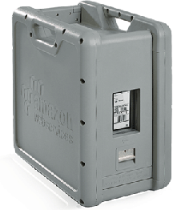
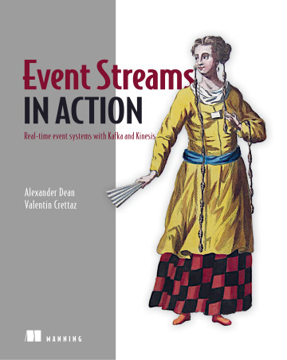
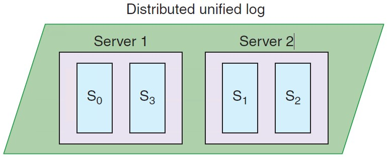
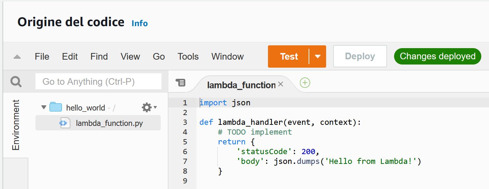
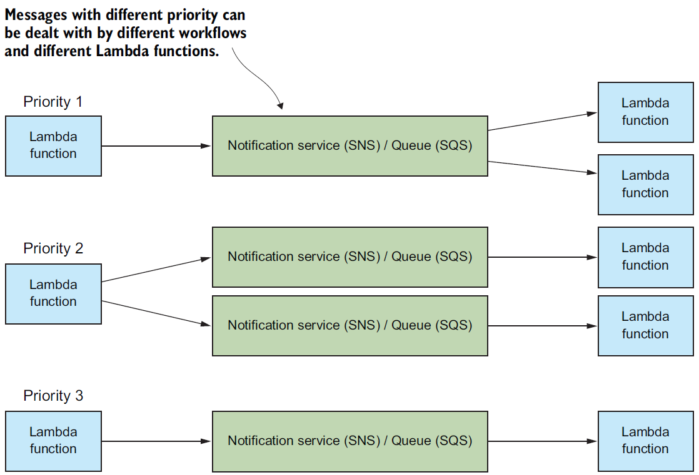
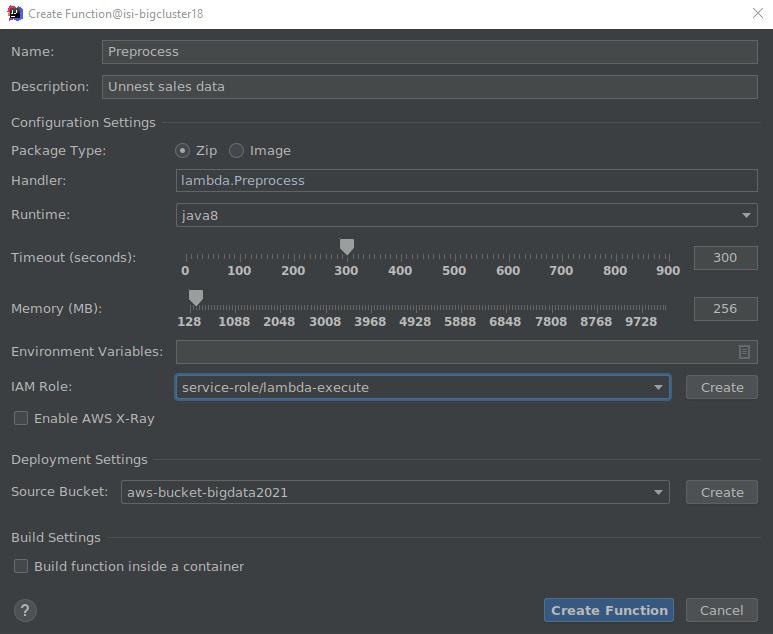

# -- newsection --

# Data pipelines on cloud (Streaming)

# 

Supporting services

Serve (deciding)

BI tools (e.g., Tableau)

Analytics (analyzing)

Networking, etc.

Machine learning

Ingestion (acquiring)

# Reference scenario: batch vs stream

# Batch vs. Streaming systems

What is a bulk processing system?

* High latency
* Exact results
* Process massive data at once
  * ... is this true?

What is a streaming system?

* Low latency
* Approximate result
  * ... is this true?
* Process data item by data item
  * ... is this true?

What is a bulk processing system?

* An engine capable to handle processing on **bounded** datasets

What is a streaming system?

* An engine capable to handle processing on **unbounded** datasets
* Streaming is a superset of batch processing

Akidau, Tyler, Slava Chernyak, and Reuven Lax.  *Streaming systems: the what, where, when, and how of large-scale data processing* . " O'Reilly Media, Inc.", 2018.

# Reference scenario: batch vs stream

|  | Batch data processing | Stream data processing |
|:-: |:-: |:-: |
| Data scope | Queries or processing over all or most of the data in the dataset | Queries or processing over data within a rolling time window, or on just the most recent data record |
| Data size | Large batches of data | Individual records or micro batches consisting of a few records |
| Latency | Minutes to hours | Seconds or milliseconds |
| Analysis | Complex analytics | Simple response functions, aggregates, and rolling metrics |

# Ingestion: batch

**Goal**: moving data to the cloud

* Moving data to the cloud
* *80TB* of data to move,
* *1Gbps* connection to the internet

How many *days*?

* *80000GB* / (*1Gbps / 8*) /  *60 / 60 / 24 * ~= a week without internet

Batch/Bulk: move data from on-premises storage

* Workflow
* Receive shipment
* Set up
* Transfer data
* Ship back (shipping carrier)

# Ingestion: batch (AWS)

AWS Snowball

* 50TB (North America only) and 80TB versions
* Not rack-mountable

Throughput

* 1 Gbps or 10 Gbps using an RJ-45 connection
* 10 Gbps using a fiber optic connection

[https://aws.amazon.com/snowball/](https://aws.amazon.com/snowball/)

# AWS Snowmobile

What if we have exabyte of data?

Value Metric

103 KB (kilobyte)

106 MB (megabyte)

109 GB (gigabyte)

1012 TB (terabyte)

1015 PB (petabyte)

1018 EB (exabyte)

1021 ZB (zettabyte)

1024 YB (yottabyte)

[https://youtu.be/8vQmTZTq7nw?t=45](https://youtu.be/8vQmTZTq7nw?t=45) (2022-11-14)

# Ingestion: stream

* Data (often) flows in both directions, storage systems are both sources and destinations for data transformations
* Two pipelines per application (data in/out)
  * Worst case (full connectivity): O(N2)

Kreps, Jay.  *I heart logs: Event data, stream processing, and data integration* . " O'Reilly Media, Inc.", 2014.

**Stream**: real-time streaming data

* **Event**: anything that we can observe occurring at a particular point in time

**Continuous streaming**

* Illimited succession of individual events
* Ordered by the point in time at which each event occurred

**Publish/subscribe (pub/sub)**: a way of communicating messages

* *Senders* publish messages associated with one or more **topics**
* *Receivers* subscribe to specific topics, receive all messages with that topic
* *Messages* are events

[https://www.manning.com/books/event-streams-in-action](https://www.manning.com/books/event-streams-in-action)

Log

* Append-only data structure
* Each application only knows about the log, it ignores the details of the source
  * E.g., a data consumer is not concerned about whether the data came from a relational database or some application

The log acts as a messaging system with durability guarantees and ordering semantics

Kreps, Jay.  *I heart logs: Event data, stream processing, and data integration* . " O'Reilly Media, Inc.", 2014.

General idea:

* Collect events from many source systems
* Store them in a unified log
* Enable applications to operate on these event streams

**Unified log**

* *Unified*, *append-only*, *ordered*, *distributed* log that allows the centralization of event streams

**Unified**: a single log in a company with applications sending/reading events

* Log serves as central data backbone
  * It can contain many distinct continuous streams of events
  * Not all events are sent to the same event stream

**Append-only**: new events are appended to the unified log

* Existing events are never updated in place
  * If read the event \#10, never look at events 1 through 10 again
* Events are automatically deleted from the unified log when they age
  * E.g., automatically remove events after 7 days

**Distributed**: the unified log lives across a cluster of machines

* Optionally divide events into shards (i.e., partitions)Still, the log is unified since we have a single (conceptual) log

Distribution ensures

* Scalability: work with streams larger than the capacity of single machines
* Durability: replicate all events within the cluster to overcome data loss
* Using a log as a universal integration mechanism is never going to be more than an elegant fantasy if we can’t build a log that is fast, cheap, and scalable

**Ordered**: events in a shard have a sequential IDs (unique in a shard)

* Local ordering keeps things much simpler than global ordering
* Applications maintain their own cursor for each shard

Lamport, Leslie. "Time, clocks, and the ordering of events in a distributed system."  *Concurrency: the Works of Leslie * *Lamport* . 2019. 179-196.

Two types of processing

* **Single-event:** a single event produces zero or more events
  * Validating “Does this event contain all the required fields?”
  * Enriching “Where is this IP address located?”
  * Filtering “Is this error critical?”
* **Multiple-event:** multiple events collectively produce zero or more events
  * Aggregating, functions such as minimum, maximum, sum
  * Pattern matching, looking for patterns or co-occurrence
  * Reordering events based on a sort key

Why not communicating directly using messaging protocols?

* A log enables
* Multi-subscriber: each data item is available to any processor that wants it
* Order: maintained in the processing done by each consumer of data
* Buffering and isolation to the individual processes
  * E.g., a that processor produces faster than its downstream consumer can keep up
* Reprocessing, maintaining state, etc.

Indeed, logs are common:

* MapReduce workflows use files to checkpoint and share their intermediate results
* SQL processing pipelines create intermediate or temporary tables

# Ingestion: stream (AWS)

Amazon Kinesis Data Streams

* Created and provisioned by shard
  * Each shard provides 1 MBps and 1000 data puts per second
* A data record consists of
  * User-supplied partition key to balance records across shards
  * Incremental sequence number added by the shard
  * A data blob
* Consumers get records by shard
  * Records are sorted by partition key and sequence number
  * Ordering is not guaranteed across shards
* Records are retained for 7 days at maximum

[https://docs.aws.amazon.com/streams/latest/dev/key-concepts.html](https://docs.aws.amazon.com/streams/latest/dev/key-concepts.html)

Re-sharding (i.e., scaling)

* Split a shard into two, or merge two shards
* Users must scale shards up and down manually
  * Monitor usage with Amazon CloudWatch and modify scale as needed
* Avoid shard management by using Kinesis Data Firehose

Kinesis is a regional service, with streams scoped to specific regions

* All ingested data must travel to the region in which the stream is defined

Costs

* Priced by shard hour, data volume, and data retention period
* Pay for resources you provision (even if not used)

[https://aws.amazon.com/cloudwatch/](https://aws.amazon.com/cloudwatch/)[https://aws.amazon.com/kinesis/data-firehose](https://aws.amazon.com/kinesis/data-firehose)

# Ingestion: stream

| Feature | AWS Kinesis | Google Pub/Sub |
|:-: |:-: |:-: |
| Unit of deployment | Stream | Topic |
| Unit of provisioning | Shard | N/A (fully managed) |
| Data unit | Record | Message |
| Data producer/destination | Producer/Consumer | Publisher/Subscriber |
| Data partitioning | User-supplied partition key | N/A (fully managed) |
| Retention period | Up to 7 days | Up to 7 days |
| Pricing | Per shard-hour, PUT payload units, and optional data retention | Message ingestion and delivery, and optional message retention |

# 

Supporting services

Serve (deciding)

BI tools (e.g., Tableau)

Analytics (analyzing)

Networking, etc.

Machine learning

Ingestion (acquiring)

# Serverless computing/processing

AWS Lambda: compose code functions in a loose orchestration

* Build modular back-end systems
* Event-driven and push-based pipelines

With Lambda, you are responsible only for your code (Lambda function)

* Lambda manages the compute fleet that offers a balance of memory and CPU
* Lambda performs operational and administrative activities on your behalf
  * Provisioning capacity, monitoring fleet health, applying security patches, etc.

# Serverless computing (AWS Lambda)

AWS Lambda

* A Lambda function is a granular service
* The Lambda runtime invokes a lambda function multiple times in parallel
* Compute service that executes code written in JavaScript/Python/C\#/Java
  * Elastic Compute Cloud (EC2) servers run the code (e.g., a Linux server)
* A function is `code + configuration + dependencies`
  * Source code (JARs or DLLs) is zipped up and deployed to a container
* Invocation supports push/pull events

# Serverless computing (FaaS)

FaaS: write single-purpose stateless functions

* Keep the single responsibility principle in mind
* A function that does just one thing is more testable and robust
* A function with a well-defined interface is also more likely to be reused
* Code should be created in a stateless style
  * Statelessness allows scalability
  * Local resources or processes will not survive along sessions
* Functions that terminate sooner are cheaper
  * E.g., pricing is based on \#requests, execution time, and allocated memory

# Patterns for data pipelines

Patterns are architectural solutions to problems in software design

* A (design) pattern is a general, best-practice reusable solution to a commonly occurring problem within a given context in software design
* It is a template for how to solve a problem in many different situations

Patterns for serverless data pipelines

  * Command pattern
  * Messaging pattern
  * Priority queue pattern
  * Pipes and filters pattern

[https://www.manning.com/books/aws-lambda-in-action](https://www.manning.com/books/aws-lambda-in-action)

# Command pattern

Command pattern

* A behavioral design pattern in which an object is used to encapsulate the information needed to perform an action or trigger an event

Encapsulate a request as an object

* Issue requests to objects without knowing anything about the operation being requested or the receiver

[https://aws.amazon.com/api-gateway](https://aws.amazon.com/api-gateway)

# Pipes and filters pattern

Decompose a complex processing task into a sequence of manageable services

* Components designed to transform data are referred to as filters
* Connectors that pass data between components are referred to as pipes

# Messaging pattern

Messaging pattern

* Describes how two different parts of a message passing system connect and communicate with each other

Decouple services from direct dependence and allow storage of events in a queue

* Reliability: if the consuming service goes offline, messages are retained in the queue and can still be processed
* A message queue can have a single sender/receiver or multiple senders/receivers

# Priority queue pattern

Decouple and prioritize requests sent to services

* Requests with a higher priority are received and processed more quickly than those with a lower priority
* Useful in applications that offer different service level guarantees

Control how and when messages are dealt with

* Different queues, topics, or streams to feed messages to your functions
* High-priority messages go through expensive services with more capacity

# That’s all, folks!

# Feedbacks?

# Exams

# -- newsection --

# Hands on AWS

# A tentative organization

Supporting services

Serve (deciding)

BI tools (e.g., Tableau)

Analytics (analyzing)

Networking, etc.

Machine learning

Ingestion (acquiring)

# Identity and Access Management

Identity and Access Management (IAM)

* Web service that controls fine-grained access to AWS resources
* IAM controls who is authenticated and authorized to use resources

IAM user

* Unique identity recognized by AWS services and applications
* Similar to user in an operating system like Windows or UNIX

IAM role

* Set of policies for making AWS service requests
* Trusted entities (e.g., such as IAM users) assume roles
  * Delegate access with defined permissions to trusted entities
  * There is no limit to the number of IAM roles a user can assume

User vs role

* User has permanent long-term credentials and is used to directly interact with AWS services
* Role does not have credentials and cannot make direct requests to AWS services
* Roles are assumed by authorized entities, such as IAM users

Alice (i.e., an IAM user) is a firewoman

* She is the same person with or without her turnout gear
* As a firewoman (i.e., a role)
  * If she speeds to a house fire and passes a police officer, he isn't going to give her a ticket
  * In her role as a *firewoman*, she is allowed to speed to the house fire
* As a private citizen (i.e., another role)
  * When she is off duty, if she speeds past that same police officer, he's going to give her a ticket
  * In her role as a *private citizen*, she is not allowed to speed

# AWS

Amazon Web Services (AWS) is a public-cloud platform

* Services can be accessed in multiple ways
* Web GUI: intuitive point and click access without any programming
  * Intuitive interfaces is part of the attraction of cloud services
  * Tedious if the same actions must be performed repeatedly
* (REST) Application programming interface (API)
  * Permits requests to be transmitted via Hypertext Transfer Protocol (HTTPS)
* Software development kits (SDKs) that you install on your computer
  * Access from programming languages such as Python, Java, etc.

# AWS Web console

We use the AWS Educate program

* Login with the provided account
* You got 150$ to work on AWS services
* Provisioned services charge even if not used

[https://www.awseducate.com/signin/SiteLogin](https://www.awseducate.com/signin/SiteLogin)

# AWS CLI

CLI interface

* Necessary to install the CLI (version 2)
* See [https://docs.aws.amazon.com/cli/latest/userguide/install-cliv2.html](https://docs.aws.amazon.com/cli/latest/userguide/install-cliv2.html)

Synopsis

********

aws [options] \<command> \<subcommand> [parameters]

Description

***********

A unified tool to manage your AWS services.

[https://docs.aws.amazon.com/cli/latest/userguide/install-cliv2-linux.html](https://docs.aws.amazon.com/cli/latest/userguide/install-cliv2-linux.html)

CLI needs credentials to work

* Go back to AWS Educate
* Click on “Account Details”
* Copy the content into the file ~/.aws/credentials
* Henceforth, we assume that you have set up the credentials file
* Credentials expire after some time; you need a manually refresh

Run `aws configure`

* Confirm AWS Access Key ID (press enter)
* Confirm AWS Secret Access Key (press enter)
* Set Default region name to `us-east-1`
* Set Default output format to `json`

It is also possible to configure an AWS profile

* A (named) profile is a collection of settings and credentials
* If profile is specified, its settings and credentials are used to run a command
* When no profile is explicitly referenced, use `default`
  * We stick to `default`

# Object storage: S3

Create S3 bucket, the following rules apply for naming buckets

* Must be between 3 and 63 characters long
* Can consist only of lowercase letters, numbers, dots (.), and hyphens (-)
* Must be unique within a partition (i.e., a group of regions)

$ git clone [https://github.com/w4bo/bigdata-aws/](https://github.com/w4bo/bigdata-aws/)

$ cd bigdata-aws/lab01-lambda

$ aws s3api create-bucket --bucket aws-bucket-bigdata2021

$ aws s3 cp datasets/inferno.txt s3://aws-bucket-bigdata2021/inferno.txt

$ aws s3api list-objects --bucket aws-bucket-bigdata2021

[https://s3.console.aws.amazon.com/s3/home?region=us-east-1\#](https://s3.console.aws.amazon.com/s3/home?region=us-east-1)

# -- newsection --

# Data pipelines on AWS Lambda

# Requirements

To start this lecture, you need to

* Activate your AWS Educate account
* Either
  * Install the necessary software
    * git
    * IntelliJ IDEA (with AWS Toolkit and Scala plugins)
    * python
    * java 1.8
    * Docker
    * AWS CLI, AWS SAM CLI
  * Be able to download and run the VM

# AWS SAM CLI

Serverless Application Model is a framework to build serverless applications

* A serverless application is a combination of Lambda functions, event sources, etc.
* Install AWS SAM CLI (on Linux)

sudo group add docker

sudo usermod –aG docker $USER

newgrp docker

sudo chmod 666 /var/run/docker.sock

wget [https://github.com/aws/aws-sam-cli/releases/latest/download/aws-sam-cli-linux-x86*64.zip](https://github.com/aws/aws-sam-cli/releases/latest/download/aws-sam-cli-linux-x86*64.zip)

unzip aws-sam-cli-linux-x86*64.zip -d sam-installation

sudo ./sam-installation/install

sam --version

[https://docs.aws.amazon.com/serverless-application-model/latest/developerguide/serverless-sam-cli-install.html](https://docs.aws.amazon.com/serverless-application-model/latest/developerguide/serverless-sam-cli-install.html)

# AWS services

AWS Educate (and AWS console)

* [https://aws.amazon.com/it/education/awseducate/](https://aws.amazon.com/it/education/awseducate/)
* [https://console.aws.amazon.com/console/home?region=us-east-1](https://console.aws.amazon.com/console/home?region=us-east-1)

IAM (authentication)

* [https://docs.aws.amazon.com/IAM/latest/UserGuide/iam-ug.pdf](https://docs.aws.amazon.com/IAM/latest/UserGuide/iam-ug.pdf)

SDK (software API)

* [https://docs.aws.amazon.com/sdk-for-java/latest/developer-guide/home.html](https://docs.aws.amazon.com/sdk-for-java/latest/developer-guide/home.html)

Lambda (serverless computing and processing)

* [https://docs.aws.amazon.com/lambda/latest/dg/getting-started.html](https://docs.aws.amazon.com/lambda/latest/dg/getting-started.html)
* [https://console.aws.amazon.com/lambda/home?region=us-east-1\#/functions](https://console.aws.amazon.com/lambda/home?region=us-east-1#/functions)

DynamoDB (key-value database)

* [https://docs.aws.amazon.com/amazondynamodb/latest/developerguide/Introduction](https://docs.aws.amazon.com/amazondynamodb/latest/developerguide/Introduction)

S3 (object storage)

* [https://s3.console.aws.amazon.com/s3/home?region=us-east-1](https://s3.console.aws.amazon.com/s3/home?region=us-east-1)

# Case study

Given a dataset of sales per customer

find the products frequently bought together

Dataset sample

%%%%%%%%%%%%%%

[ { customerName: Alice, products: [Pizza, Beer, Diaper] },

{ customerName: Bob, products: [Pizza, Beer, Diaper] },

{ customerName: Charlie, products: [Pizza, Cola] } ]

The pipeline involves a single transformation

* A classic mining problem, which one?

# Frequent itemset mining

Dataset sample

%%%%%%%%%%%%%%

[[Pizza, Beer, Diaper],

[Pizza, Beer, Diaper],

[Pizza, Cola]]

Find sets of items (i.e., itemsets) frequently appearing together

* **Item**: a product
* **Itemset**: a set of products
* **Frequently**: support above threshold
* **Support**: number of clients buying a set of products

Complexity: O(2|items|)

{Pizza,Diaper,Beer}

# Case study

Processed dataset sample

%%%%%%%%%%%%%%

[[Pizza, Beer, Diaper],

[Pizza, Beer, Diaper],

[Pizza, Cola]]

Raw dataset sample

%%%%%%%%%%%%%%

[ { customerName: Alice, products: [Pizza, Beer, Diaper] },

{ customerName: Bob, products: [Pizza, Beer, Diaper] },

{ customerName: Charlie, products: [Pizza, Cola] } ]

# Reference pipeline

# NOSQL storage: DynamoDB

Basic DynamoDB components: tables and items

* **Tables**, collection of (data) items

**Items**, a group of attributes that is uniquely identifiable

* Each table contains zero or more items
  * No limit to the number of items you can store in a table
* Each item in the table has a unique identifier, or primary key
* E.g., in the table `people`, each item represents a `person`
  * The primary key consists of one attribute (`fiscalCode`)

Attributes

* A data element that is not broken down any further
  * E.g., an item in the `people` table contains attributes `fiscalCode` and `lastName`
* Most of the attributes are scalar (have only one value)
* Some of the items have a nested attribute (`address`) up to 32 levels deep

Schemaless

* Other than the primary key, a table is schemaless
  * Neither the attributes nor their data types need to be defined beforehand
  * Each item can have its own distinct attributes

Primary Key

* To create a table, you must specify the primary key of the table
* No two items can have the same key

Two types of primary keys

* Partition key: a simple primary key composed of one attribute (partition key)
  * Keys are inputs to an internal hash function
  * The hash function determines the physical partition in which the item will be stored
  * E.g., access any item in the `people` table directly by providing the `fiscalCode`
* Composite primary key: partition key and sort key (two attributes)
  * First attribute is the partition key
  * Second attribute is the sort key
  * Items in same partition key value are stored together and sorted by sort key

[https://docs.aws.amazon.com/amazondynamodb/latest/developerguide/bp-gsi-overloading.html](https://docs.aws.amazon.com/amazondynamodb/latest/developerguide/bp-gsi-overloading.html)

Secondary Indexes

* One or more secondary indexes per table
* Indexes are automatically maintained on add, update, or delete
* Query data using an alternate key (additionally to queries against primary key)

Two types of indexes

* Global secondary has partition and sort keys different from those on table
* Local secondary has the same partition key but a different sort key
* Each table has a limited quota of 20 global and 5 local indexes

How do we shape the schema?

* [https://cloud.google.com/bigtable/docs/schema-design](https://cloud.google.com/bigtable/docs/schema-design)

Create a table `frequent-sales` with a composite key

* `dataset`: String
* `timestamp`: String

$ aws dynamodb create-table \\

--table-name frequent-sales \\

--attribute-definitions AttributeName=dataset,AttributeType=S AttributeName=timestamp,AttributeType=S \\

--key-schema AttributeName=dataset,KeyType=HASH AttributeName=timestamp,KeyType=RANGE \\

--provisioned-throughput ReadCapacityUnits=1,WriteCapacityUnits=1

$ aws dynamodb list-tables

$ aws dynamodb delete-table --table-name frequent-sales

Reading data from DynamoDB might not reflect the results of a recent write

* Eventually Consistent Reads (default)
* Response might include stale data
* After short time, the response should return the latest data

Strongly Consistent Reads

* Response includes the most up-to-date data
* A strongly consistent read might not be available if there is a network delay or outage
  * In this case, DynamoDB may return a server error (HTTP 500)
* Strongly consistent reads may have higher latency than eventually consistent reads
* Strongly consistent reads are not supported on global secondary indexes

Provisioned mode: specify the \#reads and \#writes per second

* You have predictable application traffic or traffic ramps gradually
* You can forecast capacity requirements to control costs

One read capacity unit

* One strongly consistent read per second, two eventually consistent reads per second
* RCUs also depend on the item size (a read is up to 4 KB in size), if item size is 8 KB
  * 2 RCUs to sustain one strongly consistent read per second
  * 1 RCU if you choose eventually consistent reads

One write capacity unit represents one write per second for an item up to 1 KB in size

Put a new item and get it back

$ aws dynamodb put-item    --table-name frequent-sales    --item '{"dataset": {"S": "sales"}, "timestamp": {"S": "1611226870"}, "bar": {"S": "foobar"}}'

$ aws dynamodb query    --table-name frequent-sales    --key-condition-expression "dataset =:n"     --expression-attribute-values '{":n":{"S":"sales"}}'

# Lambda: create a function

[https://console.aws.amazon.com/lambda/home?region=us-east-1\#/functions](https://console.aws.amazon.com/lambda/home?region=us-east-1#/functions)

# Lambda: attaching a role

# Lambda: create a function

[https://console.aws.amazon.com/lambda/home?region=us-east-1\#/functions](https://console.aws.amazon.com/lambda/home?region=us-east-1#/functions)

Manually creating the functions is cumbersome

* We must copy and paste code
* No automatic testing
* No debugging
* No IDE support (and not all languages are supported)

Switch to IntelliJ IDEA + AWS Toolkit

# AWS Toolkit

* Get the latest IntelliJ IDEA
* Install the `AWS Toolkit`
* Copy the credentialscp ~/.aws/credentials ~/.aws/config
* Clone the repo git clone [https://github.com/w4bo/bigdata-aws/](https://github.com/w4bo/bigdata-aws/)
* Import `lab01-lambda` as a Gradle project
* Verify that the project builds./gradlew

Click on `AWS Explorer`

* You can see the `helloworld` function
* Plus `CloudWatch Logs` and `S3`

Test the existing code locally

* With Gradle
* Or with local Lambda execution

Deploy a new Lambda function from the existing code

* Right click on AWS Explorer > Lambda
* Select `Create new AWS Lambda...`
* Populate the settings
* `Create the function`

[https://aws.amazon.com/lambda/pricing/](https://aws.amazon.com/lambda/pricing/)

Check the log for errors and pricing

* AWS Toolkit > CloudWatch Logs
* Double click on the function name
* Double click on the log entry

# Data pipeline

Deploy and execute the HelloWorld.java lambda function

* Given the created storage: S3 and DynamoDB
* Deploy the function `FIM`
* Deploy the function `Preprocess`
* Run `ReadDataset.java`
* Check that the table `frequent-sales` has the FIs for the dataset `sales`

Some hints

* Function names are case sensitive
* Some function need more than 128MB of memory
  * Behold! The higher the RAM, the higher the costs

# 

