#


# Supporting data pipelines

We can choose the XaaS configuration to build our pipelines

:::: {.columns}
::: {.column width=60%}

IaaS

* Outsource virtual machines to the cloud (AWS EC2)
* (You) Manage technological and business challenges

:::
::: {.column width=60%}


:::
::::

:::: {.columns}
::: {.column width=60%}

PaaS

* Outsource the data ecosystem to the cloud (e.g., AWS EMR)
* (You) Manage business challenges

:::
::: {.column width=40%}


:::
::::

[https://aws.amazon.com/ec2](https://aws.amazon.com/emr)

[https://aws.amazon.com/emr](https://aws.amazon.com/emr)  (2022-11-15)

# Single instance: AWS EC2

:::: {.columns}
::: {.column width=60%}

Amazon Elastic Compute Cloud

* A web service that provides resizable compute capacity
* Complete control of computing resources
  * Processor, storage, networking, OS, and purchase model

The **instance type** determines the hardware

* Different compute and memory capabilities

**Amazon Machine Image** is a software template

* The EC2 instance is used for creating the virtual server instance
* The AMI is the EC2 virtual machines image

Interact with EC2 instance as with any computer

* You have complete control of your instances

:::
::: {.column width=40%}


:::
::::

[https://aws.amazon.com/ec2/instance-types](https://aws.amazon.com/ec2/instance-types)

[https://docs.aws.amazon.com/AWSEC2/latest/UserGuide/ec2-instances-and-amis.html](https://docs.aws.amazon.com/AWSEC2/latest/UserGuide/ec2-instances-and-amis.html) 

[https://docs.aws.amazon.com/AWSEC2/latest/UserGuide/compute-optimized-instances.html](https://docs.aws.amazon.com/AWSEC2/latest/UserGuide/compute-optimized-instances.html)

# Single instance: AWS EC2

:::: {.columns}
::: {.column width=50%}


:::
::: {.column width=50%}


:::
::::

[https://aws.amazon.com/ec2/instance-types/](https://aws.amazon.com/ec2/instance-types/)

# Cluster: AWS EMR

Amazon EMR is a data platform based on the Hadoop stack

* Apache Spark, Apache Hive, Apache HBase, etc.
* You can run workloads on
  * Amazon EC2 instances
  * Amazon Elastic Kubernetes Service (EKS) clusters

Example of workload

* Upload input data into Amazon S3
* EMR launches EC2 instances that you specified
* EMR begins the execution while pulling the input data from S3 into the launched instances
* Once the cluster is finished, EMR transfers output data to Amazon S3

# AWS EMR

Deploy Multiple Clusters

:::: {.columns}
::: {.column width=60%}

Provision as much capacity as you need

:::
::: {.column width=40%}


:::
::::

:::: {.columns}
::: {.column width=60%}

Add or remove capacity at any time

:::
::: {.column width=40%}


:::
::::

# AWS EMR

:::: {.columns}
::: {.column width=60%}

EMR cluster

* Master group controls the cluster
* Coordinate the work distribution
* Manage the cluster state

Core groups

* Core instances run Data Node daemons

(Optional) Task instances

:::
::: {.column width=40%}

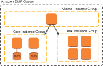

:::
::::

# AWS EMR

The central component of Amazon EMR is the **cluster**

* A collection of **Amazon Elastic Compute Cloud (Amazon EC2)** instances
* Each instance is called a **node**

The **node type ** identifies the role within the cluster

* **Master** node coordinates the distribution of data and tasks among other nodes
  * Every cluster has (at least) a master node
  * Always active
* **Core** node runs tasks and store data in the Hadoop Distributed File System (HDFS)
  * Multi-node clusters have at least one core node
  * Always active, contains the data node daemon
* **Task** node only runs tasks
  * Task nodes are optional
  * Decoupling processing and storage, we lose data locality

# AWS EMR

On-Demand Instance

* Pay for compute capacity by the hour (minimum of 60 seconds)
* No long-term commitments

Spot Instance

* Unused EC2 instance that is available for less than the on-demand price
* Hourly price is called *spot price*
  * Adjusted based on long-term supply and demand for spot instances
* Run the instance when capacity is available and price is below threshold
  * When data-center resources are low, spot instances are dropped
  * Mainly suitable for batch workloads

[https://aws.amazon.com/ec2/pricing/](https://aws.amazon.com/ec2/pricing/)

# AWS EMR

Spot Instance cost strategies

* *Capacity-optimized strategy*
* Allocated instances into the most available pools
* Look at real-time capacity data, predict which are the most available
* Works well for workloads such as big data and analytics
* Works well when we have high cost of interruption

*Lowest-price strategy*

* Allocates instances in pools with lowest price at time of fulfillment

# Creating the cluster

:::: {.columns}
::: {.column width=50%}


:::
::: {.column width=50%}

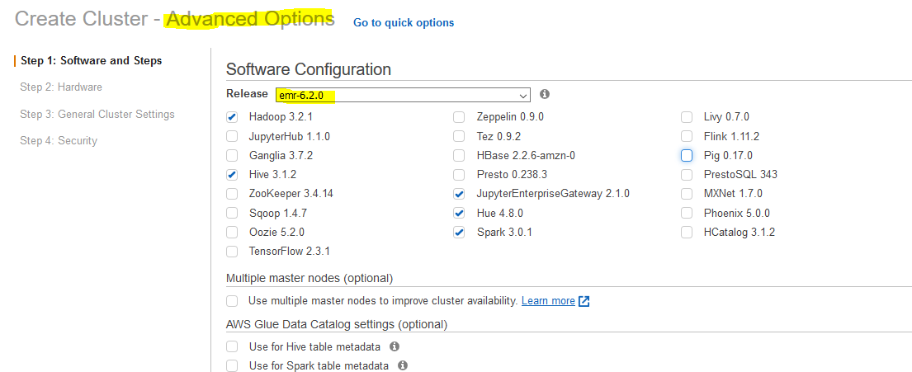

:::
::::

# Creating the cluster

Choose to launch **master**, **core**, or **task** on Spot Instances

* The **master** node controls the cluster
  * When terminated, the cluster ends
  * Use *spot instances* if you are running a cluster where sudden termination is acceptable
* **Core ** nodes process data and store information using HDFS
  * When terminated, data is lost
  * Use *spot instances* when partial HDFS data loss is tolerable
* **Task ** nodes process data but do not hold persistent data in HDFS
  * When terminated, computational capacity is lost
  * The effect of spot instances on the cluster is "minimal"

[https://docs.aws.amazon.com/emr/latest/ManagementGuide/emr-plan-instances-guidelines.html](https://docs.aws.amazon.com/emr/latest/ManagementGuide/emr-plan-instances-guidelines.html)

# Creating the cluster


# Creating the cluster

Amazon EMR provides two main file systems

* **HDFS** and **EMRFS**, specify which file system to use by the prefix
* hdfs://path (or just `path`)
  * HDFS is used by the master and core nodes
  * *AWS EBS volume storage is used for HDFS data*
  * Is fast, best used for caching the results produced by intermediate job-flow steps, *why?*
  * It’s ephemeral storage which is reclaimed when the cluster ends
* s3://DOC-EXAMPLE-BUCKET1/path (EMRFS)
  * An implementation of the Hadoop file system atop Amazon S3
  * We can avoid EBS storage

[https://docs.aws.amazon.com/emr/latest/ManagementGuide/emr-plan-storage.html](https://docs.aws.amazon.com/emr/latest/ManagementGuide/emr-plan-storage.html)

# Creating the cluster


# Creating the cluster


# Creating the cluster


# Creating the cluster


# Creating the cluster

Using CLI (command line interface)

```bash
aws emr create-cluster --auto-scaling-role EMR_AutoScaling_DefaultRole --termination-protected --applications Name=Hadoop Name=Hive Name=Hue Name=JupyterEnterpriseGateway Name=Spark --ebs-root-volume-size 10 --ec2-attributes '{"KeyName":"bigdata","InstanceProfile":"EMR_EC2_DefaultRole","SubnetId":"subnet-5fa2f912","EmrManagedSlaveSecurityGroup":"sg-07818b5690a50b3f1","EmrManagedMasterSecurityGroup":"sg-0e2f5550a2cb98f79"}' --service-role EMR_DefaultRole --enable-debugging --release-label emr-6.2.0 --log-uri 's3n://aws-logs-604905954159-us-east-1/elasticmapreduce/' --name 'BigData' --instance-groups '[{"InstanceCount":1,"BidPrice":"OnDemandPrice","EbsConfiguration":{"EbsBlockDeviceConfigs":[{"VolumeSpecification":{"SizeInGB":32,"VolumeType":"gp2"},"VolumesPerInstance":2}]},"InstanceGroupType":"MASTER","InstanceType":"m4.xlarge","Name":"Master - 1"},{"InstanceCount":1,"BidPrice":"OnDemandPrice","EbsConfiguration":{"EbsBlockDeviceConfigs":[{"VolumeSpecification":{"SizeInGB":32,"VolumeType":"gp2"},"VolumesPerInstance":2}]},"InstanceGroupType":"CORE","InstanceType":"m4.xlarge","Name":"Core - 2"}]' --scale-down-behavior TERMINATE_AT_TASK_COMPLETION --region us-east-1
```

# Cluster lifecycle

Creating a cluster (it takes ~10 minutes)

* A cluster cannot be stopped
* It can only be terminated

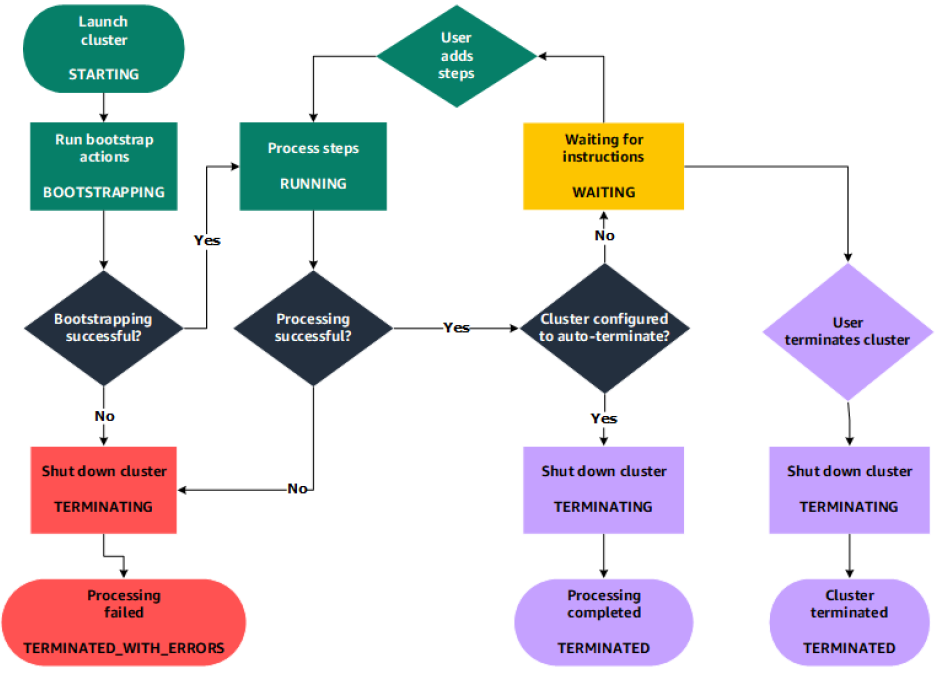

STARTING: EMR provisions EC2 instances for each required instance

* BOOTSTRAPPING: EMR runs actions that you specify on each instance
* E.g., install custom applications and perform customizations

Amazon EMR installs the native applications

* E.g., Hive, Hadoop, Spark, and so on

RUNNING: a step for the cluster is currently being run

* Cluster sequentially runs any steps that you specified when you created the cluster

WAITING: after steps run successfully

* TERMINATING: after manual shut down
* *Any data stored on the cluster is deleted*

A **step** is a user-defined unit of processing

* E.g., one algorithm that manipulates the data

Step states

* PENDING: The step is waiting to be run
* RUNNING: The step is currently running
* COMPLETED: The step completed successfully
* CANCELLED: The step was cancelled before running because an earlier step failed
* FAILED: The step failed while running

# Running the cluster

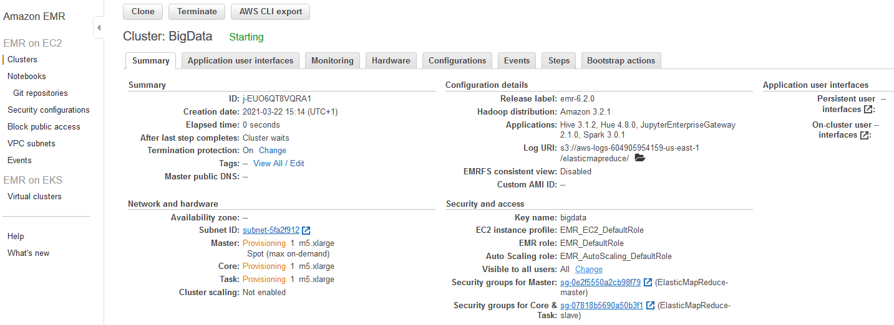


# Running a notebook


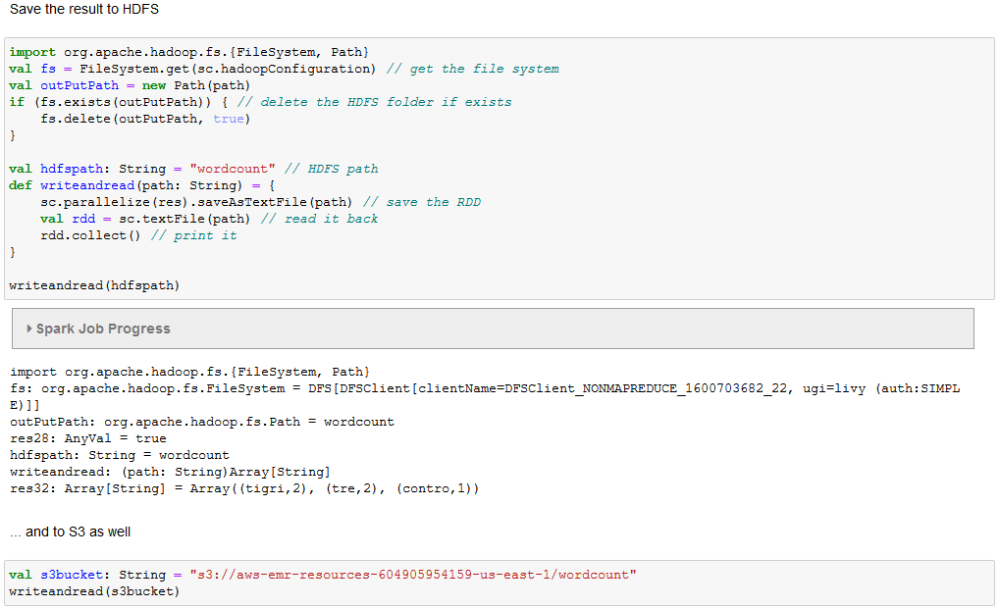

# Running a Spark Job

Connect using SSH

Install git

Clone & build the project

ssh -i ~/bigdata.pem [hadoop@ec2-54-242-176-32.compute-1.amazonaws.com](mailto:hadoop@ec2-54-242-176-32.compute-1.amazonaws.com)

sudo yum install git -y

git clone [https://github.com/w4bo/spark-word-count.git](https://github.com/w4bo/spark-word-count.git)

cd spark-word-count

./gradlew

spark-submit --class it.unibo.big.WordCount build/libs/WordCount-all.jar s3://aws-bucket-bigdata2021/inferno.txt

# Other services: HUE

Connecting to Hue

* I.e., connecting to any HTTP interface hosted on the master node of a cluster

To view the Hue web user interface

* Set Up an SSH Tunnel to the Master Node Using Dynamic Port Forwarding
* Type the following address in your browser to open the Hue web interface
  * [http://master-public-DNS:8888](http://master-public-dns:8888/)
  * Where master-public-DNS is the public DNS name of the master node
* If you are the administrator logging in for the first time
  * Enter a username and password to create your Hue superuser account
  * Otherwise, type your username and password and select Create account


# Set Up an SSH Tunnel


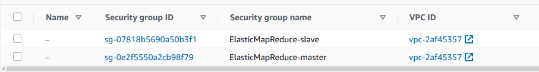


# Connect to HUE


# Connect using SSH


# 

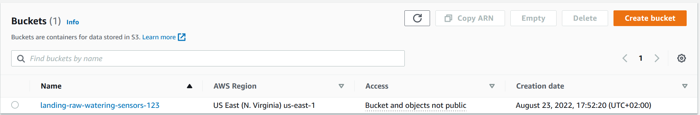

# -- newsection --

# Cluster migration - Based on a true story​

# Migration

Goals

* Evaluating the costs for a cloud/on-premises data platform
* Real-world case study
* Fill in this table

| Cost | On-premises | On cloud |
|:-: |:-: |:-: |
| Hardware |? |? |
| Software |? |? |

# Case study

Business intelligence group

# Migration

Spatial Cube (PostGIS)

Reference architecture

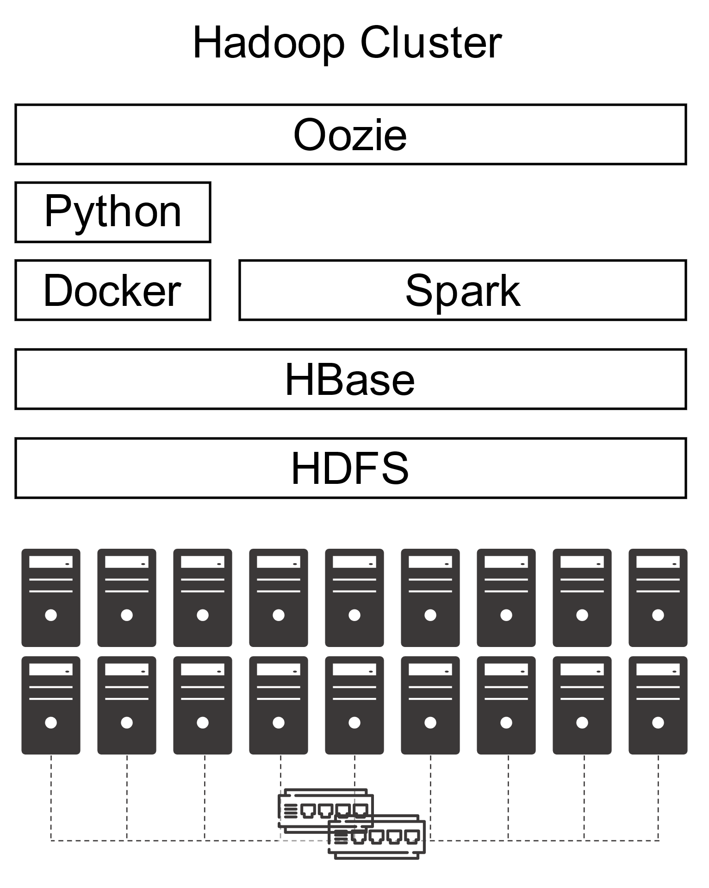

Mobile Interface

ODS (Hbase+PostGIS)

Integration processes

Loading processes

Notebook Interface

Data Lake (Hadoop)

Enrichment processes

Acquisition processes

*External sources*


Administrative

borders

Rural Land

register

Satelliteimages

On-the-field sensors

Reference architecture


Hardware

* Software
* "Classic" Hadoop stack

8 CPUs (144 total)

* - Intel(R) Core(TM) i7-8700 CPU @ 3.20GHz

32GB RAM (576GB total)

* - 2 x 16GB DIMM DDR4 2666 MHz

12TB HDD Disk (216TB total)

* - 3 x 4TB ST4000DM004-2CV1


lshw -short -C cpu

lshw -short -C memory

lshw -short -C disk

| SOLonprem | On-premises | On cloud |
|:-: |:-: |:-: |
| Hardware |? |? |
| Software |? |? |

**Hardware cost**:?

* Refer to [https://www.rect.coreto-europe.com/en/search.html?clearsearch=1](https://www.rect.coreto-europe.com/en/search.html?clearsearch=1)

# On-premises

| SOLonprem | On-premises | On cloud |
|:-: |:-: |:-: |
| Hardware | 10602€/year |? |
| Software |? |? |

**Hardware cost**(up to Mar 05, 2021): * 1767€ x 18 = 31806€

* Amortization over 3 years (i.e., *10602€/year*)

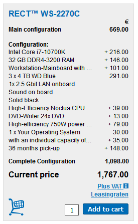

[https://www.rect.coreto-europe.com/en](https://www.rect.coreto-europe.com/en) (Accessed 2021-08-01)

| SOLonprem | On-premises | On cloud |
|:-: |:-: |:-: |
| Hardware | 10602€/year |? |
| Software |? |? |

**Software cost**:?

| SOLonprem | On-premises | On cloud |
|:-: |:-: |:-: |
| Hardware | 10602€/year |? |
| Software | 0€ |? |

**Software cost** (up to 2020): 0€*

* Free Cloudera Management System
* No software licensing (for research purpose)

| SOLonprem | On-premises | On cloud |
|:-: |:-: |:-: |
| Hardware | 10602€/year |? |
| Software | 180000€/year |? |

**Software cost**(up to Mar 05, 2021): 10000€/year x 18 = 180000€/year*

* Cloudera is no more free, 10K€ per node
* [https://www.cloudera.com/products/pricing.html\#private-cloud-services](https://www.cloudera.com/products/pricing.html#private-cloud-services)
* [https://www.cloudera.com/products/pricing/product-features.html](https://www.cloudera.com/products/pricing/product-features.html)
* No license for research purpose

*“Houston we’ve had a problem!”*

* We cannot update/extend the cluster anymore
* What about migrating to the cloud? (we only consider AWS)

# Migration

Moving a Hadoop cluster to the cloud (we only consider AWS)

* AWS price calculator [https://calculator.aws/\#/estimate](https://calculator.aws/#/estimate)

How do we start?

* We have already defined the hardware and the software stack
* Start with coarse tuning, identify the dominating costs first
  * Is it computing, storage, or processing?
* Identify a suitable budget, implement, refine later
  * Wrong refinements can do a lot of damage

# On cloud v1

| SOLcloud1 | On-premises | On cloud |
|:-: |:-: |:-: |
| Hardware | 10602€/year |? |
| Software | 180000€/year |? |

Migrating the cluster as-is:?

* Hint: add 18 EC2 instances satisfying the hardware requirements

| SOLcloud1 | On-premises | On cloud |
|:-: |:-: |:-: |
| Hardware | 10602€/year | 162000$/year |
| Software | 180000€/year |? |

SOLcloud1 migrating the cluster as-is: *13500$/month = 162000$/year*

* 18 EC2 instances (t4g.2xlarge) with 12TB EBS storage each machine
* Still, we have no software configuration

Prices change over the year

* In 2022, 162000$/year
* In 2023, 146000$/year


[https://calculator.aws/\#/estimate?id=7757afffccc3cafdcfdeb212b74623ef02ed5a36](https://calculator.aws/#/estimate?id=7757afffccc3cafdcfdeb212b74623ef02ed5a36)

# Migration

Pay attention to the region

* Different regions, different prices
* Different regions, different services
* Remember the GDPR and data locality


It makes no sense to move the cluster as-is

* More machines ensure better (on-prem) scalability but higher costs

How do we proceed with the migration?

* We need minimum software requirements
* Try to achieve the smallest migration impact
  * Find the most similar cloud-based solution to a Hadoop cluster
  * Rethink applications (later) when you got the know-how
* Identify a suitable budget, implement, refine later
  * Wrong refinements can do a lot of damage

**HDFS**

* How much durability do we need?
  * HP0: three replicas (we stick to this)
  * HP1: decrease replicas for cold data
  * HP2: move cold data to glacier or delete id
  * ...

**HBase** has marginal effects on the pricing (100GB << 50TB)

* For simplicity, we can omit it

**Overall**: 50TB storage/year


Processing takes place each time that ESA provides a satellite image

* Some days no images are available
* Some days up to 10 images are available
* Spark jobs are always executed with the same parameters

**Image processing**

* 4 machines, 2 cores, 10GB RAM at least

**Weather processing** is negligible

Image processing

4 Executors (2 cores and 10GB RAM each)

Driver (2 cores and 20GB RAM)

: 15m/core (2h total)

Weather processing

2 Executors (1 core and 500MB RAM each)

Driver (1 core and 1GB RAM)

: 0.5 m/core (1m total)

# On cloud v2

|  | On-premises | On cloud |
|:-: |:-: |:-: |
| Hardware | 2356€/year | 38000$/year |
| Software | 100000€/year |? |

Assuming 1 Executor = 1 Machine

* Compare 4 machines on-premises vs on cloud

On-premises

* 4 machines: 10602€/year / 18 machines x 4 machines = *2356€/year*
* Cloudera requires at least 10 nodes: *100000€/year*

AWS

* 4 EC2 instances: 162000$/year / 18 machines x 4 machines = *36000$/year*
  * Plus the resources for master services = *2000$/year*
* Problems
  * Still no software stack
  * A lot of storage cost
  * Machines are up-and-running even when no computation is necessary (just to persist data)

AWS

* Still, we have no software stack configuration
* Which is the major cost?

AWS

* Still, we have no software stack configuration
* Which is the major cost?


# Migration

S3 standard

S3 Infrequent Access


*AWS Storage*

* HDFS on EC2
* Heavy price
* Machine must be always on to guarantee data persistency
* Data locality

S3

* Much cheaper
* Does not require machines for data storage
* Data locality is lost


|  | On-premises | On cloud |
|:-: |:-: |:-: |
| Hardware | 2356€/year |? |
| Software | 100000€/year |? |

Migrating cluster to EMR: *?*

* Given the software requirements, we need
* 1 x Master Node (to manage the cluster)1 x Core node (with HDFS/EBS)
* 4 x Task Nodes (to compute)

Image processing

4 Executors (2 cores and 10GB RAM each)

Driver (2 cores and 20GB RAM)

: 15m/core (2h total)

Weather processing

2 Executors (1 core and 500MB RAM each)

: 0.5 m/core (1m total)

Driver (1 core and 1GB RAM)

# On cloud v3

|  | On-premises | On cloud |
|:-: |:-: |:-: |
| Hardware | 2356€/year | 14710€/year |
| Software | 100000€/year |? |

Migrating cluster to EMR: *14710€/year*

* S3 Infrequent Access storage (50 TB per month): 640€
* 1 x Master EMR nodes, EC2 (m4.xlarge), Utilization (75 h/month): 4.5€
  * 75 h/month = 15min/task x 10task/day x 30day/month / 60min/hour
* 1 x Core EMR nodes, EC2 (m4.xlarge), Utilization (75 h/month): 4.5€
* 4 x Task EMR nodes, EC2 (m4.4xlarge), Utilization (75 h/month): 72€
* 4 x EC2 *on demand (task node): 174.83€*
  * Storage amount (30 GB)
  * Workload (Daily, Duration of peak: 0 Hr 15 Min)
  * Instance type (m4.xlarge)
* 2 x EC2 on demand (master and core nodes): 330€
  * Storage amount (30 GB)
  * Instance type (m4.xlarge)

|  | On-premises | On cloud |
|:-: |:-: |:-: |
| Hardware | 2356€/year | 13445€/year |
| Software | 100000€/year |? |

Migrating cluster to EMR: *13445€/year*

* S3 Infrequent Access storage (50 TB per month): 640€
* 1 x Master EMR nodes, EC2 (m4.xlarge), Utilization (75 h/month): 4.5€
  * 75 h/month = 15min/task x 10task/day x 30day/month / 60min/hour
* 1 x Core EMR nodes, EC2 (m4.xlarge), Utilization (75 h/month): 4.5€
* 4 x Task EMR nodes, EC2 (m4.4xlarge), Utilization (75 h/month): 72€
* 4 x EC2 *spot (task node): 69.55€*
  * Storage amount (30 GB)
  * Workload (Daily, Duration of peak: 0 Hr 15 Min)
  * Instance type (m4.xlarge)
* 2 x EC2 on demand (master and core nodes): 330€
  * Storage amount (30 GB)
  * Instance type (m4.xlarge)

 *[https://calculator.aws/\#/estimate?id=c3780b12bb43b593d05def5a1d5218d9764b8a65](https://calculator.aws/#/estimate?id=c3780b12bb43b593d05def5a1d5218d9764b8a65)* 

# Migration

Summing up (cloud options)

| Machine uptime | Storage | Software | Feasible? | Cost per year |
|:-: |:-: |:-: |:-: |:-: |
| Constant | EC2 | Manual | YES: but high storage cost | ~36K€ |
| Constant | EC2 | EMR | YES: but high storage cost | ~37K€ |
| Constant | S3 | Manual | YES: but still manual provisioning | ~17K€ |
| Constant | S3 | EMR | YES | ~18K€ |
| Pay-per-use | EC2 | Manual | NO: pay-per-use + EC2 = Data unpersisted | - |
| Pay-per-use | EC2 | EMR | NO: pay-per-use + EC2 = Data unpersisted | - |
| Pay-per-use | S3 | Manual | ISH: repetitive manual provisioning | - |
| Pay-per-use | S3 | EMR | YES | ~14K€ |

Summing up

* We estimated the cluster costs
  * On-premises solution with 18 machines: no go
  * Cloud solution with 18 EC2 instances: no go
* We reduced the solution based on software requirements
  * On-premises solution with 4 machines: no go
  * Cloud solution with 4 EC2 instances: no go, we miss the software configuration
* We moved the cluster to AWS EMR + spot instances + S3 storage

Can we do better?

* Pick ad-hoc cloud services (AWS Lambda e AWS Batch)
* ... to re-think the applications (food for thoughts)

# Case study

WeLASER

# The WeLASER project

**Project description**

* *The increased use of pesticides and * *fertilisers* * damages the environment, destroys non-target plants and beneficial insects for the soil and harms human and animal health. Most seeds develop herbicide-resistant properties, rendering pesticides ineffective. Mechanical automatic systems that are studied as alternatives to pesticides deteriorate soil features, damage beneficial soil organisms and offer limited results for in-row weeding. The EU-funded WeLASER project will develop a non-chemical solution for weed management based on pioneering technology consisting of the application of lethal doses of energy on the weed meristems through a high-power laser source. An AI-vision system separates crops from weeds, identifying the weed meristems and pointing the laser at them. A smart controller based on IoT and cloud computing techniques coordinates the system, which is * *transfered* * all over the field by an autonomous vehicle.*


[https://cordis.europa.eu/project/id/101000256](https://cordis.europa.eu/project/id/101000256) (accessed 2020-08-01)

Which requirements do you foresee?

* Can we define a tentative (service) architecture for the WeLASER project?

Assumptions

* Do not consider the collection of weed/crop images & training/deploying of the CV algorithm


[https://cordis.europa.eu/project/id/101000256](https://cordis.europa.eu/project/id/101000256) (accessed 2020-08-01)

# Data sources

[https://docs.google.com/spreadsheets/d/17zEr62CzyqeIy0vU-DcjEUoxf6bMd3ziLSSeIXvk4Lg/edit?usp=sharing](https://docs.google.com/spreadsheets/d/17zEr62CzyqeIy0vU-DcjEUoxf6bMd3ziLSSeIXvk4Lg/edit?usp=sharing)

# Workload

Nothing special

* Every night compute aggregated indexes on the collected data (2h/day)

On-premises (HDFS cluster)

* How many machines do we need?
* With which resources?

# On-premises

|  | On-premises | On cloud |
|:-: |:-: |:-: |
| Hardware | 2900€/year |? |
| Software | 40000€/year |? |

On-premises

* How many machines do we need?
  * *4*: *1 master node* + *3 HDFS data nodes*
* With which resources?
  * Assuming a HDFS replication factor of 3, we need at least 1TB of disk overall (not that much)
  * Think bigger: at least 8 cores, 64GB RAM, 500GB SSD + 4TB HDD, no GPU
* 8700€ / 3 years = 2900€


[https://www.rect.coreto-europe.com/en](https://www.rect.coreto-europe.com/en) (accessed 2022-09-01)[https://www.cloudera.com/products/pricing.html](https://www.cloudera.com/products/pricing.html) (accessed 2022-09-01)

# On cloud v1

|  | On-premises | On cloud |
|:-: |:-: |:-: |
| Hardware | 2900€/year | ~40000$/year |
| Software | 40000€/year |? |

Moving the Hadoop cluster as IAAS

* EC2
* Quantity (4), Pricing strategy (EC2 Instance Savings Plans 3 Year No Upfront), *Storage amount (4 TB), * Instance type (r6g.2xlarge)

EMR

* Number of master EMR nodes (1), EC2 instance (r5.2xlarge), Utilization (100 %Utilized/Month) Number of core EMR nodes (3), EC2 instance (r5d.2xlarge), *Utilization (100 %Utilized/Month)*

*MKS (KAFKA)*

* Storage per Broker (10 GB), Number of Kafka broker nodes (3), Compute Family (m5.2xlarge)


[https://calculator.aws/\#/estimate?id=05965ca7de23fd9e7d2ab2cd0175fe8c01822c9c](https://calculator.aws/#/estimate?id=05965ca7de23fd9e7d2ab2cd0175fe8c01822c9c) (accessed 2022-09-01)

# On cloud v2

|  | On-premises | On cloud |
|:-: |:-: |:-: |
| Hardware | 2900€/year | ~4000$/year |
| Software | 40000€/year |? |

Moving the Hadoop cluster as PAAS

* EC2
* Quantity (4), Pricing strategy (*On-Demand Instances*), Storage amount (30 GB), Instance type (r6g.2xlarge)

EMR

* Number of master EMR nodes (1), EC2 instance (r5.2xlarge), Utilization (2 Hours/Day) Number of core EMR nodes (3), EC2 instance (r5d.2xlarge), *Utilization (2 Hours/Day)*

*S3*

* Standard storage (60 GB per month)

*Kinesis*

* Days for data retention (1 days), Records (100 per second), Consumer Applications (3)

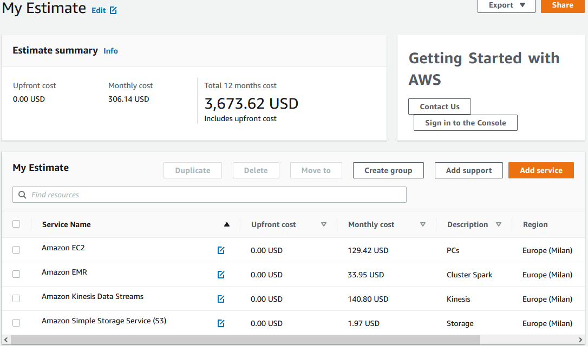

[https://calculator.aws/\#/estimate?id=53f60ff0412a18877dc8e1274f7d9875aa3bf665](https://calculator.aws/#/estimate?id=53f60ff0412a18877dc8e1274f7d9875aa3bf665) (accessed 2022-09-01)

# Cost vs price

How would you evaluate the cost and the price?

*Price* is the amount a customer is willing to pay for a product or service

* *Cost* is the expense incurred for creating a product or service
* Hardware
* Development
* Maintenance

*Profit* is the difference between price paid and costs incurred is profit

* If a customer pays $10 for a product that costs $6 to make and sell, the company earns $4

# -- newsection --

# Data pipelines on cloud (Streaming)

# 

Supporting services

Serve (deciding)

BI tools (e.g., Tableau)

Analytics (analyzing)

Networking, etc.

Machine learning

Ingestion (acquiring)

# Reference scenario: batch vs stream

# Batch vs. Streaming systems

What is a bulk processing system?

* High latency
* Exact results
* Process massive data at once
  * ... is this true?

What is a streaming system?

* Low latency
* Approximate result
  * ... is this true?
* Process data item by data item
  * ... is this true?

What is a bulk processing system?

* An engine capable to handle processing on **bounded** datasets

What is a streaming system?

* An engine capable to handle processing on **unbounded** datasets
* Streaming is a superset of batch processing

Akidau, Tyler, Slava Chernyak, and Reuven Lax.  *Streaming systems: the what, where, when, and how of large-scale data processing* . " O'Reilly Media, Inc.", 2018.

# Reference scenario: batch vs stream

|  | Batch data processing | Stream data processing |
|:-: |:-: |:-: |
| Data scope | Queries or processing over all or most of the data in the dataset | Queries or processing over data within a rolling time window, or on just the most recent data record |
| Data size | Large batches of data | Individual records or micro batches consisting of a few records |
| Latency | Minutes to hours | Seconds or milliseconds |
| Analysis | Complex analytics | Simple response functions, aggregates, and rolling metrics |

# Ingestion: batch

**Goal**: moving data to the cloud

* Moving data to the cloud
* *80TB* of data to move,
* *1Gbps* connection to the internet

How many *days*?

* *80000GB* / (*1Gbps / 8*) /  *60 / 60 / 24 * ~= a week without internet

Batch/Bulk: move data from on-premises storage

* Workflow
* Receive shipment
* Set up
* Transfer data
* Ship back (shipping carrier)

# Ingestion: batch (AWS)

AWS Snowball

* 50TB (North America only) and 80TB versions
* Not rack-mountable

Throughput

* 1 Gbps or 10 Gbps using an RJ-45 connection
* 10 Gbps using a fiber optic connection


[https://aws.amazon.com/snowball/](https://aws.amazon.com/snowball/)


# AWS Snowmobile

What if we have exabyte of data?

Value Metric

103 KB (kilobyte)

106 MB (megabyte)

109 GB (gigabyte)

1012 TB (terabyte)

1015 PB (petabyte)

1018 EB (exabyte)

1021 ZB (zettabyte)

1024 YB (yottabyte)

[https://youtu.be/8vQmTZTq7nw?t=45](https://youtu.be/8vQmTZTq7nw?t=45) (2022-11-14)

# Ingestion: stream

* Data (often) flows in both directions, storage systems are both sources and destinations for data transformations
* Two pipelines per application (data in/out)
  * Worst case (full connectivity): O(N2)


Kreps, Jay.  *I heart logs: Event data, stream processing, and data integration* . " O'Reilly Media, Inc.", 2014.

**Stream**: real-time streaming data

* **Event**: anything that we can observe occurring at a particular point in time

**Continuous streaming**

* Illimited succession of individual events
* Ordered by the point in time at which each event occurred

**Publish/subscribe (pub/sub)**: a way of communicating messages

* *Senders* publish messages associated with one or more **topics**
* *Receivers* subscribe to specific topics, receive all messages with that topic
* *Messages* are events


[https://www.manning.com/books/event-streams-in-action](https://www.manning.com/books/event-streams-in-action)

Log

* Append-only data structure
* Each application only knows about the log, it ignores the details of the source
  * E.g., a data consumer is not concerned about whether the data came from a relational database or some application

The log acts as a messaging system with durability guarantees and ordering semantics


Kreps, Jay.  *I heart logs: Event data, stream processing, and data integration* . " O'Reilly Media, Inc.", 2014.

General idea:

* Collect events from many source systems
* Store them in a unified log
* Enable applications to operate on these event streams

**Unified log**

* *Unified*, *append-only*, *ordered*, *distributed* log that allows the centralization of event streams


**Unified**: a single log in a company with applications sending/reading events

* Log serves as central data backbone
  * It can contain many distinct continuous streams of events
  * Not all events are sent to the same event stream

**Append-only**: new events are appended to the unified log

* Existing events are never updated in place
  * If read the event \#10, never look at events 1 through 10 again
* Events are automatically deleted from the unified log when they age
  * E.g., automatically remove events after 7 days

**Distributed**: the unified log lives across a cluster of machines

* Optionally divide events into shards (i.e., partitions)Still, the log is unified since we have a single (conceptual) log

Distribution ensures

* Scalability: work with streams larger than the capacity of single machines
* Durability: replicate all events within the cluster to overcome data loss
* Using a log as a universal integration mechanism is never going to be more than an elegant fantasy if we can’t build a log that is fast, cheap, and scalable


**Ordered**: events in a shard have a sequential IDs (unique in a shard)

* Local ordering keeps things much simpler than global ordering
* Applications maintain their own cursor for each shard


Lamport, Leslie. "Time, clocks, and the ordering of events in a distributed system."  *Concurrency: the Works of Leslie * *Lamport* . 2019. 179-196.

Two types of processing

* **Single-event:** a single event produces zero or more events
  * Validating “Does this event contain all the required fields?”
  * Enriching “Where is this IP address located?”
  * Filtering “Is this error critical?”
* **Multiple-event:** multiple events collectively produce zero or more events
  * Aggregating, functions such as minimum, maximum, sum
  * Pattern matching, looking for patterns or co-occurrence
  * Reordering events based on a sort key


Why not communicating directly using messaging protocols?

* A log enables
* Multi-subscriber: each data item is available to any processor that wants it
* Order: maintained in the processing done by each consumer of data
* Buffering and isolation to the individual processes
  * E.g., a that processor produces faster than its downstream consumer can keep up
* Reprocessing, maintaining state, etc.

Indeed, logs are common:

* MapReduce workflows use files to checkpoint and share their intermediate results
* SQL processing pipelines create intermediate or temporary tables

# Ingestion: stream (AWS)

Amazon Kinesis Data Streams

* Created and provisioned by shard
  * Each shard provides 1 MBps and 1000 data puts per second
* A data record consists of
  * User-supplied partition key to balance records across shards
  * Incremental sequence number added by the shard
  * A data blob
* Consumers get records by shard
  * Records are sorted by partition key and sequence number
  * Ordering is not guaranteed across shards
* Records are retained for 7 days at maximum


[https://docs.aws.amazon.com/streams/latest/dev/key-concepts.html](https://docs.aws.amazon.com/streams/latest/dev/key-concepts.html)

Re-sharding (i.e., scaling)

* Split a shard into two, or merge two shards
* Users must scale shards up and down manually
  * Monitor usage with Amazon CloudWatch and modify scale as needed
* Avoid shard management by using Kinesis Data Firehose

Kinesis is a regional service, with streams scoped to specific regions

* All ingested data must travel to the region in which the stream is defined

Costs

* Priced by shard hour, data volume, and data retention period
* Pay for resources you provision (even if not used)

[https://aws.amazon.com/cloudwatch/](https://aws.amazon.com/cloudwatch/)[https://aws.amazon.com/kinesis/data-firehose](https://aws.amazon.com/kinesis/data-firehose)

# Ingestion: stream

| Feature | AWS Kinesis | Google Pub/Sub |
|:-: |:-: |:-: |
| Unit of deployment | Stream | Topic |
| Unit of provisioning | Shard | N/A (fully managed) |
| Data unit | Record | Message |
| Data producer/destination | Producer/Consumer | Publisher/Subscriber |
| Data partitioning | User-supplied partition key | N/A (fully managed) |
| Retention period | Up to 7 days | Up to 7 days |
| Pricing | Per shard-hour, PUT payload units,<br />and optional data retention | Message ingestion and delivery,<br />and optional message retention |

# 

Supporting services

Serve (deciding)

BI tools (e.g., Tableau)

Analytics (analyzing)

Networking, etc.

Machine learning

Ingestion (acquiring)

# Serverless computing/processing

AWS Lambda: compose code functions in a loose orchestration

* Build modular back-end systems
* Event-driven and push-based pipelines

With Lambda, you are responsible only for your code (Lambda function)

* Lambda manages the compute fleet that offers a balance of memory and CPU
* Lambda performs operational and administrative activities on your behalf
  * Provisioning capacity, monitoring fleet health, applying security patches, etc.


# Serverless computing (AWS Lambda)

AWS Lambda

* A Lambda function is a granular service
* The Lambda runtime invokes a lambda function multiple times in parallel
* Compute service that executes code written in JavaScript/Python/C\#/Java
  * Elastic Compute Cloud (EC2) servers run the code (e.g., a Linux server)
* A function is `code + configuration + dependencies`
  * Source code (JARs or DLLs) is zipped up and deployed to a container
* Invocation supports push/pull events


# Serverless computing (FaaS)

FaaS: write single-purpose stateless functions

* Keep the single responsibility principle in mind
* A function that does just one thing is more testable and robust
* A function with a well-defined interface is also more likely to be reused
* Code should be created in a stateless style
  * Statelessness allows scalability
  * Local resources or processes will not survive along sessions
* Functions that terminate sooner are cheaper
  * E.g., pricing is based on \#requests, execution time, and allocated memory

# Patterns for data pipelines

Patterns are architectural solutions to problems in software design

* A (design) pattern is a general, best-practice reusable solution to a commonly occurring problem within a given context in software design
* It is a template for how to solve a problem in many different situations

Patterns for serverless data pipelines

  * Command pattern
  * Messaging pattern
  * Priority queue pattern
  * Pipes and filters pattern


[https://www.manning.com/books/aws-lambda-in-action](https://www.manning.com/books/aws-lambda-in-action)

# Command pattern

Command pattern

* A behavioral design pattern in which an object is used to encapsulate the information needed to perform an action or trigger an event

Encapsulate a request as an object

* Issue requests to objects without knowing anything about the operation being requested or the receiver


[https://aws.amazon.com/api-gateway](https://aws.amazon.com/api-gateway)

# Pipes and filters pattern

Decompose a complex processing task into a sequence of manageable services

* Components designed to transform data are referred to as filters
* Connectors that pass data between components are referred to as pipes

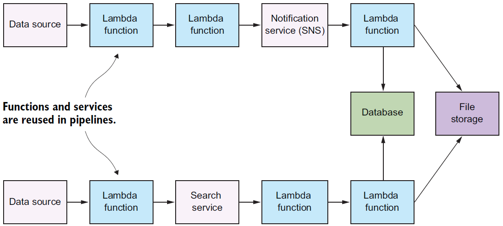

# Messaging pattern

Messaging pattern

* Describes how two different parts of a message passing system connect and communicate with each other

Decouple services from direct dependence and allow storage of events in a queue

* Reliability: if the consuming service goes offline, messages are retained in the queue and can still be processed
* A message queue can have a single sender/receiver or multiple senders/receivers

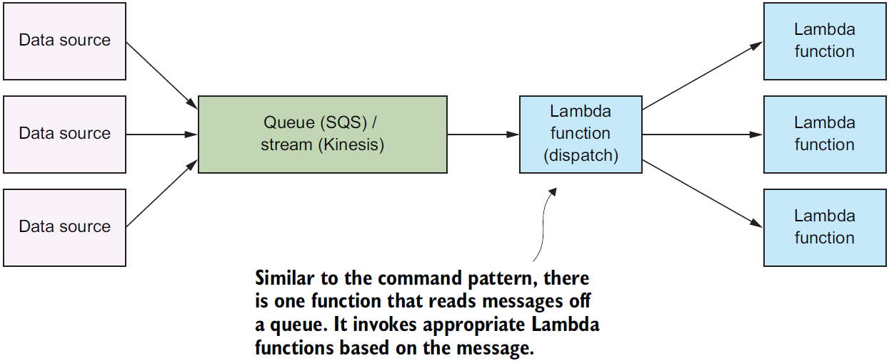

# Priority queue pattern

Decouple and prioritize requests sent to services

* Requests with a higher priority are received and processed more quickly than those with a lower priority
* Useful in applications that offer different service level guarantees

Control how and when messages are dealt with

* Different queues, topics, or streams to feed messages to your functions
* High-priority messages go through expensive services with more capacity


# That’s all, folks!

# Feedbacks?

# Exams

# -- newsection --

# Hands on AWS

# A tentative organization

Supporting services

Serve (deciding)

BI tools (e.g., Tableau)

Analytics (analyzing)

Networking, etc.

Machine learning

Ingestion (acquiring)

# Identity and Access Management

Identity and Access Management (IAM)

* Web service that controls fine-grained access to AWS resources
* IAM controls who is authenticated and authorized to use resources

IAM user

* Unique identity recognized by AWS services and applications
* Similar to user in an operating system like Windows or UNIX

IAM role

* Set of policies for making AWS service requests
* Trusted entities (e.g., such as IAM users) assume roles
  * Delegate access with defined permissions to trusted entities
  * There is no limit to the number of IAM roles a user can assume

User vs role

* User has permanent long-term credentials and is used to directly interact with AWS services
* Role does not have credentials and cannot make direct requests to AWS services
* Roles are assumed by authorized entities, such as IAM users

Alice (i.e., an IAM user) is a firewoman

* She is the same person with or without her turnout gear
* As a firewoman (i.e., a role)
  * If she speeds to a house fire and passes a police officer, he isn't going to give her a ticket
  * In her role as a *firewoman*, she is allowed to speed to the house fire
* As a private citizen (i.e., another role)
  * When she is off duty, if she speeds past that same police officer, he's going to give her a ticket
  * In her role as a *private citizen*, she is not allowed to speed

# AWS

Amazon Web Services (AWS) is a public-cloud platform

* Services can be accessed in multiple ways
* Web GUI: intuitive point and click access without any programming
  * Intuitive interfaces is part of the attraction of cloud services
  * Tedious if the same actions must be performed repeatedly
* (REST) Application programming interface (API)
  * Permits requests to be transmitted via Hypertext Transfer Protocol (HTTPS)
* Software development kits (SDKs) that you install on your computer
  * Access from programming languages such as Python, Java, etc.

# AWS Web console

We use the AWS Educate program

* Login with the provided account
* You got 150$ to work on AWS services
* Provisioned services charge even if not used


[https://www.awseducate.com/signin/SiteLogin](https://www.awseducate.com/signin/SiteLogin)


# AWS CLI

CLI interface

* Necessary to install the CLI (version 2)
* See [https://docs.aws.amazon.com/cli/latest/userguide/install-cliv2.html](https://docs.aws.amazon.com/cli/latest/userguide/install-cliv2.html)

Synopsis

********

aws [options] \<command> \<subcommand> [parameters]

Description

***********

A unified tool to manage your AWS services.

[https://docs.aws.amazon.com/cli/latest/userguide/install-cliv2-linux.html](https://docs.aws.amazon.com/cli/latest/userguide/install-cliv2-linux.html)


CLI needs credentials to work

* Go back to AWS Educate
* Click on “Account Details”
* Copy the content into the file ~/.aws/credentials
* Henceforth, we assume that you have set up the credentials file
* Credentials expire after some time; you need a manually refresh


Run `aws configure`

* Confirm AWS Access Key ID (press enter)
* Confirm AWS Secret Access Key (press enter)
* Set Default region name to `us-east-1`
* Set Default output format to `json`

It is also possible to configure an AWS profile

* A (named) profile is a collection of settings and credentials
* If profile is specified, its settings and credentials are used to run a command
* When no profile is explicitly referenced, use `default`
  * We stick to `default`

# Object storage: S3

Create S3 bucket, the following rules apply for naming buckets

* Must be between 3 and 63 characters long
* Can consist only of lowercase letters, numbers, dots (.), and hyphens (-)
* Must be unique within a partition (i.e., a group of regions)

$ git clone [https://github.com/w4bo/bigdata-aws/](https://github.com/w4bo/bigdata-aws/)

$ cd bigdata-aws/lab01-lambda

$ aws s3api create-bucket --bucket aws-bucket-bigdata2021

$ aws s3 cp datasets/inferno.txt s3://aws-bucket-bigdata2021/inferno.txt

$ aws s3api list-objects --bucket aws-bucket-bigdata2021

[https://s3.console.aws.amazon.com/s3/home?region=us-east-1\#](https://s3.console.aws.amazon.com/s3/home?region=us-east-1)

# -- newsection --

# Data pipelines on AWS Lambda

# Requirements

To start this lecture, you need to

* Activate your AWS Educate account
* Either
  * Install the necessary software
    * git
    * IntelliJ IDEA (with AWS Toolkit and Scala plugins)
    * python
    * java 1.8
    * Docker
    * AWS CLI, AWS SAM CLI
  * Be able to download and run the VM

# AWS SAM CLI

Serverless Application Model is a framework to build serverless applications

* A serverless application is a combination of Lambda functions, event sources, etc.
* Install AWS SAM CLI (on Linux)

sudo group add docker

sudo usermod –aG docker $USER

newgrp docker

sudo chmod 666 /var/run/docker.sock

wget [https://github.com/aws/aws-sam-cli/releases/latest/download/aws-sam-cli-linux-x86*64.zip](https://github.com/aws/aws-sam-cli/releases/latest/download/aws-sam-cli-linux-x86*64.zip)

unzip aws-sam-cli-linux-x86*64.zip -d sam-installation

sudo ./sam-installation/install

sam --version

[https://docs.aws.amazon.com/serverless-application-model/latest/developerguide/serverless-sam-cli-install.html](https://docs.aws.amazon.com/serverless-application-model/latest/developerguide/serverless-sam-cli-install.html)

# AWS services

AWS Educate (and AWS console)

* [https://aws.amazon.com/it/education/awseducate/](https://aws.amazon.com/it/education/awseducate/)
* [https://console.aws.amazon.com/console/home?region=us-east-1](https://console.aws.amazon.com/console/home?region=us-east-1)

IAM (authentication)

* [https://docs.aws.amazon.com/IAM/latest/UserGuide/iam-ug.pdf](https://docs.aws.amazon.com/IAM/latest/UserGuide/iam-ug.pdf)

SDK (software API)

* [https://docs.aws.amazon.com/sdk-for-java/latest/developer-guide/home.html](https://docs.aws.amazon.com/sdk-for-java/latest/developer-guide/home.html)

Lambda (serverless computing and processing)

* [https://docs.aws.amazon.com/lambda/latest/dg/getting-started.html](https://docs.aws.amazon.com/lambda/latest/dg/getting-started.html)
* [https://console.aws.amazon.com/lambda/home?region=us-east-1\#/functions](https://console.aws.amazon.com/lambda/home?region=us-east-1#/functions)

DynamoDB (key-value database)

* [https://docs.aws.amazon.com/amazondynamodb/latest/developerguide/Introduction](https://docs.aws.amazon.com/amazondynamodb/latest/developerguide/Introduction)

S3 (object storage)

* [https://s3.console.aws.amazon.com/s3/home?region=us-east-1](https://s3.console.aws.amazon.com/s3/home?region=us-east-1)

# Case study

Given a dataset of sales per customer

find the products frequently bought together

Dataset sample

%%%%%%%%%%%%%%

[ { customerName: Alice, products: [Pizza, Beer, Diaper] },

{ customerName: Bob, products: [Pizza, Beer, Diaper] },

{ customerName: Charlie, products: [Pizza, Cola] } ]

The pipeline involves a single transformation

* A classic mining problem, which one?

# Frequent itemset mining

Dataset sample

%%%%%%%%%%%%%%

[[Pizza, Beer, Diaper],

[Pizza, Beer, Diaper],

[Pizza, Cola]]

Find sets of items (i.e., itemsets) frequently appearing together

* **Item**: a product
* **Itemset**: a set of products
* **Frequently**: support above threshold
* **Support**: number of clients buying a set of products

Complexity: O(2|items|)

{Pizza,Diaper,Beer}

# Case study

Processed dataset sample

%%%%%%%%%%%%%%

[[Pizza, Beer, Diaper],

[Pizza, Beer, Diaper],

[Pizza, Cola]]

Raw dataset sample

%%%%%%%%%%%%%%

[ { customerName: Alice, products: [Pizza, Beer, Diaper] },

{ customerName: Bob, products: [Pizza, Beer, Diaper] },

{ customerName: Charlie, products: [Pizza, Cola] } ]

# Reference pipeline

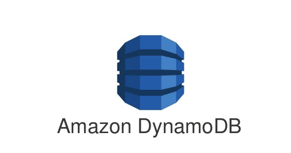


# NOSQL storage: DynamoDB

Basic DynamoDB components: tables and items

* **Tables**, collection of (data) items

**Items**, a group of attributes that is uniquely identifiable

* Each table contains zero or more items
  * No limit to the number of items you can store in a table
* Each item in the table has a unique identifier, or primary key
* E.g., in the table `people`, each item represents a `person`
  * The primary key consists of one attribute (`fiscalCode`)

Attributes

* A data element that is not broken down any further
  * E.g., an item in the `people` table contains attributes `fiscalCode` and `lastName`
* Most of the attributes are scalar (have only one value)
* Some of the items have a nested attribute (`address`) up to 32 levels deep

Schemaless

* Other than the primary key, a table is schemaless
  * Neither the attributes nor their data types need to be defined beforehand
  * Each item can have its own distinct attributes

Primary Key

* To create a table, you must specify the primary key of the table
* No two items can have the same key

Two types of primary keys

* Partition key: a simple primary key composed of one attribute (partition key)
  * Keys are inputs to an internal hash function
  * The hash function determines the physical partition in which the item will be stored
  * E.g., access any item in the `people` table directly by providing the `fiscalCode`
* Composite primary key: partition key and sort key (two attributes)
  * First attribute is the partition key
  * Second attribute is the sort key
  * Items in same partition key value are stored together and sorted by sort key


[https://docs.aws.amazon.com/amazondynamodb/latest/developerguide/bp-gsi-overloading.html](https://docs.aws.amazon.com/amazondynamodb/latest/developerguide/bp-gsi-overloading.html)

Secondary Indexes

* One or more secondary indexes per table
* Indexes are automatically maintained on add, update, or delete
* Query data using an alternate key (additionally to queries against primary key)

Two types of indexes

* Global secondary has partition and sort keys different from those on table
* Local secondary has the same partition key but a different sort key
* Each table has a limited quota of 20 global and 5 local indexes

How do we shape the schema?

* [https://cloud.google.com/bigtable/docs/schema-design](https://cloud.google.com/bigtable/docs/schema-design)

Create a table `frequent-sales` with a composite key

* `dataset`: String
* `timestamp`: String

$ aws dynamodb create-table \\

--table-name frequent-sales \\

--attribute-definitions AttributeName=dataset,AttributeType=S AttributeName=timestamp,AttributeType=S \\

--key-schema AttributeName=dataset,KeyType=HASH AttributeName=timestamp,KeyType=RANGE \\

--provisioned-throughput ReadCapacityUnits=1,WriteCapacityUnits=1

$ aws dynamodb list-tables

$ aws dynamodb delete-table --table-name frequent-sales

Reading data from DynamoDB might not reflect the results of a recent write

* Eventually Consistent Reads (default)
* Response might include stale data
* After short time, the response should return the latest data

Strongly Consistent Reads

* Response includes the most up-to-date data
* A strongly consistent read might not be available if there is a network delay or outage
  * In this case, DynamoDB may return a server error (HTTP 500)
* Strongly consistent reads may have higher latency than eventually consistent reads
* Strongly consistent reads are not supported on global secondary indexes

Provisioned mode: specify the \#reads and \#writes per second

* You have predictable application traffic or traffic ramps gradually
* You can forecast capacity requirements to control costs

One read capacity unit

* One strongly consistent read per second, two eventually consistent reads per second
* RCUs also depend on the item size (a read is up to 4 KB in size), if item size is 8 KB
  * 2 RCUs to sustain one strongly consistent read per second
  * 1 RCU if you choose eventually consistent reads

One write capacity unit represents one write per second for an item up to 1 KB in size

Put a new item and get it back

$ aws dynamodb put-item    --table-name frequent-sales    --item '{"dataset": {"S": "sales"}, "timestamp": {"S": "1611226870"}, "bar": {"S": "foobar"}}'

$ aws dynamodb query    --table-name frequent-sales    --key-condition-expression "dataset =:n"     --expression-attribute-values '{":n":{"S":"sales"}}'

# Lambda: create a function

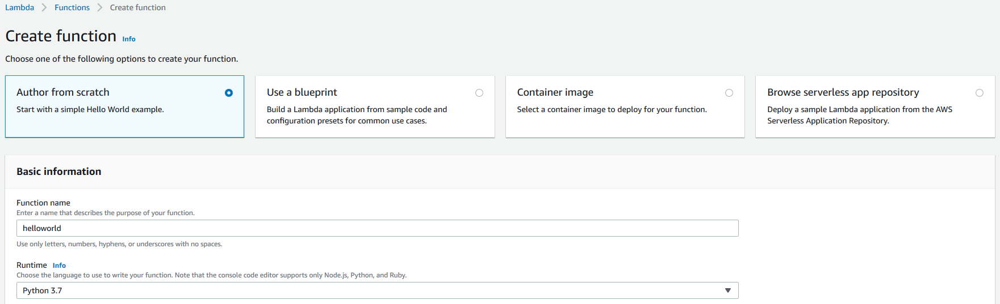

[https://console.aws.amazon.com/lambda/home?region=us-east-1\#/functions](https://console.aws.amazon.com/lambda/home?region=us-east-1#/functions)

# Lambda: attaching a role


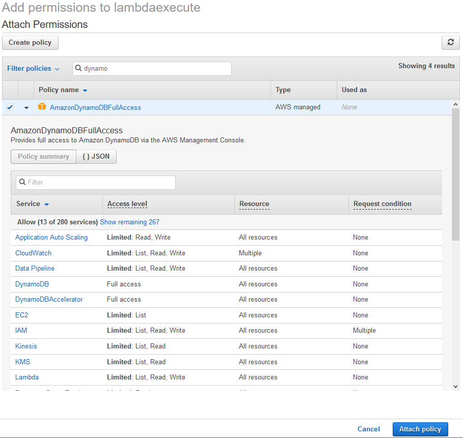


# Lambda: create a function


[https://console.aws.amazon.com/lambda/home?region=us-east-1\#/functions](https://console.aws.amazon.com/lambda/home?region=us-east-1#/functions)

Manually creating the functions is cumbersome

* We must copy and paste code
* No automatic testing
* No debugging
* No IDE support (and not all languages are supported)

Switch to IntelliJ IDEA + AWS Toolkit

# AWS Toolkit

* Get the latest IntelliJ IDEA
* Install the `AWS Toolkit`
* Copy the credentialscp ~/.aws/credentials ~/.aws/config
* Clone the repo git clone [https://github.com/w4bo/bigdata-aws/](https://github.com/w4bo/bigdata-aws/)
* Import `lab01-lambda` as a Gradle project
* Verify that the project builds./gradlew


Click on `AWS Explorer`

* You can see the `helloworld` function
* Plus `CloudWatch Logs` and `S3`


Test the existing code locally

* With Gradle
* Or with local Lambda execution

Deploy a new Lambda function from the existing code

* Right click on AWS Explorer > Lambda
* Select `Create new AWS Lambda...`
* Populate the settings
* `Create the function`


[https://aws.amazon.com/lambda/pricing/](https://aws.amazon.com/lambda/pricing/)

Check the log for errors and pricing

* AWS Toolkit > CloudWatch Logs
* Double click on the function name
* Double click on the log entry


# Data pipeline

Deploy and execute the HelloWorld.java lambda function

* Given the created storage: S3 and DynamoDB
* Deploy the function `FIM`
* Deploy the function `Preprocess`
* Run `ReadDataset.java`
* Check that the table `frequent-sales` has the FIs for the dataset `sales`

Some hints

* Function names are case sensitive
* Some function need more than 128MB of memory
  * Behold! The higher the RAM, the higher the costs

# 


