# 

# Reference scenario

The big-data cube

* Volume: small to big
* Variety: structure to unstructured
* Velocity: pull to push

Meijer, Erik. "Your mouse is a database."  *Communications of the ACM* 55.5 (2012): 66-73.

**Variety**

* **Structured**
  * Relational tuples with FK/PK relationships
* **Unstructured**
  * Key-value
  * Columnar
  * Document-based
  * Graph
  * ...

[https://www.datamation.com/big-data/structured-vs-unstructured-data/](https://www.datamation.com/big-data/structured-vs-unstructured-data/) (accessed 2022-08-01)

**Velocity** (latency)

* **High**: clients synchronously pulling data from sources
* **Low**: sources asynchronously pushing data to clients

**Velocity** (speed; dual to latency)

* **High**: processing in real-time (milliseconds) or near-real time (minutes)
* **Low**: processing can take hours

**Acceleration**

* Velocity is not constant, data comes in bursts
* Take Twitter as an example
  * Hashtags can become hugely popular and appear hundreds of times in just seconds
  * ... or slow down to one tag an hour
* Your system must be able to efficiently handle the peak as well as the lows

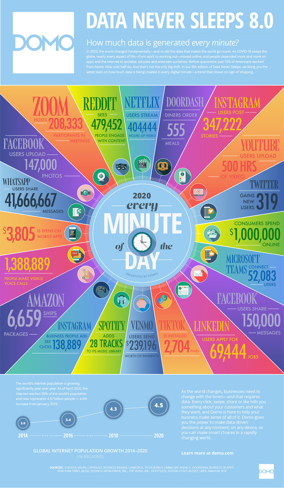

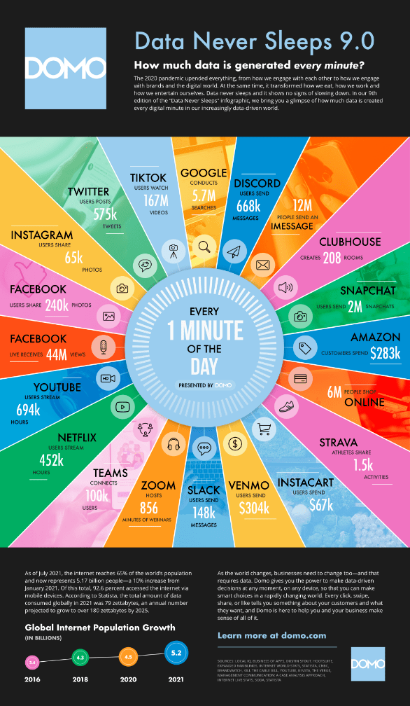

[https://www.domo.com/learn/data-never-sleeps-9](https://www.domo.com/learn/data-never-sleeps-9)

The Netflix scenario

[https://www.domo.com/learn/data-never-sleeps-9](https://www.domo.com/learn/data-never-sleeps-9)

Collecting data

Processing data

* **Scheduled Batch** 
  * Large volume of data processed on a regular scheduled basis
  * Velocity is very predictable
* **Periodic** :
  * Data processed at irregular times (e.g., after collecting a certain ---large--- amount of data)
  * Velocity is less predictable
* **Near real-time** 
  * Streaming data processed in small individual batches collected and processed within minutes
  * Velocity is a huge concern
* **Real-time** 
  * Streaming data collected and processed in very small individual batches within milliseconds
  * Velocity is the paramount concern

* **Batch and periodic** 
  * Once data has been collected, processing can be done in a controlled environment
  * There is time to plan for the appropriate resources
* **Near real-time and real-time** 
  * Collection of the data leads to an immediate need for processing
  * Depending on the complexity of the processing (cleansing, scrubbing, curation), this can slow down the velocity of the solution significantly
  * Plan accordingly

Plus other Vs

* **Veracity**: ** ** data trustworthiness/quality
* **Value**: ability to extract meaningful information
* ...

Our focus

* (Un)Structured big-data batch
* (Un)Structured big-data streams

**Goal**: keep in mind the cube to

* categorize the services

Scenario 1

* My business has a set of 15 JSON data files that are each about 2.5 GB in size.
* They are placed on a file server once an hour, and they must be ingested as soon as they arrive in this location.
* Data must be combined with all transactions from financial dashboard for this same period, then compared to the recommendations from marketing engine
* All data is fully cleansed.
* The results from this time period must be made available to decision makers by 10 minutes after the hour in the form of financial dashboards.

*Which Vs are involved?*

Scenario 1

* My business has a set of 15 JSON data files that are each about 2.5 GB in size.
* They are placed on a file server once an hour, and they must be ingested as soon as they arrive in this location.
* Data must be combined with all transactions from financial dashboard for this same period, then compared to the recommendations from marketing engine
* All data is fully cleansed.
* The results from this time period must be made available to decision makers by 10 minutes after the hour in the form of financial dashboards.

Which Vs are involved?

* *Volume* This scenario describes huge JSON files to be combined with transactional data and marketing data.
* *Velocity* "Wait - now hurry up!" Wait to collect data for a full hour and then produce meaningful results in 10 minutes *(is it batch or stream processing?)*
* *Variety* three data source types: log files, transactional data, and recommendation information
* *Value* populate dashboards that are used by decision makers as soon as they are made available. The value is reached because it requires an understanding of what the organization is trying to accomplish

Scenario 2

* My business compiles data generated by hundreds of corporations.
* This data is delivered to us in very large files, transactional updates, and even data streams.
* The data must be cleansed and prepared to ensure that rogue inputs do not skew the results.
* Knowing the data source for each record is vital to the work we do.
* A large portion of the data gathered is irrelevant to our analysis, so this data must be eliminated.
* The final requirement is that all data must be combined and loaded into our data warehouse, where it will be analyzed.

*Which Vs are involved?*

Scenario 2

* My business compiles data generated by hundreds of corporations.
* This data is delivered to us in very large files, transactional updates, and even data streams.
* The data must be cleansed and prepared to ensure that rogue inputs do not skew the results.
* Knowing the data source for each record is vital to the work we do.
* A large portion of the data gathered is irrelevant to our analysis, so this data must be eliminated.
* The final requirement is that all data must be combined and loaded into our data warehouse, where it will be analyzed.

Which Vs are involved?

* *Volume* The data is delivered in very large files, transactional updates, and even in data streams
* *Variety* The business will need to combine the data from all three sources into a single data warehouse.
* *Veracity* The data is known to be suspect. The data must be cleansed and prepared to ensure that rogue inputs do not skew the results. Knowing the data source for each record is vital to the work we do.

# Data-driven companies

*Data-driven company * refers to companies where decisions and processes are supported by data

* Decisions are based on quantitative rather than qualitative knowledge
* Processes & Knowledge are an asset of the company and are not lost if managers change
* The gap between a data-driven decision and a good decision is a good manager

Adopting a data-driven mindset goes far beyond adopting a business intelligence solution and entails:

* *Create a data culture*
* *Change the mindset of managers*
* *Change processes*
* *Improve the quality of all the data*

# Why going cloud?

*Digitalization* is a journey that involves three main dimensions

* Moving from A to B is a multi-year process made of intermediate goals
* Each of which must be *feasible*
  * Solves a company pain and brings value
  * Can be accomplished in a limited time range (typically less than one year)
  * Costs must be economically related to gains

Are processes extensively digitalized and produces reliable data?

*Technological* *infrastructure*

Do we have the right persons to drive the project and exploit the results?

*Data quality *

*& quantity*

Is the technogical infrastructure appropriate to support data collection and analysis?

**Cloud computing** (National Institute of Standards and Technology)

* *“A model for enabling * *ubiquitous, convenient, on-demand * *network access to a * *shared pool* * of configurable computing resources (e.g., networks, servers, storage, services) that can be rapidly provisioned and released with * *minimal management effort * *or service provider interaction.”*
* On-demand self-service (consume services when you want)
* Broad network access (consume services from anywhere)
* Resource pooling (infrastructure, virtual platforms, and applications)
* Rapid elasticity (enable horizontal scalability)
* Measured service (pay for the service you consume as you consume)

**Digital transformation ** involves the **cloud** to create/change business flows

* Often involves changing the company culture to adapt to this new way of doing business
* One of the end goal is to meet ever-changing business and market demand

Goal: adjusts capacity to have predictable performance at the lowest cost

* **Scalability** that is not possible on premises
* Scale from one to thousands of servers

**Elasticity**

* Automatically scale resources in response to run-time conditions
* Adapt to changes in workload by turning on/off resources to match the necessary capacity
* Core justification for the cloud adoption

Hardware scalability

* No longer think about rack space, switches, and power supplies, etc.

Grow storage from GBs to PBs

* 1PB: one hundred 10TB Enterprise Capacity 3.5 HDD hard drives

[https://blog.seagate.com/business/linus-tech-tips-want-petabyte-system/](https://blog.seagate.com/business/linus-tech-tips-want-petabyte-system/)

**Resource pooling**

* Enable *cost-sharing*, a resource to serve different consumers
* Resources are dynamically reassigned according to demands
* Based on *virtualization*, * * running multiple virtual instances on top of a physical computer system
* Economy of scale for physical resources

**Reliability**

* Built to handle failures
* Fault-tolerant or highly available

Worldwide **deployment**

* Deploy applications as close to customers as possible
  * E.g., to reduce network latency
* Improve data locality
* Compliant to privacy regulations (e.g., GDPR)

Measured **quality of service**

* Services leverage a quantitative qualitative metering capability making pay-as-you-go (or pay-per-use) billing and validation of the service quality available

Service **integration**

* Do not reinvent the wheel, eliminate repetitive tasks
  * Use services that solve common problems (e.g., load balancing, queuing)
* Abstract and automatically adapt the architecture to requirements
  * E.g., create (test) environments on demand

*Integration* and *abstraction* are drivers of change

* From *databases* to *data platforms*
* From *on-premises* to *serverless* architectures
* From *custom* to *standardized* data pipelines

# Is cloud a silver bullet?

[https://www.reuters.com/article/us-france-ovh-fire-idUSKBN2B20NU](https://www.reuters.com/article/us-france-ovh-fire-idUSKBN2B20NU)

Cloud computing is the outsourcing of a company’s hardware and software architecture

* Which are the risks and issues?

---

Google has a long track record on clean energy: in 2007, Google became the first major company to become carbon neutral. And in 2017, Google became the first company of our size to match 100% of its electricity consumption with renewable energy. Today, Google Cloud is the only major cloud provider to purchase enough renewable energy to cover our entire operations, and over the years, we’ve purchased more wind and solar power than any other corporation in history. 
But wind and solar power don’t work in all places at all times. Though we buy enough renewable energy on average to match our data centers’ electricity consumption, that average is an annual average. Thus, for a particular data center, at any given time we may have too much renewable power, or too little. When we have too much, we feed it into the local grid so someone else can consume it. When we have too little, we draw power from the local grid, and that power may not be renewable.

Left: Mytton, David. "Data centre water consumption."  *npj* * Clean Water* 4.1 (2021): 1-6.Right: [https://cloud.google.com/blog/topics/inside-google-cloud/announcing-round-the-clock-clean-energy-for-cloud](https://cloud.google.com/blog/topics/inside-google-cloud/announcing-round-the-clock-clean-energy-for-cloud) (accessed 2022-08-01)

---

Google has a long track record on clean energy: in 2007, Google became the first major company to become carbon neutral. And in 2017, Google became the first company of our size to match 100% of its electricity consumption with renewable energy. Today, Google Cloud is the only major cloud provider to purchase enough renewable energy to cover our entire operations, and over the years, we’ve purchased more wind and solar power than any other corporation in history. 
But wind and solar power don’t work in all places at all times. Though we buy enough renewable energy on average to match our data centers’ electricity consumption, that average is an annual average. Thus, for a particular data center, at any given time we may have too much renewable power, or too little. When we have too much, we feed it into the local grid so someone else can consume it. When we have too little, we draw power from the local grid, and that power may not be renewable.

# 

[https://xkcd.com/908/](https://xkcd.com/908/)

# Cloud computing: types of cloud

There are different types of cloud

* **Public**: accessible to anyone willing to pay (e.g., Microsoft, AWS, Google)
* **Private**: accessible by individuals within an institution
  * In public cloud, any resources that you are not using can be used by other
  * Users share the costs
  * Cost-sharing disappears in private clouds
* **Hybrid**: a mix of the previous

Cloud services are hosted in separate geographic areas

* Locations are composed of **regions** and **availability zones**

Region (e.g., us-east-1)

* Is an independent geographical area that groups data centers
* Has availability zones

Availability zones in a region

* A data center
* Connected through low-latency links
* Resources are usually replicated across zones but not regions

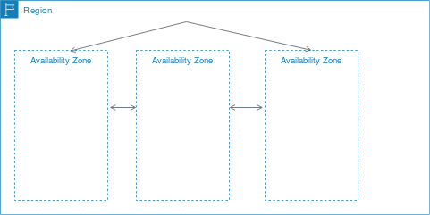

[https://docs.aws.amazon.com/AWSEC2/latest/UserGuide/using-regions-availability-zones.html](https://docs.aws.amazon.com/AWSEC2/latest/UserGuide/using-regions-availability-zones.html)

# Cloud computing: principal vendors

Gartner Magic Quadrant

* Understanding the technology providers to consider for an investment
* **Leaders** execute well and are well positioned for tomorrow
* **Visionaries** understand where the market is going but do not yet execute well
* **Niche Players** focus successfully on a small segment, or are unfocused and do not out-innovate or outperform others
* **Challengers** execute well but do not demonstrate an understanding of market direction
* Focusing on leaders isn’t always the best
  * A niche player may support needs better than a market leader. It depends on how the provider aligns with business goals

[https://www.gartner.com/en/research/methodologies/magic-quadrants-research](https://www.gartner.com/en/research/methodologies/magic-quadrants-research)

# Cloud computing: deployment models

On a cloud architecture, you can rely on *serverless* or *managed * services

* *Serverless*
* Standalone independent services built for a specific purpose and integrated by cloud service provider
* No visibility into the machines
  * There are still servers in serverless, but they are abstracted away
  * No server management, do not have to manage any servers or scale them
  * E.g., when you run a query on [BigQuery](https://cloud.google.com/blog/products/bigquery/separation-of-storage-and-compute-in-bigquery) you do not know how many machines were used
* Pay for what your application uses, usually per request or per usage

*(Fully) Managed*

* Visibility and control of machines
  * You can choose the number of machines that are being used to run your application
* Do not have to set up any machines, the management and backup are taken care for you
* Pay for machine runtime, however long you run the machines and resources that your application uses

[https://cloud.google.com/blog/topics/developers-practitioners/serverless-vs-fully-managed-whats-difference](https://cloud.google.com/blog/topics/developers-practitioners/serverless-vs-fully-managed-whats-difference) (accessed 2020-08-01)

Understanding architectures is paramount to successful systems

* Good architectures help to scale
* Poor architectures cause issues that necessitate a costly rewrite

**XaaS** ** (anything as a service)**

* A collective term that refers to the delivery of anything as a service
* It encompasses the products, tools and technologies that vendors deliver to users

**On-premises**

* Provisioning servers is time-consuming
  * A non-trivial environment is hard to set up
* Require dedicated operations people
* Often a distraction from strategic tasks

**Infrastructure as a service (IaaS)**

* A computing infrastructure provisioned and managed over the internet (e.g., AWS EC2)
* Avoid expense/complexity of buying/managing physical servers/data-centers
* IaaS overcomes issues on-premises
* Possibly requires to manage many environments

**Platform as a Service (PaaS)**

* A development and deployment environment in the cloud (e.g., AWS Elastic Beanstalk)
* Support complete application life-cycle: building, testing, deploying, etc.
* Avoid expense/complexity of managing licenses and application infrastructure

**PaaS** and **containers** are potential solutions to inconsistent infrastructures

* PaaS provides a platform for users to run their software
* Developers write software targeting features/capabilities of the platform

Containerization isolates an application with its own environment

* Lightweight alternative to full virtualization
* Containers are isolated but need to be deployed to (public/private) server
* Excellent solution when dependencies are in play
* Housekeeping challenges and complexities

*Containers* and *virtual machines * are packaged computing environments

* *Containers*
* On top of physical server and its host OS
* Share the host OS kernel
* Shared components are read-only
* “Light”, take seconds to start

*Virtual machines*

* Emulate a hardware/software system
* On top of a hypervisor (VM monitor)

**Function as a Service (** **FaaS** **)**

* A coding environment, cloud provider provisions platform to run the code (e.g., AWS Lambda)
* Infrastructure provisioning and management are invisible to the developer

Principles of FaaS architectures

* FaaS is based on a serverless approach, use a compute service to execute code on demand
* Every function could be considered as a standalone service
* Write single-purpose stateless functions

Functions react to events

* Design push-based, event-driven pipelines
* Create thicker, more powerful front ends
* Embrace third-party services (e.g., security)

FaaS is not a silver bullet

* Not appropriate for latency-sensitive applications
* Strict specific service-level agreements
* Migration costs
* Vendor lock-in can be an issue

**Software as a service (SaaS)**

* An application environment
* Access cloud-based apps over the Internet (e.g., email, Microsoft Office 365, Github)

# 

[https://xkcd.com/1084/](https://xkcd.com/1084/)

# -- newsection --

# From data lake to data warehouse

---

https://catalog.us-east-1.prod.workshops.aws/workshops/ea7ddf16-5e0a-4ec7-b54e-5cadf3028b78/en-US

# Context: Soil moisture monitoring

Optimizing soil moisture is crucial for watering and crop performance [1]

* **GOAL**: build an expert system to save water while improving fruit quality (i.e., provide a recommendation of the optimal amount of water)
* *Soils* have different water retention
* *Watering systems* have different behaviors (e.g., drippers and sprinklers)
* *Plants* have different water demand (e.g., Kiwi [2] vs Grapes)
* *Sensors* produce different measurements with different precisions

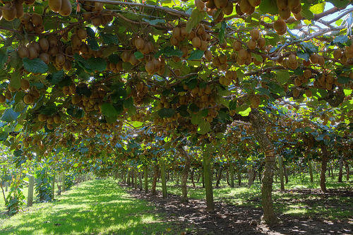

[1] Turkeltaub et al., Real-time monitoring of nitrate transport in the deep vadose zone under a crop field–implications for groundwater protection, Hydrology and Earth System Sciences 20 (8) (2016) 3099–3108.[2] M. Judd, et al., Water use by sheltered kiwifruit under advective conditions, New Zealand journal of agricultural research 29 (1) (1986) 83–92.

(Example) Scenarios of digital transformation in agriculture

* Scenario \#1
* The farmer/technician controls the watering system based only on the experience
* No digital data/KPIs/automation

Scenario \#2

* The control of the watering system is refined by observing sensor data
* Sensor data is digitalized, no KPIs/automatic

Scenario \#3

* Sensor data feeds a decision support system that, knowing how to optimize KPIs, controls the watering system

(Example) Scenarios of digital transformation in agriculture

* Scenario \#1
* The farmer/technician controls the watering system based only on the experience
* No digital data/KPIs/automation

Scenario \#2

* The control of the watering system is refined by observing sensor data
* Sensor data is digitalized, no KPIs/automatic

Scenario \#3

* Sensor data feeds a decision support system that, knowing how to optimize KPIs, controls the watering system

Artificial intelligence (AI) is intelligence demonstrated by machines. AI research has been defined as the field of study of intelligent agents, which refers to any system that perceives its environment and takes actions that maximize its chance of achieving its goals.

We need to understand how the soil behaves

* *Simulate* [1, 2] the soil behavior according to physical models [3]
* However, a *fine tuning * is required
* We need to *know/parametrize everything*
  * Soil (e.g., retention curve, hysteresis [4])
  * Plant (e.g., roots, LAI)
  * Weather conditions (temperature, humidity, wind, precipitations)
  * Watering system (e.g., capacity, distance between drippers)

Tuning can take months (of human interactions)!

* Need to collect samples from the field... if parameters are incorrect, trace back
* Need to implement/code all these features into the simulator [1, 2]
* Hyper-parameter tuning with machine learning can help, but it is not a silver bullet

[1] Šimunek, J., et al. "HYDRUS: Model use, calibration, and validation." Transactions of the ASABE 55.4 (2012): 1263-1274.[2] Bittelli, Marco, et al. Soil physics with Python: transport in the soil-plant-atmosphere system. OUP Oxford, 2015.[3] Van Genuchten, M. Th. "A closed‐form equation for predicting the hydraulic conductivity of unsaturated soils." Soil science society of America journal 44.5 (1980): 892-898.[4] Pham, Hung Q., Delwyn G. Fredlund, and S. Lee Barbour. "A study of hysteresis models for soil-water characteristic curves." Canadian Geotechnical Journal 42.6 (2005): 1548-1568.

But... we have sensors!                  [1]                                      [2]                                          [3]

* These settings are too coarse to monitor soil moisture with precision
* They require many sensors

[1] Koyuncu, Hakan, et al. "Construction of 3D soil moisture maps in agricultural fields by using wireless sensor communication." Gazi University Journal of Science 34.1 (2021): 84-98.[2] Zheng, Zhong, et al. "Spatial estimation of soil moisture and salinity with neural kriging." International Conference on Computer and Computing Technologies in Agriculture. Springer, Boston, MA, 2008.[3] Fersch, Benjamin, et al. "Synergies for soil moisture retrieval across scales from airborne polarimetric SAR, cosmic ray neutron roving, and an in situ sensor network." Water Resources Research 54.11 (2018): 9364-9383.

# Reference scenario

We consider an orchard where

* *Kiwi plants * are aligned along *rows*
* Each row has many * drippers* (e.g., 1 every meter)
* Drippers can water a *limited soil volume*

Francia, Matteo, et al. "Multi-sensor profiling for precision soil-moisture monitoring." Computers and Electronics in Agriculture 197 (2022): 106924.

We consider an orchard where

* *Kiwi plants * are aligned along *rows*
* Each row has many * drippers* (e.g., 1 every meter)
* Drippers can water a *limited soil volume*

Francia, Matteo, et al. "Multi-sensor profiling for precision soil-moisture monitoring." Computers and Electronics in Agriculture 197 (2022): 106924.

# Sensor layouts and symmetry assumptions

When the watered volume is symmetric along the row, a *2D grid of sensors * (left) is sufficient to represent the entire soil volume

* When relevant moisture variations take place along the row too, a *3D grid of sensors* (right) is required
* E.g., too sparse drippers
* E.g., non-homogeneous suction of the roots

Francia, Matteo, et al. "Multi-sensor profiling for precision soil-moisture monitoring." Computers and Electronics in Agriculture 197 (2022): 106924.

# Reference scenario

(a) Soil moisture is a continuum

* (b) Sensors return a discretized representation of soil moisture
* The monitoring accuracy changes
* depending on the *sensor* *layout*

Francia, Matteo, et al. "Multi-sensor profiling for precision soil-moisture monitoring." Computers and Electronics in Agriculture 197 (2022): 106924.

Francia, Matteo, et al. "Multi-sensor profiling for precision soil-moisture monitoring." Computers and Electronics in Agriculture 197 (2022): 106924.

# In action

Log in AWS Academy [https://awsacademy.instructure.com](https://awsacademy.instructure.com/)

In AWS, start the lab (it takes 5-10 minutes)

Download the Notebook from Virtuale

Upload the Notebook to Sagemaker (not in COLAB!)

# Data lake: AWS S3

AWS Simple Storage Service (S3)

* A *serverless* object storage service offering industry-leading scalability, data availability, security, and performance.
* Customers of all sizes and industries can store and protect any amount of data for virtually any use case, such as data lakes

Last access 2022-08

# Data exploration: AWS SageMaker

Amazon SageMaker

* Fully *managed* service that provides machine learning (ML) capabilities for data scientists and developers to prepare, build, train, and deploy high-quality ML models efficiently

Last access 2022-08

# ETL: AWS Glue

AWS Glue

* A serverless data integration service to discover and prepare data for analytics
* Provide capabilities for data integration so that you can start analyzing your data and putting it to use in minutes
* Provide both visual and code-based interfaces to make data integration easier
* Users can easily find and access data using the AWS Glue Data Catalog

Last access 2022-08

Last access 2022-08

Last access 2022-08

Last access 2022-08

Last access 2022-08

*select* date*format(timestamp, 'yyyy-MM-dd HH') *as* hour,        date*format(timestamp, 'yyyy') *as* year,       date*format(timestamp, 'yyyy-MM') *as* month,       date*format(timestamp, 'yyyy-MM-dd') *as* date,       concat('(', xx, ', ', yy, ')') *as* sensor,       xx *as* dist, yy *as* depth, value, timestamp *from* (    *select* from*unixtime(*int* (timestamp / 3600) * 3600) *as* timestamp,            xx, yy, *avg* (value) *as* value *from* myDataSource * group by * xx, yy, *int* (timestamp / 3600) * 3600)

Last access 2022-08

Last access 2022-08

# DWH: AWS RDS

Amazon Relational Database Service (Amazon RDS)

* A collection of managed services that makes it simple to set up, operate, and scale relational databases in the cloud

Last access 2022-08

Last access 2022-08

Last access 2022-08

Last access 2022-08

# Designing the DWH

# -- newsection --

# Data pipelines on cloud (Storage)

# Data pipeline

Data pipeline

* *"A * *sequence* * of operations to transform and consume raw data"*

[https://xkcd.com/2054/](https://xkcd.com/2054/)

Quemy, Alexandre. "Data Pipeline Selection and Optimization."  *DOLAP* . 2019.

The pyramid abstracts tons of techniques, algorithms, etc.

* To provide them as services, architecting data pipelines on cloud requires
* Standardization (of common services)
* Integration
* Orchestration
* Accessibility through simple APIs

Let us look to data pipelines on different cloud services providers

# Data pipeline - AWS

Three main categories

* Ingest
  * Gateway, DataSync (batch)
  * Kinesis, SNS, SQS (stream)
* Transform and store
  * S3 and Glacier (storage)
  * Glue (ETL)
* Serve and consume
  * EMR (Hadoop-like cluster)
  * Athena (serverless query service to analyze data in Amazon S3)
  * (Many) Machine learning services

[https://console.aws.amazon.com/console](https://console.aws.amazon.com/console)

# Data pipeline - Google cloud

Three main categories

* Ingest
  * Transfer service (batch)
  * Pub/Sub (stream)
* Analyze
  * Dataproc (batch)
  * Dataflow (stream)
  * Cloud storage (storage)
  * Machine learning services
* Serve
  * BigQuery (query service)

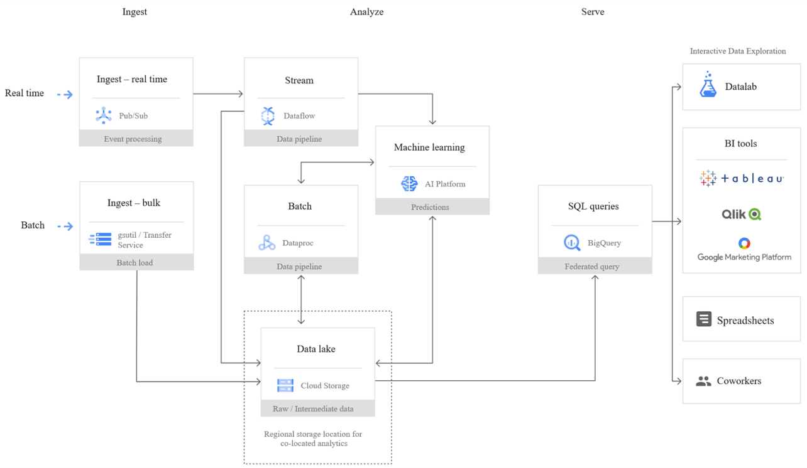

# A tentative organization

Real-time processing and analytics

Operational metadata

Batch processing and analytics

Slow storage (data lake)

ETL tools overlay

We have services

* To transform data
* To support the transformation

The (DIKW) pyramid abstracts many techniques and algorithms

* Standardization
* Integration
* Orchestration
* Accessibility through APIs

Supporting services

Serve (deciding)

BI tools (e.g., Tableau)

Analytics (analyzing/process)

Networking, etc.

Machine learning

Ingestion (acquiring/collect)

# Data pipeline

DIKW hierarchy

* Layers representing structural relationships between data, information, knowledge, and wisdom

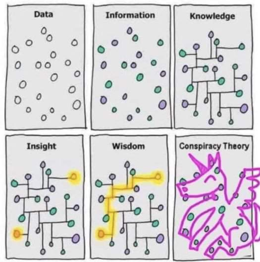

Ackoff, Russell L. "From data to wisdom." Journal of applied systems analysis 16.1 (1989): 3-9.

# A tentative organization

This is not a sharp taxonomy

* Ingestion vs Analytics
* Data streams are used for ingestion
* ... and (event) processing

Supporting services

Serve (deciding)

BI tools (e.g., Tableau)

Analytics (analyzing)

Networking, etc.

Machine learning

Ingestion (acquiring)

This is not a sharp taxonomy

* Storage vs Serving
* Databases are storage
* ... with processing capability
* ... and with serving capability

Supporting services

Serve (deciding)

BI tools (e.g., Tableau)

Analytics (analyzing)

Networking, etc.

Machine learning

Ingestion (acquiring)

# 

Supporting services

Serve (deciding)

BI tools (e.g., Tableau)

Analytics (analyzing)

Networking, etc.

Machine learning

Ingestion (acquiring)

# Storage

**Goal**: persisting data

* Which storage do we choose?
* **Storage model ** (or data model) ~= variety
  * How data are organized/accessed in a storage system
    * Structured vs unstructured
    * Data access model (key-value, column, etc.)
* Access **frequency**
* **Analyses ** to be performed

# Storage models

Mansouri, Yaser, Adel Nadjaran Toosi, and Rajkumar Buyya. "Data storage management in cloud environments: Taxonomy, survey, and future directions." ACM Computing Surveys (CSUR) 50.6 (2017): 1-51.

# Storage models (AWS)

Data structure: structured

* Data abstraction: database

Data access model: relational

* **Relational**
* Store data with predefined schemas and relationships between them
* Support ACID transactions
* Maintain referential integrity

[https://aws.amazon.com/products/databases/](https://aws.amazon.com/products/databases/)

Data structure: semi/unstructured

* Data abstraction: database

Data access model: *

* **Key/value: ** store and retrieve large volumes of data
* **Document: ** store semi-structured data as JSON-like documents
* **Wide column:** use tables but unlike a relational database, columns can vary from row to row in the same table
* **Graph: ** navigate and query relationships between highly connected datasets
* **... and more**

[https://aws.amazon.com/products/databases/](https://aws.amazon.com/products/databases/)

# Storage models (Google Cloud)

[https://cloud.google.com/products/databases](https://cloud.google.com/products/databases)

# Storage models (AWS)

Data structure: unstructured

* Data abstraction: file (or database)

Data access model: key-value

* **File system** (EFS), **object storage** (S3) (or **DB K-V** ; e.g., DynamoDB)
* Handle unstructured data
* ... organized as files (or blob)
* ... accessed using a key-value

Differ in the supported features

* E.g., maximum item size (DynamoDB: 400KB, S3: 5TB)
* E.g., indexes, querying mechanisms, latency, etc.

# AWS S3

Simple Storage Service (S3)

* Serverless storage, save data as **objects** within **buckets** 
* An **object** is composed of a file and any metadata that describes that file (e.g.,  **object key**)
*  **Buckets** are logical containers for objects
  * You can have one or more buckets in your account
  * Control access for each bucket individually
  * Choose the geographical region where Amazon S3 will store the bucket and its contents

Benefits

* Unified data architecture
  * Build a multi-tenant environment, where many users can bring their own data
  * Improve both cost and data governance over traditional solutions
* Decoupling of storage from compute and data processing
  * You can cost-effectively store all data types in their native formats
  * Then, launch transformations as you need

# Storage: access frequency (AWS)

24 storage (AWS S3) **classes**

* **Standard**: general purpose
* **Infrequent** (rapid) **access**
* **One Zone-IA**: lower-cost option for infrequently accessed data that do not require high availability and resilience
* **Glacier**: low-cost storage class for data archiving, three retrieval options that range from a few minutes to hours
* **Deep Glacier**: long-term retention for data accessed once or twice in a year. E.g., retain data sets for 10 years or longer
* **Intelligent-Tiering**: move objects between access tiers when access patterns change

[https://aws.amazon.com/s3/storage-classes/](https://aws.amazon.com/s3/storage-classes/)

**Lifecycle** configuration

* A set of rules that define actions that Amazon S3 applies to a group of objects

Two types of actions:

* **Transition: ** when objects transition to another storage class. E.g., archive objects to the S3 Glacier storage class one year after creating them
* **Expiration**: when objects expire. Amazon S3 deletes expired objects on your behalf

[https://docs.aws.amazon.com/AmazonS3/latest/userguide/object-lifecycle-mgmt.html](https://docs.aws.amazon.com/AmazonS3/latest/userguide/object-lifecycle-mgmt.html)

# Storage: access frequency (Google Cloud)

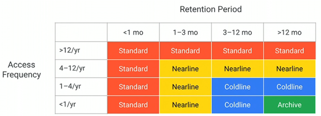

[https://cloud.google.com/blog/products/storage-data-transfer/archive-storage-class-for-coldest-data-now-available](https://cloud.google.com/blog/products/storage-data-transfer/archive-storage-class-for-coldest-data-now-available)

# Organizing the data lake

Having consistent principles on how to organize your data is important

* To build standardized pipelines with the same design with regard to where read/write data
* Standardization makes it easier to manage your pipelines at scale
* Helps data users search for data in the storage and understand exactly to find what they need
* Decoupling storage from processing

Landing area (LA)

* Save *raw data* from ingestion
* Transient, data is not stored for long term

Staging area (SA)

* Raw data goes through a set of common transformations: ensuring *basic quality* and making sure it *conforms to existing schemas* for this data source and then data is saved into SA

Archive area (A)

* After saving into SA, raw data from LA should be *copied into the archive* to reprocess any given batch of data by simply copying it from AA into LA
* Useful for debugging and testing

Production area (PA)

* Apply the business logic to data from SA

Pass-through job

* Copy data from SA to PA and then into DWH without applying any business logic
* Optional, but having a data set in the data warehouse and PA that is an exact replica can be helpful when debugging any issues with the business logic

Cloud data warehouse (DWH)

* Failed area (FA)
* You need to be able to deal with all kinds of errors and failures
* There might be bugs in the pipeline code, cloud resources may fail

| Area | Permissions | Tier |
|:-: |:-: |:-: |
| Landing | Ingestion applications can write Scheduled pipelines can readData consumers can’t access | Hot |
| Staging | Scheduled pipelines can read/write Selected data consumers can read | Hot |
| Production | Scheduled pipelines can read/writeSelected data consumers can read | Hot |
| Archive | Scheduled pipelines can writeDedicated data reprocessing pipelines can read  | Cold or archive |
| Failed | Scheduled pipelines can writeDedicated data reprocessing pipelines can readData consumers don’t have access | Hot |

Use folders to organize data inside areas into a logical structure

* *Namespace*
  * Logically group multiple pipelines together.
* *Pipeline name*
  * Each data pipeline should have a name that reflects its purpose. For example
    * A pipeline that takes data from the LA, applies common processing steps, and saves data into SA
    * You will also have one for archiving data into AA
* *Data source name*
  * Ingestion layer will assign a name to each data source you bring into the platform
* *BatchId*
  * Unique identifier for any batch of data that is saved into LA
  * E.g., Since only ingestion can write to LA, it is its responsibility to generate this identifier
  * A common choice for this type of an identifier is a Universally Unique Identifier (UUID)

Different areas will have slightly different folder structures

* /landing/ETL/sales*oracle*ingest/customers/01DFTFX89YDFAXREPJTR94

However, alternative organizations are available

> "A data lake is a central repository system for storage, processing, and analysis of raw data, in which the data is **kept in its original format ** and is processed to be queried only when needed. It can store a **varied amount of formats ** in big data ecosystems, from unstructured, semi-structured, to structured data sources."
>
> Couto et al., 2019 ​

# Data Lakehouse

Combine the key benefits of data lakes and data warehouses

* Low-cost storage in an open format accessible by a variety of systems from the former
* Powerful management and optimization features from the latter
  * ACID transactions, data versioning, auditing, indexing, caching, and query optimization.

Key question: can we combine these benefits in an effective way?

* Direct access means that they **give up some aspects of data independence**, which has been a cornerstone of relational DBMS design
* **Lakehouses** ** are an especially good fit for cloud environments with separate compute and storage**: different computing applications can run on-demand on separate computing nodes (e.g., a GPU cluster for ML) while directly accessing the same storage data

# Data Independence

* Data independence can be explained using the three-schema architecture
* Data independence: modify the schema at one level of the database system without altering the schema at the next higher level

# Data Lakehouse

**1** **st** **generation systems**: data warehousing started with helping business leaders get analytical insights

* Data in these warehouses would be written with *schema-on-write*, which ensured that the data model was optimized for downstream BI consumption
* Several challenges
  * They typically coupled compute and storage into an on-premises appliance
    * This forced enterprises to provision and pay for the peak of user load and data under management, very costly
  * More and more datasets were completely unstructured, which DWHs could not store and query at all

Armbrust, Michael, et al. "Lakehouse: a new generation of open platforms that unify data warehousing and advanced analytics."  *CIDR* . 2021.

---

https://dl.acm.org/doi/fullHtml/10.1145/3524284

**2** **nd** **generation**: offloading all the raw data into data lakes

* The data lake is *schema-on-read* and stores any data at low cost, but on the other hand, punted the problem of data quality and governance
* In this architecture, a small subset of data in the lake would later be ETLed to a downstream data warehouse
* The use of open formats also made data lake data directly accessible to a wide range of other analytics engines, such as machine learning systems
* From 2015 onwards, cloud data lakes, such as S3, ADLS and GCS, started replacing HDFS
  * Superior durability (often >10 nines), geo-replication, and most importantly, extremely low cost

While the cloud data lake and warehouse architecture is ostensibly cheap, a two-tier architecture is highly complex for users

* Data is first ETLed into lakes, and then again ELTed into warehouses
* Enterprise use cases now include advanced analytics such as machine learning, for which neither data lakes nor warehouses are ideal
* (Some) main problems:
  * **Reliability** . Keeping the data lake and warehouse consistent is difficult and costly
  * Data **staleness** . The data in the warehouse is stale compared to that of the data lake, with new data frequently taking days to load
  * **Limited support for advanced analytics** . Businesses want to ask predictive questions using their warehousing data, e.g., “which customers should I offer discounts to?” None of the leading machine learning systems directly work well on top of warehouses
    * Process large datasets using complex non-SQL code

# Dataset Search for Data Discovery, Augmentation, and Explanation

Is there a real need for many unstructured and integrated dataset?

* Recent years have seen an explosion in our ability to collect and catalog immense amounts of data about our environment, society, and populace
* Governments, and organizations are increasingly making structured data available on the Web and in various repositories and data lakes
* **This opportunity is often missed due to a central technical barrier**: it is currently nearly impossible for domain experts to weed through the vast amount of available information to discover datasets that are needed for their specific application

Juliana Freire, keynote @ EDBT 2023

# Data Lakehouse

Main features

* **Store data in a low-cost object store** using a standard file format such as Apache Parquet
* **Implement a transactional metadata layer** on top of the object store that defines which objects are part of a table version
* **Implement management features ** within the metadata layer

Challenges:

* The metadata layer is insufficient to achieve good SQL performance
  * **Data warehouses use several techniques to get state-of-the-art performance**
    * Storing hot data on fast devices such as SSDs, maintaining statistics, building efficient indexes, etc.
  * **In a Lakehouse it is not possible to change the format**, but it is possible to implement other optimizations that leave the data files unchanged

# Delta Lake

**Challenges**:

* Most **cloud object stores are merely key-value stores**, with no cross-key consistency
* **Multi-object updates are not atomic**, there is no isolation between queries
  * If a query needs to update multiple objects in the table readers will see partial updates as the query updates each object individually
* For large tables with millions of objects, **metadata operations are expensive**
  * The latency of cloud object stores is so much higher that these data skipping checks can take longer than the actual query

Armbrust, Michael, et al. "Delta lake: high-performance ACID table storage over cloud object stores." Proceedings of the VLDB Endowment 13.12 (2020): 3411-3424.

Delta Lake uses a **transaction log ** that is compacted **into Apache Parquet ** for significantly faster metadata operations for large tabular datasets

* E.g., quickly search billions of table partitions for those relevant to a query
* The log is stored in the **delta*log** subdirectory within the table
* It contains
  * Sequence of JSON objects with increasing, zero-padded numerical IDs to store the log records
  * Occasional checkpoints for specific log objects that summarize the log up to that point

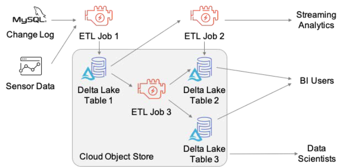

Each log record object (e.g., 000003.json) contains an array of actions to apply to the previous version of the table to generate the next one

* Examples of actions are:
* Change Metadata
* Add or Remove Files

It is necessary to compress the log periodically into checkpoints

* Checkpoints store all the non-redundant actions in the table’s log up to a certain log record ID, in Parquet format
* Some sets of actions are redundant and can be removed
* Read the *last*checkpoint object in the table’s log directory, if it exists, to obtain a recent checkpoint ID

Example of a write transaction

* Transaction will read the data at table version r (if needed) and attempt to write log record r+1
* Read data at table version r, if required combine previous checkpoint and further log records
* Write any new data objects that the transaction aims to add to the table into new files in the correct data directories, generating the object names using GUIDs.
  * This step can happen in parallel
  * At the end, these objects are ready to be referenced in a new log record.
* Attempt to write the transaction’s log record into the r+1 .json log object, if no other client has written this object
* **This step needs to be atomic** . If the step fails, the transaction can be retried; depending on the query’s semantics (optimistic concurrency)
* Optionally, write a new .parquet checkpoint for log record r+1

Creating the r+1 .json record, needs to be atomic: only 1 client should succeed. Not all large-scale storage systems have an atomic put operation

* Google Cloud Storage and Azure Blob Store support atomic put-if-absent operations
* HDFS, we use atomic renames to rename a temporary file to the target name
* Amazon S3 need ad-hoc protocols

# Lakehouse

(SQL) Format-independent optimizations are

* **Caching**: When using a transactional metadata layer such as Delta Lake, it is safe for a Lakehouse system to cache files from the cloud object store on faster storage devices such as SSDs and RAM on the processing nodes
* **Auxiliary data**: maintain column min-max statistics for each data file in the table within the same Parquet file used to store the transaction log, which enables data skipping optimizations when the base data is clustered by particular columns
* **Data layout**:
  * Record ordering: which records are clustered together and hence easiest to read together, e.g. ordering records using individual dimensions or space-filling curves such as Z-order
  * Compression strategies differently for various groups of records, or other strategies

Offer a declarative version of the DataFrame APIs which maps data preparation computations into Spark SQL query plans and can benefit from logical optimizations

# -- newsection --

# Data pipelines on cloud (Computing)

# 

Supporting services

Serve (deciding)

BI tools (e.g., Tableau)

Analytics (analyzing)

Networking, etc.

Machine learning

Ingestion (acquiring)

# Supporting data pipelines

We can choose the XaaS configuration to build our pipelines

* IaaS
* Outsource virtual machines to the cloud (AWS EC2)
* (You) Manage technological and business challenges

PaaS

* Outsource the data ecosystem to the cloud (e.g., AWS EMR)
* (You) Manage business challenges

[https://aws.amazon.com/ec2](https://aws.amazon.com/emr)[https://aws.amazon.com/emr](https://aws.amazon.com/emr)  (2022-11-15)

# Single instance: AWS EC2

Amazon Elastic Compute Cloud

* A web service that provides resizable compute capacity
* Complete control of computing resources
  * Processor, storage, networking, OS, and purchase model

The **instance type** determines the hardware

* Different compute and memory capabilities

**Amazon Machine Image** is a software template

* The EC2 instance is used for creating the virtual server instance
* The AMI is the EC2 virtual machines image

Interact with EC2 instance as with any computer

* You have complete control of your instances

[https://aws.amazon.com/ec2/instance-types](https://aws.amazon.com/ec2/instance-types) [https://docs.aws.amazon.com/AWSEC2/latest/UserGuide/ec2-instances-and-amis.html](https://docs.aws.amazon.com/AWSEC2/latest/UserGuide/ec2-instances-and-amis.html) [https://docs.aws.amazon.com/AWSEC2/latest/UserGuide/compute-optimized-instances.html](https://docs.aws.amazon.com/AWSEC2/latest/UserGuide/compute-optimized-instances.html)

[https://aws.amazon.com/ec2/instance-types/](https://aws.amazon.com/ec2/instance-types/)

AWS uses public-key cryptography to secure the login

* You can create one using the Amazon EC2 console
* Open the Amazon EC2 console at [https://console.aws.amazon.com/ec2/](https://console.aws.amazon.com/ec2/)
* In the navigation pane, choose `Key Pairs`
* Choose `Create key pair`
* For `Name`, enter a descriptive name for the key pair
* For `File format`, choose the format in which to save the private key
  * OpenSSH, choose `pem` (` chmod 400 * *my-key-* * *pair* * .pe m `)
  * PuTTY, choose `ppk`
* Choose `Create key pair`
* The private key file is automatically downloaded by your browser

# Cluster: AWS EMR

Amazon EMR is a data platform based on the Hadoop stack

* Apache Spark, Apache Hive, Apache HBase, etc.
* You can run workloads on
  * Amazon EC2 instances
  * Amazon Elastic Kubernetes Service (EKS) clusters

Example of workload

* Upload input data into Amazon S3
* EMR launches EC2 instances that you specified
* EMR begins the execution while pulling the input data from S3 into the launched instances
* Once the cluster is finished, EMR transfers output data to Amazon S3

# Motivation

Amazon EMR (Elastic Map Reduce)

* Provides a managed Hadoop framework

Some features

* Service integration
  * Automatically control EC2 instances
  * Transparently use S3 storage
* Pricing:
  * Low Hourly Pricing
  * Amazon EC2 Spot Integration

[https://aws.amazon.com/emr](https://aws.amazon.com/emr)

# AWS EMR

Deploy Multiple Clusters

Provision as much capacity as you need

Add or remove capacity at any time

Resize a Running Cluster

EMR cluster

* Master group controls the cluster
* Coordinate the work distribution
* Manage the cluster state

Core groups

* Core instances run Data Node daemons

(Optional) Task instances

Amazon EMR Cluster

Master Instance Group

Task Instance Group

Core Instance Group

The central component of Amazon EMR is the **cluster**

* A collection of **Amazon Elastic Compute Cloud (Amazon EC2)** instances
* Each instance is called a **node**

The **node type ** identifies the role within the cluster

* **Master** node coordinates the distribution of data and tasks among other nodes
  * Every cluster has (at least) a master node
  * Always active
* **Core** node runs tasks and store data in the Hadoop Distributed File System (HDFS)
  * Multi-node clusters have at least one core node
  * Always active, contains the data node daemon
* **Task** node only runs tasks
  * Task nodes are optional
  * Decoupling processing and storage, we lose data locality

On-Demand Instance

* Pay for compute capacity by the hour (minimum of 60 seconds)
* No long-term commitments

Spot Instance

* Unused EC2 instance that is available for less than the on-demand price
* Hourly price is called *spot price*
  * Adjusted based on long-term supply and demand for spot instances
* Run the instance when capacity is available and price is below threshold
  * When data-center resources are low, spot instances are dropped
  * Mainly suitable for batch workloads

[https://aws.amazon.com/ec2/pricing/](https://aws.amazon.com/ec2/pricing/)

---

https://us-east-1.console.aws.amazon.com/ec2/v2/home?region=us-east-1#SpotInstances:

Spot Instance cost strategies

* *Capacity-optimized strategy*
* Allocated instances into the most available pools
* Look at real-time capacity data, predict which are the most available
* Works well for workloads such as big data and analytics
* Works well when we have high cost of interruption

*Lowest-price strategy*

* Allocates instances in pools with lowest price at time of fulfillment

# Creating the cluster

Choose to launch **master**, **core**, or **task** on Spot Instances

* The **master** node controls the cluster
  * When terminated, the cluster ends
  * Use *spot instances* if you are running a cluster where sudden termination is acceptable
* **Core ** nodes process data and store information using HDFS
  * When terminated, data is lost
  * Use *spot instances* when partial HDFS data loss is tolerable
* **Task ** nodes process data but do not hold persistent data in HDFS
  * When terminated, computational capacity is lost
  * The effect of spot instances on the cluster is "minimal"

[https://docs.aws.amazon.com/emr/latest/ManagementGuide/emr-plan-instances-guidelines.html](https://docs.aws.amazon.com/emr/latest/ManagementGuide/emr-plan-instances-guidelines.html)

Amazon EMR provides two main file systems

* **HDFS** and **EMRFS**, specify which file system to use by the prefix
* hdfs://path (or just `path`)
  * HDFS is used by the master and core nodes
  * *AWS EBS volume storage is used for HDFS data*
  * Is fast, best used for caching the results produced by intermediate job-flow steps, *why?*
  * It’s ephemeral storage which is reclaimed when the cluster ends
* s3://DOC-EXAMPLE-BUCKET1/path (EMRFS)
  * An implementation of the Hadoop file system atop Amazon S3
  * We can avoid EBS storage

[https://docs.aws.amazon.com/emr/latest/ManagementGuide/emr-plan-storage.html](https://docs.aws.amazon.com/emr/latest/ManagementGuide/emr-plan-storage.html)

Choose the frameworks and applications to install

* Data process
* Submit jobs or queries directly to installed applications
* Run steps in the cluster

Submitting jobs

* Connect to the master node over a secure connection
* Access the interfaces and tools that are available on your cluster

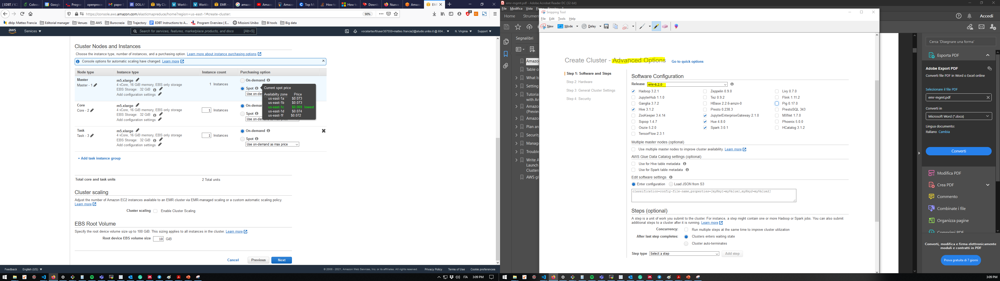

Allows EMR to call other AWS Services such as EC2 on your behalf.

Provides access to other AWS services such as S3, DynamoDB from EC2 instances that are launched by EMR.

Using CLI (command line interface)

* This is more pragmatic, but there are many options to explore
* Let’s stick to AWS Console
* [https://console.aws.amazon.com/elasticmapreduce/](https://console.aws.amazon.com/elasticmapreduce/)

aws emr create-cluster \\

* --name * *"My First EMR Cluster" * * \\
* --release-label * *emr-5.32.0 * * \\
* --applications Name=Spark \\
* --ec2-attributes KeyName= * *myEMRKeyPairName * * \\
* --instance-type m5.xlarge \\
* --instance-count 3 \\
* --use-default-roles

Using CLI (command line interface)

aws emr create-cluster --auto-scaling-role EMR*AutoScaling*DefaultRole --termination-protected --applications Name=Hadoop Name=Hive Name=Hue Name=JupyterEnterpriseGateway Name=Spark --ebs-root-volume-size 10 --ec2-attributes '{"KeyName":"bigdata","InstanceProfile":"EMR*EC2*DefaultRole","SubnetId":"subnet-5fa2f912","EmrManagedSlaveSecurityGroup":"sg-07818b5690a50b3f1","EmrManagedMasterSecurityGroup":"sg-0e2f5550a2cb98f79"}' --service-role EMR*DefaultRole --enable-debugging --release-label emr-6.2.0 --log-uri 's3n://aws-logs-604905954159-us-east-1/elasticmapreduce/' --name 'BigData' --instance-groups '[{"InstanceCount":1,"BidPrice":"OnDemandPrice","EbsConfiguration":{"EbsBlockDeviceConfigs":[{"VolumeSpecification":{"SizeInGB":32,"VolumeType":"gp2"},"VolumesPerInstance":2}]},"InstanceGroupType":"MASTER","InstanceType":"m4.xlarge","Name":"Master - 1"},{"InstanceCount":1,"BidPrice":"OnDemandPrice","EbsConfiguration":{"EbsBlockDeviceConfigs":[{"VolumeSpecification":{"SizeInGB":32,"VolumeType":"gp2"},"VolumesPerInstance":2}]},"InstanceGroupType":"CORE","InstanceType":"m4.xlarge","Name":"Core - 2"}]' --scale-down-behavior TERMINATE*AT*TASK*COMPLETION --region us-east-1

# Cluster lifecycle

Creating a cluster (it takes ~10 minutes)

* A cluster cannot be stopped
* It can only be terminated

STARTING: EMR provisions EC2 instances for each required instance

* BOOTSTRAPPING: EMR runs actions that you specify on each instance
* E.g., install custom applications and perform customizations

Amazon EMR installs the native applications

* E.g., Hive, Hadoop, Spark, and so on

RUNNING: a step for the cluster is currently being run

* Cluster sequentially runs any steps that you specified when you created the cluster

WAITING: after steps run successfully

* TERMINATING: after manual shut down
* *Any data stored on the cluster is deleted*

A **step** is a user-defined unit of processing

* E.g., one algorithm that manipulates the data

Step states

* PENDING: The step is waiting to be run
* RUNNING: The step is currently running
* COMPLETED: The step completed successfully
* CANCELLED: The step was cancelled before running because an earlier step failed
* FAILED: The step failed while running

# Running the cluster

# Running a notebook

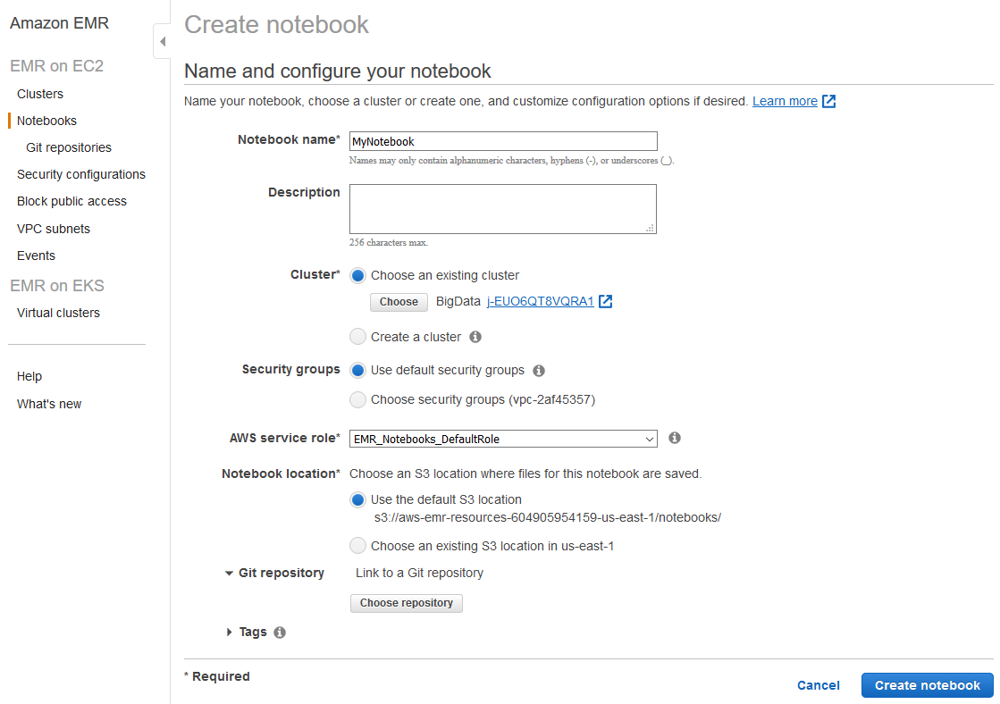

# Running a Spark Job

Connect using SSH

Install git

Clone & build the project

ssh -i ~/bigdata.pem [hadoop@ec2-54-242-176-32.compute-1.amazonaws.com](mailto:hadoop@ec2-54-242-176-32.compute-1.amazonaws.com)

sudo yum install git -y

git clone [https://github.com/w4bo/spark-word-count.git](https://github.com/w4bo/spark-word-count.git)

cd spark-word-count

./gradlew

spark-submit --class it.unibo.big.WordCount build/libs/WordCount-all.jar s3://aws-bucket-bigdata2021/inferno.txt

# Other services: HUE

Connecting to Hue

* I.e., connecting to any HTTP interface hosted on the master node of a cluster

To view the Hue web user interface

* Set Up an SSH Tunnel to the Master Node Using Dynamic Port Forwarding
* Type the following address in your browser to open the Hue web interface
  * [http://master-public-DNS:8888](http://master-public-dns:8888/)
  * Where master-public-DNS is the public DNS name of the master node
* If you are the administrator logging in for the first time
  * Enter a username and password to create your Hue superuser account
  * Otherwise, type your username and password and select Create account

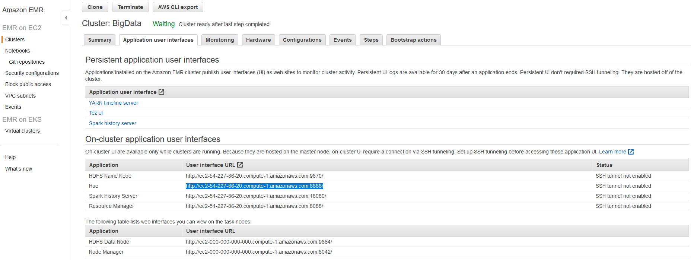

# Set Up an SSH Tunnel

# Connect to HUE

# Connect using SSH

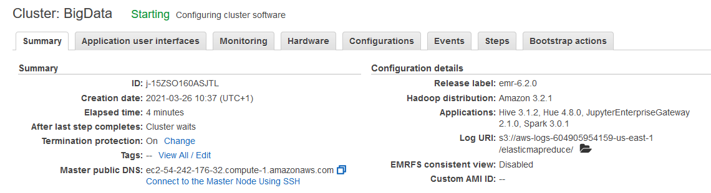

# 

# -- newsection --

# Cluster migration - Based on a true story​

# Migration

Goals

* Evaluating the costs for a cloud/on-premises data platform
* Real-world case study
* Fill in this table

| Cost | On-premises | On cloud |
|:-: |:-: |:-: |
| Hardware |? |? |
| Software |? |? |

# Case study

Business intelligence group

# Migration

Spatial Cube (PostGIS)

Reference architecture

Mobile Interface

ODS (Hbase+PostGIS)

Integration processes

Loading processes

Notebook Interface

Data Lake (Hadoop)

Enrichment processes

Acquisition processes

*External sources*

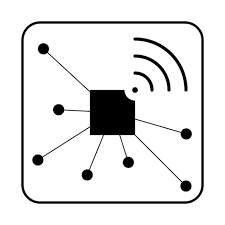

Administrative

borders

Rural Land

register

Satelliteimages

On-the-field sensors

Reference architecture

Hardware

* Software
* "Classic" Hadoop stack

8 CPUs (144 total)

* - Intel(R) Core(TM) i7-8700 CPU @ 3.20GHz

32GB RAM (576GB total)

* - 2 x 16GB DIMM DDR4 2666 MHz

12TB HDD Disk (216TB total)

* - 3 x 4TB ST4000DM004-2CV1

lshw -short -C cpu

lshw -short -C memory

lshw -short -C disk

| SOLonprem | On-premises | On cloud |
|:-: |:-: |:-: |
| Hardware |? |? |
| Software |? |? |

**Hardware cost**:?

* Refer to [https://www.rect.coreto-europe.com/en/search.html?clearsearch=1](https://www.rect.coreto-europe.com/en/search.html?clearsearch=1)

# On-premises

| SOLonprem | On-premises | On cloud |
|:-: |:-: |:-: |
| Hardware | 10602€/year |? |
| Software |? |? |

**Hardware cost**(up to Mar 05, 2021): * 1767€ x 18 = 31806€

* Amortization over 3 years (i.e., *10602€/year*)

[https://www.rect.coreto-europe.com/en](https://www.rect.coreto-europe.com/en) (Accessed 2021-08-01)

| SOLonprem | On-premises | On cloud |
|:-: |:-: |:-: |
| Hardware | 10602€/year |? |
| Software |? |? |

**Software cost**:?

| SOLonprem | On-premises | On cloud |
|:-: |:-: |:-: |
| Hardware | 10602€/year |? |
| Software | 0€ |? |

**Software cost** (up to 2020): 0€*

* Free Cloudera Management System
* No software licensing (for research purpose)

| SOLonprem | On-premises | On cloud |
|:-: |:-: |:-: |
| Hardware | 10602€/year |? |
| Software | 180000€/year |? |

**Software cost**(up to Mar 05, 2021): 10000€/year x 18 = 180000€/year*

* Cloudera is no more free, 10K€ per node
* [https://www.cloudera.com/products/pricing.html\#private-cloud-services](https://www.cloudera.com/products/pricing.html#private-cloud-services)
* [https://www.cloudera.com/products/pricing/product-features.html](https://www.cloudera.com/products/pricing/product-features.html)
* No license for research purpose

*“Houston we’ve had a problem!”*

* We cannot update/extend the cluster anymore
* What about migrating to the cloud? (we only consider AWS)

# Migration

Moving a Hadoop cluster to the cloud (we only consider AWS)

* AWS price calculator [https://calculator.aws/\#/estimate](https://calculator.aws/#/estimate)

How do we start?

* We have already defined the hardware and the software stack
* Start with coarse tuning, identify the dominating costs first
  * Is it computing, storage, or processing?
* Identify a suitable budget, implement, refine later
  * Wrong refinements can do a lot of damage

# On cloud v1

| SOLcloud1 | On-premises | On cloud |
|:-: |:-: |:-: |
| Hardware | 10602€/year |? |
| Software | 180000€/year |? |

Migrating the cluster as-is:?

* Hint: add 18 EC2 instances satisfying the hardware requirements

| SOLcloud1 | On-premises | On cloud |
|:-: |:-: |:-: |
| Hardware | 10602€/year | 162000$/year |
| Software | 180000€/year |? |

SOLcloud1 migrating the cluster as-is: *13500$/month = 162000$/year*

* 18 EC2 instances (t4g.2xlarge) with 12TB EBS storage each machine
* Still, we have no software configuration

Prices change over the year

* In 2022, 162000$/year
* In 2023, 146000$/year

[https://calculator.aws/\#/estimate?id=7757afffccc3cafdcfdeb212b74623ef02ed5a36](https://calculator.aws/#/estimate?id=7757afffccc3cafdcfdeb212b74623ef02ed5a36)

# Migration

Pay attention to the region

* Different regions, different prices
* Different regions, different services
* Remember the GDPR and data locality

It makes no sense to move the cluster as-is

* More machines ensure better (on-prem) scalability but higher costs

How do we proceed with the migration?

* We need minimum software requirements
* Try to achieve the smallest migration impact
  * Find the most similar cloud-based solution to a Hadoop cluster
  * Rethink applications (later) when you got the know-how
* Identify a suitable budget, implement, refine later
  * Wrong refinements can do a lot of damage

**HDFS**

* How much durability do we need?
  * HP0: three replicas (we stick to this)
  * HP1: decrease replicas for cold data
  * HP2: move cold data to glacier or delete id
  * ...

**HBase** has marginal effects on the pricing (100GB << 50TB)

* For simplicity, we can omit it

**Overall**: 50TB storage/year

Processing takes place each time that ESA provides a satellite image

* Some days no images are available
* Some days up to 10 images are available
* Spark jobs are always executed with the same parameters

**Image processing**

* 4 machines, 2 cores, 10GB RAM at least

**Weather processing** is negligible

Image processing

4 Executors (2 cores and 10GB RAM each)

Driver (2 cores and 20GB RAM)

: 15m/core (2h total)

Weather processing

2 Executors (1 core and 500MB RAM each)

Driver (1 core and 1GB RAM)

: 0.5 m/core (1m total)

# On cloud v2

|  | On-premises | On cloud |
|:-: |:-: |:-: |
| Hardware | 2356€/year | 38000$/year |
| Software | 100000€/year |? |

Assuming 1 Executor = 1 Machine

* Compare 4 machines on-premises vs on cloud

On-premises

* 4 machines: 10602€/year / 18 machines x 4 machines = *2356€/year*
* Cloudera requires at least 10 nodes: *100000€/year*

AWS

* 4 EC2 instances: 162000$/year / 18 machines x 4 machines = *36000$/year*
  * Plus the resources for master services = *2000$/year*
* Problems
  * Still no software stack
  * A lot of storage cost
  * Machines are up-and-running even when no computation is necessary (just to persist data)

AWS

* Still, we have no software stack configuration
* Which is the major cost?

AWS

* Still, we have no software stack configuration
* Which is the major cost?

# Migration

S3 standard

S3 Infrequent Access

*AWS Storage*

* HDFS on EC2
* Heavy price
* Machine must be always on to guarantee data persistency
* Data locality

S3

* Much cheaper
* Does not require machines for data storage
* Data locality is lost

|  | On-premises | On cloud |
|:-: |:-: |:-: |
| Hardware | 2356€/year |? |
| Software | 100000€/year |? |

Migrating cluster to EMR: *?*

* Given the software requirements, we need
* 1 x Master Node (to manage the cluster)1 x Core node (with HDFS/EBS)
* 4 x Task Nodes (to compute)

Image processing

4 Executors (2 cores and 10GB RAM each)

Driver (2 cores and 20GB RAM)

: 15m/core (2h total)

Weather processing

2 Executors (1 core and 500MB RAM each)

: 0.5 m/core (1m total)

Driver (1 core and 1GB RAM)

# On cloud v3

|  | On-premises | On cloud |
|:-: |:-: |:-: |
| Hardware | 2356€/year | 14710€/year |
| Software | 100000€/year |? |

Migrating cluster to EMR: *14710€/year*

* S3 Infrequent Access storage (50 TB per month): 640€
* 1 x Master EMR nodes, EC2 (m4.xlarge), Utilization (75 h/month): 4.5€
  * 75 h/month = 15min/task x 10task/day x 30day/month / 60min/hour
* 1 x Core EMR nodes, EC2 (m4.xlarge), Utilization (75 h/month): 4.5€
* 4 x Task EMR nodes, EC2 (m4.4xlarge), Utilization (75 h/month): 72€
* 4 x EC2 *on demand (task node): 174.83€*
  * Storage amount (30 GB)
  * Workload (Daily, Duration of peak: 0 Hr 15 Min)
  * Instance type (m4.xlarge)
* 2 x EC2 on demand (master and core nodes): 330€
  * Storage amount (30 GB)
  * Instance type (m4.xlarge)

|  | On-premises | On cloud |
|:-: |:-: |:-: |
| Hardware | 2356€/year | 13445€/year |
| Software | 100000€/year |? |

Migrating cluster to EMR: *13445€/year*

* S3 Infrequent Access storage (50 TB per month): 640€
* 1 x Master EMR nodes, EC2 (m4.xlarge), Utilization (75 h/month): 4.5€
  * 75 h/month = 15min/task x 10task/day x 30day/month / 60min/hour
* 1 x Core EMR nodes, EC2 (m4.xlarge), Utilization (75 h/month): 4.5€
* 4 x Task EMR nodes, EC2 (m4.4xlarge), Utilization (75 h/month): 72€
* 4 x EC2 *spot (task node): 69.55€*
  * Storage amount (30 GB)
  * Workload (Daily, Duration of peak: 0 Hr 15 Min)
  * Instance type (m4.xlarge)
* 2 x EC2 on demand (master and core nodes): 330€
  * Storage amount (30 GB)
  * Instance type (m4.xlarge)

 *[https://calculator.aws/\#/estimate?id=c3780b12bb43b593d05def5a1d5218d9764b8a65](https://calculator.aws/#/estimate?id=c3780b12bb43b593d05def5a1d5218d9764b8a65)* 

# Migration

Summing up (cloud options)

| Machine uptime | Storage | Software | Feasible? | Cost per year |
|:-: |:-: |:-: |:-: |:-: |
| Constant | EC2 | Manual | YES: but high storage cost | ~36K€ |
| Constant | EC2 | EMR | YES: but high storage cost | ~37K€ |
| Constant | S3 | Manual | YES: but still manual provisioning | ~17K€ |
| Constant | S3 | EMR | YES | ~18K€ |
| Pay-per-use | EC2 | Manual | NO: pay-per-use + EC2 = Data unpersisted | - |
| Pay-per-use | EC2 | EMR | NO: pay-per-use + EC2 = Data unpersisted | - |
| Pay-per-use | S3 | Manual | ISH: repetitive manual provisioning | - |
| Pay-per-use | S3 | EMR | YES | ~14K€ |

Summing up

* We estimated the cluster costs
  * On-premises solution with 18 machines: no go
  * Cloud solution with 18 EC2 instances: no go
* We reduced the solution based on software requirements
  * On-premises solution with 4 machines: no go
  * Cloud solution with 4 EC2 instances: no go, we miss the software configuration
* We moved the cluster to AWS EMR + spot instances + S3 storage

Can we do better?

* Pick ad-hoc cloud services (AWS Lambda e AWS Batch)
* ... to re-think the applications (food for thoughts)

# Case study

WeLASER

# The WeLASER project

**Project description**

* *The increased use of pesticides and * *fertilisers* * damages the environment, destroys non-target plants and beneficial insects for the soil and harms human and animal health. Most seeds develop herbicide-resistant properties, rendering pesticides ineffective. Mechanical automatic systems that are studied as alternatives to pesticides deteriorate soil features, damage beneficial soil organisms and offer limited results for in-row weeding. The EU-funded WeLASER project will develop a non-chemical solution for weed management based on pioneering technology consisting of the application of lethal doses of energy on the weed meristems through a high-power laser source. An AI-vision system separates crops from weeds, identifying the weed meristems and pointing the laser at them. A smart controller based on IoT and cloud computing techniques coordinates the system, which is * *transfered* * all over the field by an autonomous vehicle.*

[https://cordis.europa.eu/project/id/101000256](https://cordis.europa.eu/project/id/101000256) (accessed 2020-08-01)

Which requirements do you foresee?

* Can we define a tentative (service) architecture for the WeLASER project?

Assumptions

* Do not consider the collection of weed/crop images & training/deploying of the CV algorithm

[https://cordis.europa.eu/project/id/101000256](https://cordis.europa.eu/project/id/101000256) (accessed 2020-08-01)

# Data sources

[https://docs.google.com/spreadsheets/d/17zEr62CzyqeIy0vU-DcjEUoxf6bMd3ziLSSeIXvk4Lg/edit?usp=sharing](https://docs.google.com/spreadsheets/d/17zEr62CzyqeIy0vU-DcjEUoxf6bMd3ziLSSeIXvk4Lg/edit?usp=sharing)

# Workload

Nothing special

* Every night compute aggregated indexes on the collected data (2h/day)

On-premises (HDFS cluster)

* How many machines do we need?
* With which resources?

# On-premises

|  | On-premises | On cloud |
|:-: |:-: |:-: |
| Hardware | 2900€/year |? |
| Software | 40000€/year |? |

On-premises

* How many machines do we need?
  * *4*: *1 master node* + *3 HDFS data nodes*
* With which resources?
  * Assuming a HDFS replication factor of 3, we need at least 1TB of disk overall (not that much)
  * Think bigger: at least 8 cores, 64GB RAM, 500GB SSD + 4TB HDD, no GPU
* 8700€ / 3 years = 2900€

[https://www.rect.coreto-europe.com/en](https://www.rect.coreto-europe.com/en) (accessed 2022-09-01)[https://www.cloudera.com/products/pricing.html](https://www.cloudera.com/products/pricing.html) (accessed 2022-09-01)

# On cloud v1

|  | On-premises | On cloud |
|:-: |:-: |:-: |
| Hardware | 2900€/year | ~40000$/year |
| Software | 40000€/year |? |

Moving the Hadoop cluster as IAAS

* EC2
* Quantity (4), Pricing strategy (EC2 Instance Savings Plans 3 Year No Upfront), *Storage amount (4 TB), * Instance type (r6g.2xlarge)

EMR

* Number of master EMR nodes (1), EC2 instance (r5.2xlarge), Utilization (100 %Utilized/Month) Number of core EMR nodes (3), EC2 instance (r5d.2xlarge), *Utilization (100 %Utilized/Month)*

*MKS (KAFKA)*

* Storage per Broker (10 GB), Number of Kafka broker nodes (3), Compute Family (m5.2xlarge)

[https://calculator.aws/\#/estimate?id=05965ca7de23fd9e7d2ab2cd0175fe8c01822c9c](https://calculator.aws/#/estimate?id=05965ca7de23fd9e7d2ab2cd0175fe8c01822c9c) (accessed 2022-09-01)

# On cloud v2

|  | On-premises | On cloud |
|:-: |:-: |:-: |
| Hardware | 2900€/year | ~4000$/year |
| Software | 40000€/year |? |

Moving the Hadoop cluster as PAAS

* EC2
* Quantity (4), Pricing strategy (*On-Demand Instances*), Storage amount (30 GB), Instance type (r6g.2xlarge)

EMR

* Number of master EMR nodes (1), EC2 instance (r5.2xlarge), Utilization (2 Hours/Day) Number of core EMR nodes (3), EC2 instance (r5d.2xlarge), *Utilization (2 Hours/Day)*

*S3*

* Standard storage (60 GB per month)

*Kinesis*

* Days for data retention (1 days), Records (100 per second), Consumer Applications (3)

[https://calculator.aws/\#/estimate?id=53f60ff0412a18877dc8e1274f7d9875aa3bf665](https://calculator.aws/#/estimate?id=53f60ff0412a18877dc8e1274f7d9875aa3bf665) (accessed 2022-09-01)

# Cost vs price

How would you evaluate the cost and the price?

*Price* is the amount a customer is willing to pay for a product or service

* *Cost* is the expense incurred for creating a product or service
* Hardware
* Development
* Maintenance

*Profit* is the difference between price paid and costs incurred is profit

* If a customer pays $10 for a product that costs $6 to make and sell, the company earns $4

# -- newsection --

# Data pipelines on cloud (Streaming)

# 

Supporting services

Serve (deciding)

BI tools (e.g., Tableau)

Analytics (analyzing)

Networking, etc.

Machine learning

Ingestion (acquiring)

# Reference scenario: batch vs stream

# Batch vs. Streaming systems

What is a bulk processing system?

* High latency
* Exact results
* Process massive data at once
  * ... is this true?

What is a streaming system?

* Low latency
* Approximate result
  * ... is this true?
* Process data item by data item
  * ... is this true?

What is a bulk processing system?

* An engine capable to handle processing on **bounded** datasets

What is a streaming system?

* An engine capable to handle processing on **unbounded** datasets
* Streaming is a superset of batch processing

Akidau, Tyler, Slava Chernyak, and Reuven Lax.  *Streaming systems: the what, where, when, and how of large-scale data processing* . " O'Reilly Media, Inc.", 2018.

# Reference scenario: batch vs stream

|  | Batch data processing | Stream data processing |
|:-: |:-: |:-: |
| Data scope | Queries or processing over all or most of the data in the dataset | Queries or processing over data within a rolling time window, or on just the most recent data record |
| Data size | Large batches of data | Individual records or micro batches consisting of a few records |
| Latency | Minutes to hours | Seconds or milliseconds |
| Analysis | Complex analytics | Simple response functions, aggregates, and rolling metrics |

# Ingestion: batch

**Goal**: moving data to the cloud

* Moving data to the cloud
* *80TB* of data to move,
* *1Gbps* connection to the internet

How many *days*?

* *80000GB* / (*1Gbps / 8*) /  *60 / 60 / 24 * ~= a week without internet

Batch/Bulk: move data from on-premises storage

* Workflow
* Receive shipment
* Set up
* Transfer data
* Ship back (shipping carrier)

# Ingestion: batch (AWS)

AWS Snowball

* 50TB (North America only) and 80TB versions
* Not rack-mountable

Throughput

* 1 Gbps or 10 Gbps using an RJ-45 connection
* 10 Gbps using a fiber optic connection

[https://aws.amazon.com/snowball/](https://aws.amazon.com/snowball/)

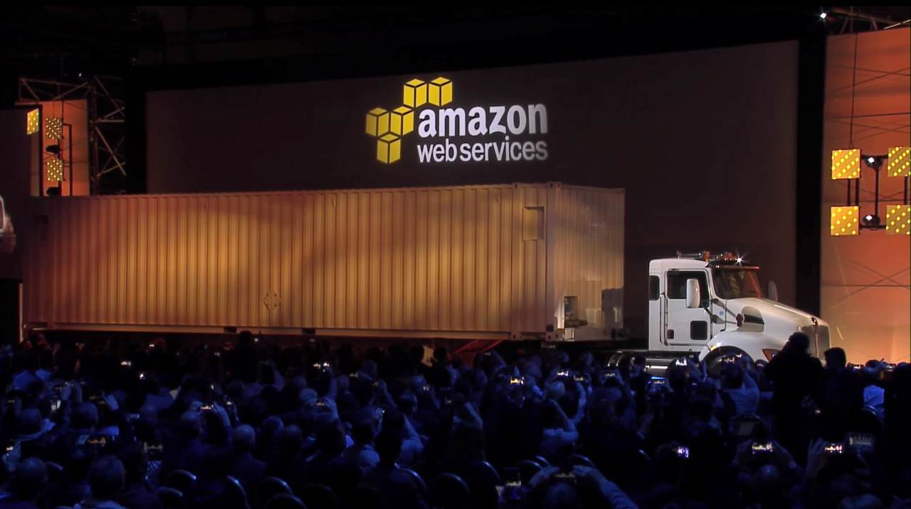

# AWS Snowmobile

What if we have exabyte of data?

Value Metric

103 KB (kilobyte)

106 MB (megabyte)

109 GB (gigabyte)

1012 TB (terabyte)

1015 PB (petabyte)

1018 EB (exabyte)

1021 ZB (zettabyte)

1024 YB (yottabyte)

[https://youtu.be/8vQmTZTq7nw?t=45](https://youtu.be/8vQmTZTq7nw?t=45) (2022-11-14)

# Ingestion: stream

* Data (often) flows in both directions, storage systems are both sources and destinations for data transformations
* Two pipelines per application (data in/out)
  * Worst case (full connectivity): O(N2)

Kreps, Jay.  *I heart logs: Event data, stream processing, and data integration* . " O'Reilly Media, Inc.", 2014.

**Stream**: real-time streaming data

* **Event**: anything that we can observe occurring at a particular point in time

**Continuous streaming**

* Illimited succession of individual events
* Ordered by the point in time at which each event occurred

**Publish/subscribe (pub/sub)**: a way of communicating messages

* *Senders* publish messages associated with one or more **topics**
* *Receivers* subscribe to specific topics, receive all messages with that topic
* *Messages* are events

[https://www.manning.com/books/event-streams-in-action](https://www.manning.com/books/event-streams-in-action)

Log

* Append-only data structure
* Each application only knows about the log, it ignores the details of the source
  * E.g., a data consumer is not concerned about whether the data came from a relational database or some application

The log acts as a messaging system with durability guarantees and ordering semantics

Kreps, Jay.  *I heart logs: Event data, stream processing, and data integration* . " O'Reilly Media, Inc.", 2014.

General idea:

* Collect events from many source systems
* Store them in a unified log
* Enable applications to operate on these event streams

**Unified log**

* *Unified*, *append-only*, *ordered*, *distributed* log that allows the centralization of event streams

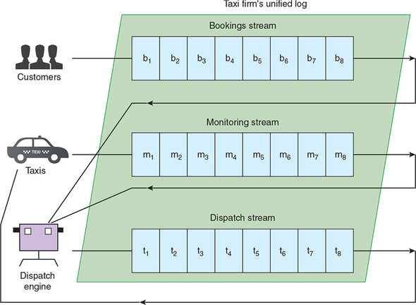

**Unified**: a single log in a company with applications sending/reading events

* Log serves as central data backbone
  * It can contain many distinct continuous streams of events
  * Not all events are sent to the same event stream

**Append-only**: new events are appended to the unified log

* Existing events are never updated in place
  * If read the event \#10, never look at events 1 through 10 again
* Events are automatically deleted from the unified log when they age
  * E.g., automatically remove events after 7 days

**Distributed**: the unified log lives across a cluster of machines

* Optionally divide events into shards (i.e., partitions)Still, the log is unified since we have a single (conceptual) log

Distribution ensures

* Scalability: work with streams larger than the capacity of single machines
* Durability: replicate all events within the cluster to overcome data loss
* Using a log as a universal integration mechanism is never going to be more than an elegant fantasy if we can’t build a log that is fast, cheap, and scalable

**Ordered**: events in a shard have a sequential IDs (unique in a shard)

* Local ordering keeps things much simpler than global ordering
* Applications maintain their own cursor for each shard

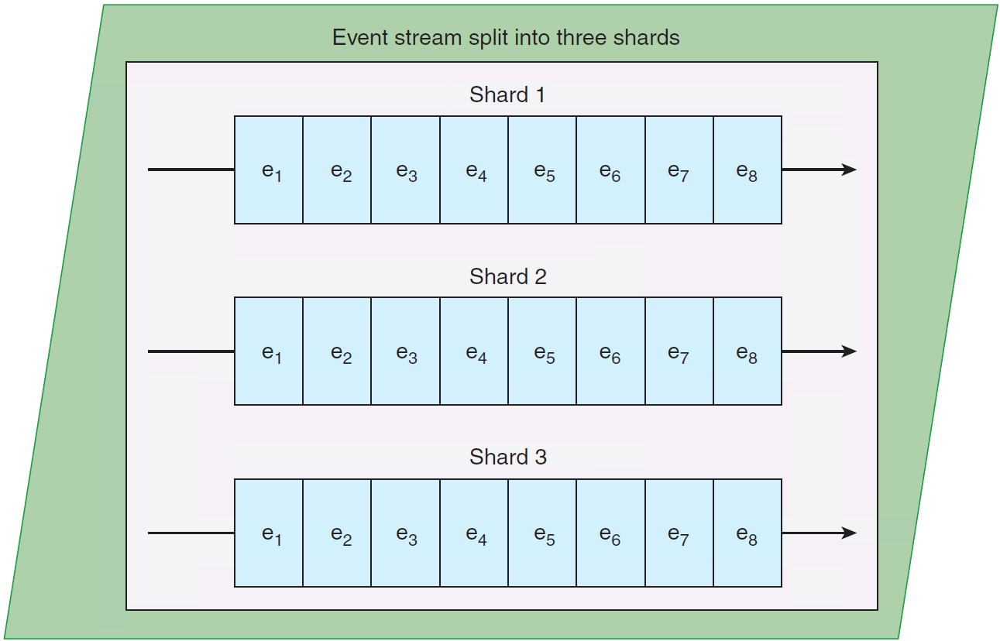

Lamport, Leslie. "Time, clocks, and the ordering of events in a distributed system."  *Concurrency: the Works of Leslie * *Lamport* . 2019. 179-196.

Two types of processing

* **Single-event:** a single event produces zero or more events
  * Validating “Does this event contain all the required fields?”
  * Enriching “Where is this IP address located?”
  * Filtering “Is this error critical?”
* **Multiple-event:** multiple events collectively produce zero or more events
  * Aggregating, functions such as minimum, maximum, sum
  * Pattern matching, looking for patterns or co-occurrence
  * Reordering events based on a sort key

Why not communicating directly using messaging protocols?

* A log enables
* Multi-subscriber: each data item is available to any processor that wants it
* Order: maintained in the processing done by each consumer of data
* Buffering and isolation to the individual processes
  * E.g., a that processor produces faster than its downstream consumer can keep up
* Reprocessing, maintaining state, etc.

Indeed, logs are common:

* MapReduce workflows use files to checkpoint and share their intermediate results
* SQL processing pipelines create intermediate or temporary tables

# Ingestion: stream (AWS)

Amazon Kinesis Data Streams

* Created and provisioned by shard
  * Each shard provides 1 MBps and 1000 data puts per second
* A data record consists of
  * User-supplied partition key to balance records across shards
  * Incremental sequence number added by the shard
  * A data blob
* Consumers get records by shard
  * Records are sorted by partition key and sequence number
  * Ordering is not guaranteed across shards
* Records are retained for 7 days at maximum

[https://docs.aws.amazon.com/streams/latest/dev/key-concepts.html](https://docs.aws.amazon.com/streams/latest/dev/key-concepts.html)

Re-sharding (i.e., scaling)

* Split a shard into two, or merge two shards
* Users must scale shards up and down manually
  * Monitor usage with Amazon CloudWatch and modify scale as needed
* Avoid shard management by using Kinesis Data Firehose

Kinesis is a regional service, with streams scoped to specific regions

* All ingested data must travel to the region in which the stream is defined

Costs

* Priced by shard hour, data volume, and data retention period
* Pay for resources you provision (even if not used)

[https://aws.amazon.com/cloudwatch/](https://aws.amazon.com/cloudwatch/)[https://aws.amazon.com/kinesis/data-firehose](https://aws.amazon.com/kinesis/data-firehose)

# Ingestion: stream

| Feature | AWS Kinesis | Google Pub/Sub |
|:-: |:-: |:-: |
| Unit of deployment | Stream | Topic |
| Unit of provisioning | Shard | N/A (fully managed) |
| Data unit | Record | Message |
| Data producer/destination | Producer/Consumer | Publisher/Subscriber |
| Data partitioning | User-supplied partition key | N/A (fully managed) |
| Retention period | Up to 7 days | Up to 7 days |
| Pricing | Per shard-hour, PUT payload units, and optional data retention | Message ingestion and delivery, and optional message retention |

# 

Supporting services

Serve (deciding)

BI tools (e.g., Tableau)

Analytics (analyzing)

Networking, etc.

Machine learning

Ingestion (acquiring)

# Serverless computing/processing

AWS Lambda: compose code functions in a loose orchestration

* Build modular back-end systems
* Event-driven and push-based pipelines

With Lambda, you are responsible only for your code (Lambda function)

* Lambda manages the compute fleet that offers a balance of memory and CPU
* Lambda performs operational and administrative activities on your behalf
  * Provisioning capacity, monitoring fleet health, applying security patches, etc.

# Serverless computing (AWS Lambda)

AWS Lambda

* A Lambda function is a granular service
* The Lambda runtime invokes a lambda function multiple times in parallel
* Compute service that executes code written in JavaScript/Python/C\#/Java
  * Elastic Compute Cloud (EC2) servers run the code (e.g., a Linux server)
* A function is `code + configuration + dependencies`
  * Source code (JARs or DLLs) is zipped up and deployed to a container
* Invocation supports push/pull events

# Serverless computing (FaaS)

FaaS: write single-purpose stateless functions

* Keep the single responsibility principle in mind
* A function that does just one thing is more testable and robust
* A function with a well-defined interface is also more likely to be reused
* Code should be created in a stateless style
  * Statelessness allows scalability
  * Local resources or processes will not survive along sessions
* Functions that terminate sooner are cheaper
  * E.g., pricing is based on \#requests, execution time, and allocated memory

# Patterns for data pipelines

Patterns are architectural solutions to problems in software design

* A (design) pattern is a general, best-practice reusable solution to a commonly occurring problem within a given context in software design
* It is a template for how to solve a problem in many different situations

Patterns for serverless data pipelines

  * Command pattern
  * Messaging pattern
  * Priority queue pattern
  * Pipes and filters pattern

[https://www.manning.com/books/aws-lambda-in-action](https://www.manning.com/books/aws-lambda-in-action)

# Command pattern

Command pattern

* A behavioral design pattern in which an object is used to encapsulate the information needed to perform an action or trigger an event

Encapsulate a request as an object

* Issue requests to objects without knowing anything about the operation being requested or the receiver

[https://aws.amazon.com/api-gateway](https://aws.amazon.com/api-gateway)

# Pipes and filters pattern

Decompose a complex processing task into a sequence of manageable services

* Components designed to transform data are referred to as filters
* Connectors that pass data between components are referred to as pipes

# Messaging pattern

Messaging pattern

* Describes how two different parts of a message passing system connect and communicate with each other

Decouple services from direct dependence and allow storage of events in a queue

* Reliability: if the consuming service goes offline, messages are retained in the queue and can still be processed
* A message queue can have a single sender/receiver or multiple senders/receivers

# Priority queue pattern

Decouple and prioritize requests sent to services

* Requests with a higher priority are received and processed more quickly than those with a lower priority
* Useful in applications that offer different service level guarantees

Control how and when messages are dealt with

* Different queues, topics, or streams to feed messages to your functions
* High-priority messages go through expensive services with more capacity

# That’s all, folks!

# Feedbacks?

# Exams

# -- newsection --

# Hands on AWS

# A tentative organization

Supporting services

Serve (deciding)

BI tools (e.g., Tableau)

Analytics (analyzing)

Networking, etc.

Machine learning

Ingestion (acquiring)

# Identity and Access Management

Identity and Access Management (IAM)

* Web service that controls fine-grained access to AWS resources
* IAM controls who is authenticated and authorized to use resources

IAM user

* Unique identity recognized by AWS services and applications
* Similar to user in an operating system like Windows or UNIX

IAM role

* Set of policies for making AWS service requests
* Trusted entities (e.g., such as IAM users) assume roles
  * Delegate access with defined permissions to trusted entities
  * There is no limit to the number of IAM roles a user can assume

User vs role

* User has permanent long-term credentials and is used to directly interact with AWS services
* Role does not have credentials and cannot make direct requests to AWS services
* Roles are assumed by authorized entities, such as IAM users

Alice (i.e., an IAM user) is a firewoman

* She is the same person with or without her turnout gear
* As a firewoman (i.e., a role)
  * If she speeds to a house fire and passes a police officer, he isn't going to give her a ticket
  * In her role as a *firewoman*, she is allowed to speed to the house fire
* As a private citizen (i.e., another role)
  * When she is off duty, if she speeds past that same police officer, he's going to give her a ticket
  * In her role as a *private citizen*, she is not allowed to speed

# AWS

Amazon Web Services (AWS) is a public-cloud platform

* Services can be accessed in multiple ways
* Web GUI: intuitive point and click access without any programming
  * Intuitive interfaces is part of the attraction of cloud services
  * Tedious if the same actions must be performed repeatedly
* (REST) Application programming interface (API)
  * Permits requests to be transmitted via Hypertext Transfer Protocol (HTTPS)
* Software development kits (SDKs) that you install on your computer
  * Access from programming languages such as Python, Java, etc.

# AWS Web console

We use the AWS Educate program

* Login with the provided account
* You got 150$ to work on AWS services
* Provisioned services charge even if not used

[https://www.awseducate.com/signin/SiteLogin](https://www.awseducate.com/signin/SiteLogin)

# AWS CLI

CLI interface

* Necessary to install the CLI (version 2)
* See [https://docs.aws.amazon.com/cli/latest/userguide/install-cliv2.html](https://docs.aws.amazon.com/cli/latest/userguide/install-cliv2.html)

Synopsis

********

aws [options] \<command> \<subcommand> [parameters]

Description

***********

A unified tool to manage your AWS services.

[https://docs.aws.amazon.com/cli/latest/userguide/install-cliv2-linux.html](https://docs.aws.amazon.com/cli/latest/userguide/install-cliv2-linux.html)

CLI needs credentials to work

* Go back to AWS Educate
* Click on “Account Details”
* Copy the content into the file ~/.aws/credentials
* Henceforth, we assume that you have set up the credentials file
* Credentials expire after some time; you need a manually refresh

Run `aws configure`

* Confirm AWS Access Key ID (press enter)
* Confirm AWS Secret Access Key (press enter)
* Set Default region name to `us-east-1`
* Set Default output format to `json`

It is also possible to configure an AWS profile

* A (named) profile is a collection of settings and credentials
* If profile is specified, its settings and credentials are used to run a command
* When no profile is explicitly referenced, use `default`
  * We stick to `default`

# Object storage: S3

Create S3 bucket, the following rules apply for naming buckets

* Must be between 3 and 63 characters long
* Can consist only of lowercase letters, numbers, dots (.), and hyphens (-)
* Must be unique within a partition (i.e., a group of regions)

$ git clone [https://github.com/w4bo/bigdata-aws/](https://github.com/w4bo/bigdata-aws/)

$ cd bigdata-aws/lab01-lambda

$ aws s3api create-bucket --bucket aws-bucket-bigdata2021

$ aws s3 cp datasets/inferno.txt s3://aws-bucket-bigdata2021/inferno.txt

$ aws s3api list-objects --bucket aws-bucket-bigdata2021

[https://s3.console.aws.amazon.com/s3/home?region=us-east-1\#](https://s3.console.aws.amazon.com/s3/home?region=us-east-1)

# -- newsection --

# Data pipelines on AWS Lambda

# Requirements

To start this lecture, you need to

* Activate your AWS Educate account
* Either
  * Install the necessary software
    * git
    * IntelliJ IDEA (with AWS Toolkit and Scala plugins)
    * python
    * java 1.8
    * Docker
    * AWS CLI, AWS SAM CLI
  * Be able to download and run the VM

# AWS SAM CLI

Serverless Application Model is a framework to build serverless applications

* A serverless application is a combination of Lambda functions, event sources, etc.
* Install AWS SAM CLI (on Linux)

sudo group add docker

sudo usermod –aG docker $USER

newgrp docker

sudo chmod 666 /var/run/docker.sock

wget [https://github.com/aws/aws-sam-cli/releases/latest/download/aws-sam-cli-linux-x86*64.zip](https://github.com/aws/aws-sam-cli/releases/latest/download/aws-sam-cli-linux-x86*64.zip)

unzip aws-sam-cli-linux-x86*64.zip -d sam-installation

sudo ./sam-installation/install

sam --version

[https://docs.aws.amazon.com/serverless-application-model/latest/developerguide/serverless-sam-cli-install.html](https://docs.aws.amazon.com/serverless-application-model/latest/developerguide/serverless-sam-cli-install.html)

# AWS services

AWS Educate (and AWS console)

* [https://aws.amazon.com/it/education/awseducate/](https://aws.amazon.com/it/education/awseducate/)
* [https://console.aws.amazon.com/console/home?region=us-east-1](https://console.aws.amazon.com/console/home?region=us-east-1)

IAM (authentication)

* [https://docs.aws.amazon.com/IAM/latest/UserGuide/iam-ug.pdf](https://docs.aws.amazon.com/IAM/latest/UserGuide/iam-ug.pdf)

SDK (software API)

* [https://docs.aws.amazon.com/sdk-for-java/latest/developer-guide/home.html](https://docs.aws.amazon.com/sdk-for-java/latest/developer-guide/home.html)

Lambda (serverless computing and processing)

* [https://docs.aws.amazon.com/lambda/latest/dg/getting-started.html](https://docs.aws.amazon.com/lambda/latest/dg/getting-started.html)
* [https://console.aws.amazon.com/lambda/home?region=us-east-1\#/functions](https://console.aws.amazon.com/lambda/home?region=us-east-1#/functions)

DynamoDB (key-value database)

* [https://docs.aws.amazon.com/amazondynamodb/latest/developerguide/Introduction](https://docs.aws.amazon.com/amazondynamodb/latest/developerguide/Introduction)

S3 (object storage)

* [https://s3.console.aws.amazon.com/s3/home?region=us-east-1](https://s3.console.aws.amazon.com/s3/home?region=us-east-1)

# Case study

Given a dataset of sales per customer

find the products frequently bought together

Dataset sample

%%%%%%%%%%%%%%

[ { customerName: Alice, products: [Pizza, Beer, Diaper] },

{ customerName: Bob, products: [Pizza, Beer, Diaper] },

{ customerName: Charlie, products: [Pizza, Cola] } ]

The pipeline involves a single transformation

* A classic mining problem, which one?

# Frequent itemset mining

Dataset sample

%%%%%%%%%%%%%%

[[Pizza, Beer, Diaper],

[Pizza, Beer, Diaper],

[Pizza, Cola]]

Find sets of items (i.e., itemsets) frequently appearing together

* **Item**: a product
* **Itemset**: a set of products
* **Frequently**: support above threshold
* **Support**: number of clients buying a set of products

Complexity: O(2|items|)

{Pizza,Diaper,Beer}

# Case study

Processed dataset sample

%%%%%%%%%%%%%%

[[Pizza, Beer, Diaper],

[Pizza, Beer, Diaper],

[Pizza, Cola]]

Raw dataset sample

%%%%%%%%%%%%%%

[ { customerName: Alice, products: [Pizza, Beer, Diaper] },

{ customerName: Bob, products: [Pizza, Beer, Diaper] },

{ customerName: Charlie, products: [Pizza, Cola] } ]

# Reference pipeline

# NOSQL storage: DynamoDB

Basic DynamoDB components: tables and items

* **Tables**, collection of (data) items

**Items**, a group of attributes that is uniquely identifiable

* Each table contains zero or more items
  * No limit to the number of items you can store in a table
* Each item in the table has a unique identifier, or primary key
* E.g., in the table `people`, each item represents a `person`
  * The primary key consists of one attribute (`fiscalCode`)

Attributes

* A data element that is not broken down any further
  * E.g., an item in the `people` table contains attributes `fiscalCode` and `lastName`
* Most of the attributes are scalar (have only one value)
* Some of the items have a nested attribute (`address`) up to 32 levels deep

Schemaless

* Other than the primary key, a table is schemaless
  * Neither the attributes nor their data types need to be defined beforehand
  * Each item can have its own distinct attributes

Primary Key

* To create a table, you must specify the primary key of the table
* No two items can have the same key

Two types of primary keys

* Partition key: a simple primary key composed of one attribute (partition key)
  * Keys are inputs to an internal hash function
  * The hash function determines the physical partition in which the item will be stored
  * E.g., access any item in the `people` table directly by providing the `fiscalCode`
* Composite primary key: partition key and sort key (two attributes)
  * First attribute is the partition key
  * Second attribute is the sort key
  * Items in same partition key value are stored together and sorted by sort key

[https://docs.aws.amazon.com/amazondynamodb/latest/developerguide/bp-gsi-overloading.html](https://docs.aws.amazon.com/amazondynamodb/latest/developerguide/bp-gsi-overloading.html)

Secondary Indexes

* One or more secondary indexes per table
* Indexes are automatically maintained on add, update, or delete
* Query data using an alternate key (additionally to queries against primary key)

Two types of indexes

* Global secondary has partition and sort keys different from those on table
* Local secondary has the same partition key but a different sort key
* Each table has a limited quota of 20 global and 5 local indexes

How do we shape the schema?

* [https://cloud.google.com/bigtable/docs/schema-design](https://cloud.google.com/bigtable/docs/schema-design)

Create a table `frequent-sales` with a composite key

* `dataset`: String
* `timestamp`: String

$ aws dynamodb create-table \\

--table-name frequent-sales \\

--attribute-definitions AttributeName=dataset,AttributeType=S AttributeName=timestamp,AttributeType=S \\

--key-schema AttributeName=dataset,KeyType=HASH AttributeName=timestamp,KeyType=RANGE \\

--provisioned-throughput ReadCapacityUnits=1,WriteCapacityUnits=1

$ aws dynamodb list-tables

$ aws dynamodb delete-table --table-name frequent-sales

Reading data from DynamoDB might not reflect the results of a recent write

* Eventually Consistent Reads (default)
* Response might include stale data
* After short time, the response should return the latest data

Strongly Consistent Reads

* Response includes the most up-to-date data
* A strongly consistent read might not be available if there is a network delay or outage
  * In this case, DynamoDB may return a server error (HTTP 500)
* Strongly consistent reads may have higher latency than eventually consistent reads
* Strongly consistent reads are not supported on global secondary indexes

Provisioned mode: specify the \#reads and \#writes per second

* You have predictable application traffic or traffic ramps gradually
* You can forecast capacity requirements to control costs

One read capacity unit

* One strongly consistent read per second, two eventually consistent reads per second
* RCUs also depend on the item size (a read is up to 4 KB in size), if item size is 8 KB
  * 2 RCUs to sustain one strongly consistent read per second
  * 1 RCU if you choose eventually consistent reads

One write capacity unit represents one write per second for an item up to 1 KB in size

Put a new item and get it back

$ aws dynamodb put-item    --table-name frequent-sales    --item '{"dataset": {"S": "sales"}, "timestamp": {"S": "1611226870"}, "bar": {"S": "foobar"}}'

$ aws dynamodb query    --table-name frequent-sales    --key-condition-expression "dataset =:n"     --expression-attribute-values '{":n":{"S":"sales"}}'

# Lambda: create a function

[https://console.aws.amazon.com/lambda/home?region=us-east-1\#/functions](https://console.aws.amazon.com/lambda/home?region=us-east-1#/functions)

# Lambda: attaching a role

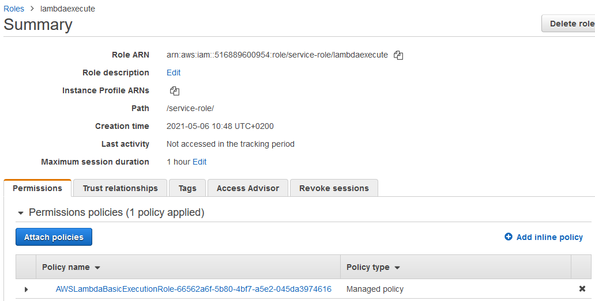

# Lambda: create a function

[https://console.aws.amazon.com/lambda/home?region=us-east-1\#/functions](https://console.aws.amazon.com/lambda/home?region=us-east-1#/functions)

Manually creating the functions is cumbersome

* We must copy and paste code
* No automatic testing
* No debugging
* No IDE support (and not all languages are supported)

Switch to IntelliJ IDEA + AWS Toolkit

# AWS Toolkit

* Get the latest IntelliJ IDEA
* Install the `AWS Toolkit`
* Copy the credentialscp ~/.aws/credentials ~/.aws/config
* Clone the repo git clone [https://github.com/w4bo/bigdata-aws/](https://github.com/w4bo/bigdata-aws/)
* Import `lab01-lambda` as a Gradle project
* Verify that the project builds./gradlew

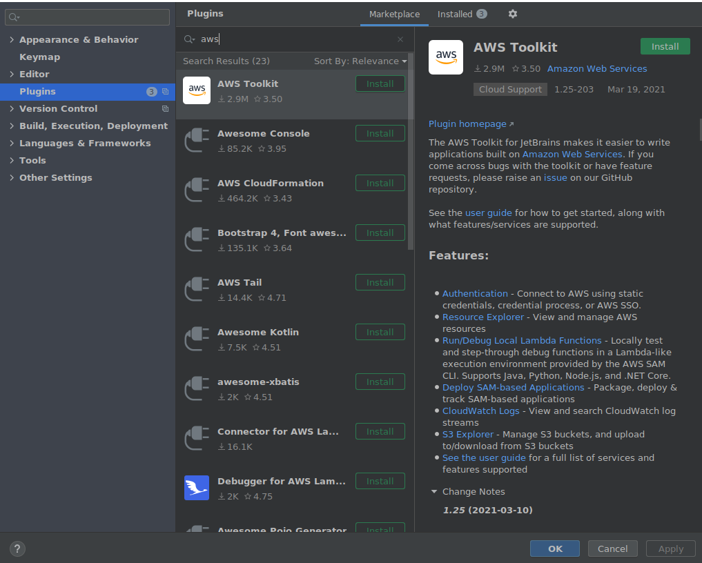

Click on `AWS Explorer`

* You can see the `helloworld` function
* Plus `CloudWatch Logs` and `S3`

Test the existing code locally

* With Gradle
* Or with local Lambda execution

Deploy a new Lambda function from the existing code

* Right click on AWS Explorer > Lambda
* Select `Create new AWS Lambda...`
* Populate the settings
* `Create the function`

[https://aws.amazon.com/lambda/pricing/](https://aws.amazon.com/lambda/pricing/)

Check the log for errors and pricing

* AWS Toolkit > CloudWatch Logs
* Double click on the function name
* Double click on the log entry

# Data pipeline

Deploy and execute the HelloWorld.java lambda function

* Given the created storage: S3 and DynamoDB
* Deploy the function `FIM`
* Deploy the function `Preprocess`
* Run `ReadDataset.java`
* Check that the table `frequent-sales` has the FIs for the dataset `sales`

Some hints

* Function names are case sensitive
* Some function need more than 128MB of memory
  * Behold! The higher the RAM, the higher the costs

# 

